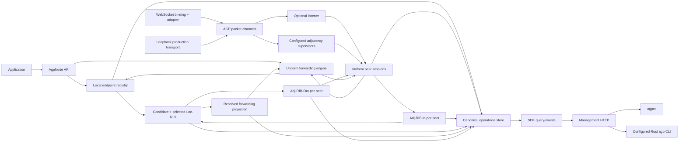

# AGP - system architecture

**Instant: current state.**\
This document describes AGP as it is built and proved today, not as it is intended to become.\
There is no target-state companion because current and target have not yet diverged; ratifying a decision that changes structure without building it creates that divergence, and the split happens then rather than in anticipation of it.

## 1. Status and authority

Per-section maturity separates generated structure, source-checked behavior, and the authored logical view.

| Field | Value |
|---|---|
| North star | [`VISION.md`](../VISION.md#north-star) - cited, never restated |
| Intent authority | [`DECISIONS.md` section 2](DECISIONS.md#2-confirmed-intent) |
| Ruling authority | The complete [`decision register`](DECISIONS.md#3-decision-records), with implementation state in [`traceability.json`](design/traceability.json) |
| Axiom applicability | [`design/axioms.md`](design/axioms.md) |
| Mechanism index | [`design/mechanisms.md`](design/mechanisms.md) |
| Verification | [`GATES.md`](GATES.md) and [`VERIFICATION.md`](VERIFICATION.md) |

| Section | Maturity | Reopens on |
|---|---|---|
| 2 Mandate | Approved | A change to the north star |
| 3 Non-negotiable outcomes | Approved | A ruling that retires a `U` outcome |
| 4 Concerns and their duties | Approved | A new sovereign concern earning a boundary |
| 5 Logical architecture | Provisional | A changed runtime relationship requires source review of the authored diagram; manifest dependencies are generated separately in section 7 |
| 6 Topology is configuration | Approved | A topology that configuration cannot express |
| 7 Package and module composition | Approved | A changed manifest regenerates the tables; a moved module requires reviewing its recorded duty |
| 8 Canonical processing paths | Approved | A new ruling changes admission, forwarding, reporting, pacing, or state projection |
| 9 Global invariants | Approved | A ruling that adds or retires an invariant |
| 10 Scope boundary | Approved | A ratified change to the vision's exclusions or the mechanism register's re-entry conditions |
| 11 Mechanics, rationale, consequence | Approved | Any of the above |
| 12 Owed and open | Live | Continuously |

The justification chain runs domain, axioms, north star, principles, decisions, model.\
The programme purpose is held by [`VISION.md`](../VISION.md), and historical rulings by [`DECISIONS.md`](DECISIONS.md).\
At the system layer, this shape must route by held reachability, refuse before unsafe forwarding, and expose its state through one canonical projection.\
The principles are uniform-node composition, sovereign boundaries, bounded resources, and evidence-backed outcomes; the sections below describe how the built system realizes them.

**Currency correction (`B39`, `B11`, `B13`):** this current-state view previously stopped at D19, treated every send as selected-route-only, and duplicated the deferred list.\
It now absorbs the later admission, disposition, credit, and observation decisions, derives package structure from manifests, and leaves deferred-mechanism ownership in its register.\
Historical decision text remains in the decision register.

This architecture supersedes the MVP's hub/spoke runtime split and its explicit exclusion of route propagation.\
Existing AGP v1 peers, `createRouter()`, and `createSpoke()` are not compatibility constraints.\
The mechanism index records strict conceptual alignment, adaptations, deliberate departures, and deferred familiar mechanisms; AGP does not claim BGP wire compatibility.

---

## 2. Mandate

AGP topology is assembled from identical `AgpNode` instances.\
A node may accept or initiate packet channels through an injected transport, expose local endpoints, import routes, export selected routes, deliver locally, and forward in transit.\
Configuration determines which capabilities are active; no protocol role, transport kind, or separate implementation makes a node a hub or spoke.

The AGP kernel consumes only a reliable, ordered, duplicate-free, bounded, full-duplex packet-channel contract.\
It never observes carrier framing, addresses, compression, negotiation, security configuration, or native close codes.\
WebSocket and Loopback are equally canonical production transports and must drive the same protocol, FSM, session, routing, and operations behavior.

Every node owns:

1. a local endpoint registry;
2. a per-session imported route table (Adj-RIB-In);
3. a deterministic candidate and selected RIB (Loc-RIB);
4. a resolved forwarding projection;
5. a per-session selected-route export table (Adj-RIB-Out);
6. a uniform session directory for inbound and outbound transports;
7. one canonical, revisioned operational state store.

Every locally originated or received data message consults the same forwarding decision: selected RIB/FIB by default, or a candidate route where the message names an advertiser (`D26`, `D30`).\
No usable forwarding route means no onward data packet.

---

## 3. Non-negotiable outcomes

| ID | Outcome | Source |
|---|---|---|
| U1 | `createNode()` is the sole runtime factory. | Survey Q1/Q3/Q6 |
| U2 | Listener, dialer, local delivery, and transit behavior compose inside the same implementation. | Confirmed survey composite |
| U3 | Either side of an adjacency can exchange endpoint routes. | Survey Q4(a) |
| U4 | A selected learned route may be exported to other peers for multi-hop transit. | Survey Q4(b) |
| U5 | Ordered path provenance rejects control-plane loops. | Survey Q4(c) |
| U6 | A data path is gated by the local selected RIB, or by the local candidate RIB where a message names the instance it is for. | Survey Q1(b), amended by `D30` |
| U7 | A local route miss rejects before wire admission. | Survey Q5(a) |
| U8 | A transit route miss emits no onward data packet. | Survey Q5(b) |
| U9 | A correlated nonfatal failure travels back toward the source. | Survey Q5(c) |
| U10 | Management HTTP and `agpctl` remain stable where their semantics remain true. | Survey Q6(c) |
| U11 | Every named public data-only DTO-wire, configuration, SDK, operational state, event, and management-has a sovereign, separately inspectable JSON Schema. | Stakeholder direction, 2026-07-30 |
| U12 | Protocol, core, node, routing, and canonical operations contain no concrete-transport semantics or branching. | Transport fixed intent, 2026-07-30 |
| U13 | Every conforming transport drives identical AGP packet, FSM, session, advertisement, RIB, forwarding, and teardown semantics. | Transport fixed intent, 2026-07-30 |
| U14 | Loopback is a canonical production transport for process-local AGP topologies and traverses the complete AGP protocol stack. | Stakeholder approval, 2026-07-30 |
| U15 | WebSocket binding rules and its Node.js implementation are sovereign owners outside the AGP kernel. | Transport fixed intent, 2026-07-30 |

---

## 4. Concerns and their duties

AGP is composed of separable concerns rather than layers of one thing.\
Three are planes, distinguished by function; one is the carriage beneath them.\
Source shorthand below is `<package>/<file>` within `packages/<package>/src/`; section 7 gives exact module homes.

| Concern | Owns | Sovereign home |
|---|---|---|
| Control plane | Sessions, endpoint advertisement, route selection, propagation, withdrawal | `core/fsm.ts`, `core/routing.ts`, `node/session-controller.ts` |
| Data plane | Admission, forwarding, hop accounting, reverse delivery certainty | `node/data-plane.ts`, `node/dispositions.ts`, `node/label-table.ts` |
| Management plane | Canonical state, events, counters, and read-only projections | `core/operations.ts`, `@agp/management-http`, the HTTP clients |
| Wire and transport | The packet language, and the carrier-neutral channel beneath it | `@agp/protocol`, `@agp/transport`, the bindings |

Four concerns cut across all of them rather than belonging to any one:

| Cross-cutting | Owns | Sovereign home |
|---|---|---|
| Identity and admission | Who a peer is permitted to claim to be | `IdentityAdmissionPort`, OPEN |
| Resource governance | What may be consumed, locally and by a peer | `core/bounded.ts`, `core/credit.ts`, `node/session-writer.ts`; `D19` as amended by `D29` |
| Time and liveness | Deadlines, keepalive, hold, retry | `core/fsm.ts`, `node/session-controller.ts`, `node/send-admission.ts` |
| Observability | What the system reports about itself | `core/operations.ts`, `core/latency.ts`, `node/outstanding.ts` |

Separability is the claim, and it is testable: a carrier is replaced without touching routing, and a management surface is added without the kernel knowing.\
Where a concern has no single home the architecture is wrong, not the table.

---

## 5. Logical architecture



No arrow permits an adapter to reconstruct canonical state or a session to inspect carrier identity.\
HTTP and CLI are projections of SDK snapshots committed by the node.

This is an authored logical view, not the generated manifest dependency graph in section 7.\
Message activity uses `operations.messages()` and delivery outcomes use the node's disposition surface; neither requires HTTP or the operator event stream.

---

## 6. Topology is configuration

The minimal public configuration shape is:
```ts
interface NodeConfig {
  nodeId: string;
  listen?: {
    transportRef: string;
  };
  peers?: readonly {
    adjacencyId: string;
    expectedNodeId: string;
    transportRef: string;
    reconnect?: ReconnectPolicy;
  }[];
  transit?: {
    enabled: boolean;
    defaultHopLimit?: number;
  };
  routeRejectionRetry?: {
    initialMs?: number; // default 1000
    maxMs?: number;     // default 30000
  };
  limits?: {
    receiveLimitBytes: number;
    // Other protocol limits remain explicit.
  };
  capacity?: {
    transportReceivePackets?: number; // default 64
    transportReceiveBytes?: number;   // default max(receiveLimitBytes, 4_194_304)
    // Existing maxPendingHandshakes/maxSessions and other capacities remain.
  };
  // Admission and protocol timers remain explicit.
}
```

The node derives the neutral channel limit triple from effective configuration exactly as `maxPacketBytes = receiveLimitBytes`, `maxBufferedPackets = transportReceivePackets ?? 64`, and `maxBufferedBytes = transportReceiveBytes ?? max(receiveLimitBytes, 4_194_304)`.\
An explicit byte capacity below the single-packet limit is synchronously `CONFIG_INVALID`; adapter or native defaults never alter the triple.

Concrete transport configuration is supplied when constructing the injected transport.\
For example, a WebSocket adapter resolves `transportRef` values to capabilities bound to host/port/path or URL records, while a Loopback adapter resolves them to capabilities bound to addresses inside one explicit process-local fabric.\
`@agp/core` validates logical reference shape and `createNode()` resolves each reference once; neither parses or stores either adapter's configuration.

### Canonical peer declaration

One `peers[]` entry declares desired outbound AGP adjacency intent:
```json
{
  "adjacencyId": "hub-primary",
  "expectedNodeId": "hub",
  "transportRef": "peer.hub.primary"
}
```

- `adjacencyId` is the stable node-local identity of the dial/reconnect
  supervisor.
- `expectedNodeId` is the AGP identity required from remote `OPEN`; resolving
  the intended carrier target does not authenticate that identity.
- `transportRef` is a carrier-neutral application-local composition key. It
  SHOULD describe intent, such as `peer.hub.primary`, rather than embed
  `websocket`, a scheme, address, or credential.

Every `adjacencyId` is unique across this node's `peers[]` by exact string equality.\
A duplicate violates `PEER-ADJACENCY-UNIQUENESS-1` and makes `createNode()` fail synchronously with `CONFIG_INVALID` before resolving any transport reference or constructing a partial node.

The embedding application separately supplies the concrete target binding:
```ts
const transport = createNodeWsTransport({
  listeners: [],
  targets: [{
    transportRef: "peer.hub.primary",
    url: "ws://hub.internal.example/agp",
    compression: { mode: "disabled" },
    security: { mode: "trusted-development" },
  }],
});

const node = createNode(nodeConfig, { transport });
```

The factory call is composition pseudocode for the trusted-development profile; the pre-shared-key profile binds a `wss:` locator and an injected key port instead.\
A Loopback composition can bind the same `peer.hub.primary` reference to `{ fabricId: "app", address: "hub" }` without changing `NodeConfig`.

`peers[]` is not an inbound allowlist.\
Inbound authority comes from `listen.transportRef`, the acquired channel's observed peer evidence, remote `OPEN`, and `IdentityAdmissionPort`.\
Keeping those concerns separate prevents a dial target, claimed protocol identity, and admission policy from becoming one overloaded peer object.

`listen` and `peers` are independent:

- a leaf may only dial;
- a central star node may only listen;
- a transit node may listen and dial;
- a mesh node may listen and dial several peers;
- an application-local node may expose endpoints without accepting transit.

These are topology descriptions, not roles.\
The controller's internal acquisition record is exactly `kind: dial | accept`; it alone owns reconnect behavior.\
Public `direction: outbound | inbound` is derived exactly as `dial -> outbound`, `accept -> inbound` and remains read-only connection evidence.\
It never controls which protocol messages a peer may send.

Before OPEN identity admission, `connections()` exposes a sovereign pre-identity controller record keyed by its temporarily node-wide local session ID.\
It has no `remoteNodeId`; configured or claimed identity is never presented as admitted fact.\
Successful admission atomically replaces that row with the ordinary pair-scoped session.\
Pre-admission teardown emits `connection.preidentity-closed`; only identity-admitted teardown emits pair-scoped `session.closed`.

### Required example geometries

| Geometry | Purpose |
|---|---|
| Star | Preserve the familiar two-leaf/one-central layout using identical node code and populated RIBs on all nodes |
| Line `A-B-C` | Prove learned-route re-advertisement and two-hop delivery |
| Triangle | Prove path-loop rejection and deterministic single-path selection |
| Diamond | Prove alternate-candidate promotion after selected-path loss without multipath forwarding |
| Process-local Loopback star and line | Prove canonical production composition without sockets while exercising the complete packet codec and node kernel |

Every independent-process example runs the same executable with a different configuration document.\
Loopback examples compose multiple ordinary `AgpNode` instances in one process; they do not use a separate node path.

---

## 7. Package and module composition

Packages are distribution boundaries, not declarations that all code inside a package is one A3 module.

The workspace inventory and dependency table are generated from the root workspace list and each package manifest.\
`npm run architecture:generate` updates them; `npm run architecture:check` rejects drift, including external and non-runtime dependency declarations.

<!-- BEGIN GENERATED: workspace-packages -->
| Workspace package | Manifest responsibility | Internal consumers |
|---|---|---|
| [`@agp/binding-websocket`](../packages/binding-websocket/package.json) | AGP v1 over WebSocket: sovereign RFC 6455 configuration, subprotocol, validation, and close mappings. | `@agp/transport-node-ws` |
| [`@agp/core`](../packages/core/package.json) | AGP node configuration and state schemas, peer FSM, RIB/FIB, bounded resources, clocks, and canonical operations. | `@agp/management-http`, `@agp/node` |
| [`@agp/management-http`](../packages/management-http/package.json) | Optional loopback-only read projection over an AGP `OperationsReader`. | No workspace consumer |
| [`@agp/node`](../packages/node/package.json) | AGP uniform node: lifecycle, endpoints, sessions, routing composition, data admission, and reverse dispositions. | No workspace consumer |
| [`@agp/protocol`](../packages/protocol/package.json) | AGP sovereign wire schemas, generated DTOs, codec, preflight checks, and contextual semantics. | `@agp/core`, `@agp/node` |
| [`@agp/transport`](../packages/transport/package.json) | AGP carrier-neutral transport contract: listener, acquisition, channel, terminal, evidence, diagnostics, and conformance kit. | `@agp/binding-websocket`, `@agp/core`, `@agp/node`, `@agp/transport-loopback`, `@agp/transport-node-ws` |
| [`@agp/transport-loopback`](../packages/transport-loopback/package.json) | Canonical process-local production AGP transport fabric implementing the neutral port. | No workspace consumer |
| [`@agp/transport-node-ws`](../packages/transport-node-ws/package.json) | Node.js `ws` implementation of the neutral AGP transport port. | No workspace consumer |
<!-- END GENERATED: workspace-packages -->

The non-workspace consumers are authored separately because HTTP composition is not an npm dependency:

| Consumer | Responsibility | Consumes |
|---|---|---|
| `agpctl` | Read-only HTTP requests and deterministic table/JSON rendering | Management HTTP |
| `rustcli/agp` | Authored contexts, verbs, response requirements, and views on the shared programmable Rust CLI | Management HTTP and the sibling CLI runtime |

The production module homes below carry these concerns; paths are relative to `packages/` unless a CLI path is named:

| Module boundary | One exact concern |
|---|---|
| `protocol/src/schemas/`, `protocol/src/types.generated.ts` | Own accepted wire data shape and generated DTOs |
| `protocol/src/codec.ts` | Encode bounded envelopes and validate decoded peer packets |
| `protocol/src/semantic.ts` | Evaluate contextual wire rules that JSON Schema cannot express |
| `core/src/fsm.ts` | Transition one peer-session state from one serialized event |
| `core/src/routing.ts` | Derive imports, candidates, one selected route, FIB, and exports as one routing transaction |
| `core/src/bounded.ts` | Reserve and release bounded count/byte/work resources |
| `core/src/operations.ts` | Commit and project immutable canonical state revisions |
| `core/src/credit.ts` | Track receiver grants and sender spending |
| `node/src/node.ts` | Compose the one-shot node lifecycle and its public API |
| `node/src/endpoint-registry.ts`, `node/src/handler-ledger.ts` | Hold endpoint bindings and bounded handler execution authority |
| `node/src/data-plane.ts`, `node/src/send-admission.ts` | Resolve forwarding and enforce pre-commit cancellation |
| `node/src/session-writer.ts` | Bound ordered writes and pace them against peer credit |
| `node/src/dispositions.ts`, `node/src/label-table.ts`, `node/src/outstanding.ts` | Return exact-path outcomes and expose bounded origin observations |
| `transport/src/types.ts` | Define acquisition and packet-channel capabilities |
| `transport/src/schemas/` | Own peer evidence, terminal causes, references, limits, and observable transport records |
| `transport/src/conformance/` | Prove every implementation against the same behavioral profile |
| `binding-websocket/src/mapping.ts` | Map AGP packets and neutral terminal intents to RFC 6455 without kernel leakage |
| `transport-node-ws/src/adapter.ts` | Implement the WebSocket binding with Node.js `ws` |
| `transport-loopback/src/fabric.ts` | Own isolated process-local addressing, listeners, channels, bounds, and shutdown |
| `management-http/src/server.ts` | Wrap one `OperationsReader` result in its exact HTTP contract |
| `cli/lib/http.sh`, `cli/drv/` | Perform bounded read-only management requests |
| `cli/tpl/` | Render validated response documents without routing logic |
| `rustcli/spec/` | Declare the complete HTTP management surface and operator defaults as reusable data |

Internal module boundaries are not automatically public exports.\
Stable public surfaces have demonstrated application or workspace consumers; the generated reverse-dependency column records only workspace declarations, not the whole consumer population.\
Tests import public contracts or same-module test seams, never another module's private implementation.

A root AGP v1 schema catalog composes the package-owned catalogs.\
It is an assembly manifest, not an alternate owner or a source of copied definitions.

`@agp/router` and `@agp/spoke` are absent.\
The uniform node does not wrap two legacy implementations.

The manifest dependency graph is:

<!-- BEGIN GENERATED: package-dependencies -->
| Consumer | Dependency | Declaration | Boundary |
|---|---|---|---|
| `@agp/binding-websocket` | `@agp/transport` | `dependencies` | Workspace |
| `@agp/binding-websocket` | `ajv` | `dependencies` | External |
| `@agp/core` | `@agp/protocol` | `dependencies` | Workspace |
| `@agp/core` | `@agp/transport` | `dependencies` | Workspace |
| `@agp/core` | `ajv` | `dependencies` | External |
| `@agp/management-http` | `@agp/core` | `dependencies` | Workspace |
| `@agp/management-http` | `ajv` | `dependencies` | External |
| `@agp/node` | `@agp/core` | `dependencies` | Workspace |
| `@agp/node` | `@agp/protocol` | `dependencies` | Workspace |
| `@agp/node` | `@agp/transport` | `dependencies` | Workspace |
| `@agp/protocol` | `ajv` | `dependencies` | External |
| `@agp/transport` | `ajv` | `dependencies` | External |
| `@agp/transport-loopback` | `@agp/transport` | `dependencies` | Workspace |
| `@agp/transport-node-ws` | `@agp/binding-websocket` | `dependencies` | Workspace |
| `@agp/transport-node-ws` | `@agp/transport` | `dependencies` | Workspace |
| `@agp/transport-node-ws` | `ws` | `dependencies` | External |
<!-- END GENERATED: package-dependencies -->

The management adapter does not depend on node internals: an application supplies the public `OperationsReader`.\
The native CLI consumes the same HTTP projection; the sibling CLI project owns transport, navigation, observation receipts, and table mechanics.\
Adapters depend on public contracts only.\
No package imports another package's `src/` or private symbol.

---

## 8. Canonical processing paths

### 8.1 Local endpoint registration

1. `expose(endpoint, handler)` validates the endpoint and creates one active
   binding.
2. The routing transaction installs a local candidate.
3. Selection and forwarding recompute.
4. Every affected Adj-RIB-Out recomputes its desired selected-route snapshot.
5. Endpoint, RIB, forwarding, and export state commit at one operations
   revision.

Closing the binding performs the inverse transaction before later data is admitted.

### 8.2 Adjacency establishment

1. A configured transport listener accepts or an adjacency supervisor connects
   through a logical `transportRef`.
2. The transport yields an already-acquired conforming packet channel; binding
   negotiation is complete and carrier details remain private.
3. The same peer-session controller runs the BGP-inspired FSM.
4. Both nodes exchange `OPEN`, negotiate limits, exchange transit policy, and reach
   `Established`.
5. Both nodes send their current authoritative route snapshot, which may be
   empty.
6. Each accepted snapshot replaces only the importing session's Adj-RIB-In.
7. Selection, forwarding, and downstream exports converge.

Internal acquisition kind affects reconnect ownership only.\
A `dial` acquisition for a configured adjacency is supervised and retried; an `accept` acquisition is not redialed by its session controller.\
Public direction is only the fixed read-only projection described in section 6.

### 8.3 Local send

`D32` bounds the pre-admission waits with the caller's monotonic timeout and cancellation signal.\
Before committing admission, the node rechecks that neither has won; rejected queued work cannot subsequently deliver.\
After that commit, cancellation cannot revoke the message or its receipt.

The node yields to the macrotask queue after a bounded number of sends, so an application's tight await loop cannot indefinitely starve protocol timers (`D28`).

1. Validate payload, source binding, destination, and caller options.
2. Prove the source is the selected local route.
3. Resolve the destination through the selected RIB/FIB, or a candidate for a
   named advertiser. A hop lacking that candidate retains the selector while
   using its selected route; a pinned mismatch is refused at local delivery.
4. If absent or unusable, reject `send()` with typed `NO_ROUTE` before
   reserving a wire queue slot.
5. For a local destination, preflight handler capacity. For a peer next hop,
   prove exact live egress authority and allocate a fresh, never-reused return
   token before encoding against the egress receive bound.
6. For peer egress, prove that a selected route for the same source identity is in that peer's
   acknowledged Adj-RIB-Out; otherwise reject with typed
   `SOURCE_NOT_ADVERTISED` before writing data.
7. For peer egress, preflight label and writer capacity. On either path,
   recheck timeout/cancellation before admission commit.
8. Admit exactly one local handler delivery or one peer-session write and
   return a receipt naming the resolved route and operations revision used for
   admission. It does not claim end-to-end delivery.

Peer admission completes at bounded enqueue, not at the carrier write.\
The session writer waits for the peer's byte and packet grant before dispatching data; control traffic has reserved capacity.\
Under `D29`, the node grants credit when the carrier does not promise receiver-capacity backpressure; absence of that promise takes the protective path.\
Loopback declares the promise, socket carriers do not, and the kernel does not branch on either carrier's name.

### 8.4 Transit forwarding

1. Parse and validate the complete data message.
2. Validate the source origin against a feasible route learned from the ingress
   peer.
3. Resolve the destination through the same selected-or-candidate decision
   used by local send; if absent, enqueue no onward data and report `NO_ROUTE`.
4. If the selected destination is local, reserve and deliver without transit
   permission or hop decrement.
5. For nonlocal forwarding, require transit permission, remaining hop budget,
   and an exact Established egress distinct from ingress.
6. Preflight a fresh hop token, packet bounds, ACKed source export, label binding and
   writer capacity, then commit one forwarding admission and enqueue one
   packet with its decremented hop limit. Peer credit gates writer dispatch.

There is no broadcast, flood, or implicit default next hop.

### 8.5 Session loss

`D31` reports affected outstanding sends as `unknown`, not as definite non-delivery.\
A destination may already have admitted the handler while its disposition was still returning.\
The same distinction is relayed along the recorded ingress path.

1. Move the session out of `Established` before route mutation.
2. Atomically remove its complete Adj-RIB-In, invalidate its complete
   Adj-RIB-Out, and resolve or remove every affected reverse label binding.
3. Recompute affected candidates, selected routes, forwarding entries, and
   exports to every remaining peer.
4. Publish the one revision before admitting later affected data.
5. The configured adjacency supervisor, if any, schedules a fresh session.

### 8.6 Delivery observations

`D23` batches terminal reports along exact-controller label bindings, never by a reverse route lookup.\
Every terminal report releases the binding it completes, including uncertainty; bounded expiry and configured eviction remain backstops.\
`D31` separates destination handler admission (`delivered`), definite refusal (`failed`), and delivery uncertainty (`unknown`).\
`disposition()`, `settled()`, and `dispositions()` expose those observations; tracking completion is not application processing success.\
Correlation is application-owned and explicitly copied into replies; the node owns neither call pairing nor retries.

### 8.7 State and observation cost

`D20` projects resource usage, credit, and measured timing as bounded aggregates.\
`D21` makes writes return revision identity and share immutable values; a read pays for projection rather than every write cloning held state.\
`D22` records session self-transitions but suppresses duplicate announcements where other activity already reports them.\
`D24` separates operator events from opted-in message activity and delivery dispositions.\
`D25` keeps traffic-rated leaf values readable without treating each change as a structural revision; new structural changes still advance the canonical revision.

### 8.8 Packet validation

Under `D27`, the decoder validates received packets against sovereign schemas.\
The encoder bounds packets constructed from the node's generated types without validating them a second time.\
The outbound-wire validity gate checks emitted transport bytes, so this optimization does not weaken the peer-input boundary.

---

## 9. Global invariants

1. There is one node implementation and one peer-session implementation.
2. Every active local binding has exactly one local candidate.
3. Every learned candidate is owned by exactly one local peer session.
4. Every selected route has exactly one resolved forwarding entry, and every
   forwarding entry identifies exactly one selected route.
5. Every learned selected path begins at `originNodeId` and ends at the local
   node.
6. A node never installs or exports a path containing the same node ID twice.
7. A route is never exported to a peer whose node ID already appears in its
   path.
8. Every data write names a selected route or an eligible named-instance
   candidate valid at its admission revision (`D26`, `D30`).
9. A route miss produces zero onward data packets.
10. Session loss removes all and only state owned by that session before later
    affected data is admitted.
11. Every named public data-only DTO resolves to one sovereign schema ID.
12. SDK, HTTP, and CLI views never derive conflicting state from private
    runtime objects.
13. The kernel cannot branch on transport kind, address, binding protocol, or
    native terminal code.
14. A Loopback packet traverses the same encode, decode, FSM, session, RIB, and
    forwarding path as a WebSocket packet.
15. Every accepted packet channel satisfies the one neutral transport profile
    before the node can adopt it.

---

## 10. Scope boundary

AGP routes bounded one-way messages by held reachability and reports what it can establish about delivery.\
It does not own application call state, retry policy, processing acknowledgements, durable custody, or caller-selected paths.\
Management clients project canonical read-only state; local CLI configuration does not mutate the routing plane.

The [vision](../VISION.md) owns enduring exclusions, and the [current and deferred mechanism register](design/mechanisms.md) owns capabilities and their re-entry conditions.\
This architecture references those owners rather than maintaining a second list.\
An injected identity-admission policy and the built pre-shared-key transport profile are part of the current system, not promises of a future security mechanism.\
Application-owned request/reply or relay functionality does not, by itself, reopen a kernel deferral.

---

## 11. Mechanics, rationale, and consequence

### Mechanics

The runtime composes capabilities over one sovereign packet-channel contract, gates forwarding by the selected-or-candidate RIB, exchanges full selected-route snapshots, and projects canonical state through one revisioned store.\
Bounded writers, carrier-dependent credit, and pre-admission deadlines govern different stages; terminal dispositions describe delivery certainty without taking custody or promising processing.

### Rationale

A spoke with an implicit upstream does not know reachability; it delegates the decision.\
Giving every process a RIB while retaining that behavior would be a cosmetic unification.\
Symmetric selected-route exchange makes each node capable of local reasoning and lets arbitrary topologies emerge from configuration without another fundamental rewrite.\
A transport-neutral packet boundary makes that same statement true beneath the session: process-local and network composition differ only in the injected transport.

### Consequence of violation

- Retaining separate session/data paths recreates hub/spoke under new names.
- Allowing any send to bypass the RIB reintroduces implicit default routing.
- Propagating routes without ordered paths creates stable control-plane loops.
- Persisting derived live state creates phantom sessions and stale forwarding.
- Reconstructing operations in adapters produces multiple truths.
- Letting transport bindings leak into core configuration, protocol parsing,
  FSM guards, or close behavior makes substitution cosmetic.
- Letting Loopback bypass packet encoding or session machinery creates a second
  protocol implementation disguised as an optimization.

---

## 12. Owed and open

Held as a register rather than prose, and deliberately short: the substantive registers live where they are owned, and duplicating them here would fork them.

| Owed | Register that owns it |
|---|---|
| Deferred mechanisms, each with a re-entry condition | [`design/mechanisms.md` section 3](design/mechanisms.md#3-deferred-familiar-mechanisms) |
| Open findings from sweeps | [`VERIFICATION.md` section 4.6](VERIFICATION.md#46-open-findings-from-sweeps) |
| Excluded coverage combinations | [`VERIFICATION.md` section 4.8](VERIFICATION.md#48-excluded-combinations) |
| The triaged set of next moves | [`BOARD.md`](BOARD.md) |

Risk not held by any of those:

| Risk | Consequence if it lands |
|---|---|
| The logical runtime diagram and module duties require source review | Manifest generation proves distribution dependencies, not every runtime relationship or authored explanation |
| Current and target instants are not separated | A decision that changes structure and is ratified before it is built has to be described somewhere, and if that place is this document then this document stops being one instant. `B26` gave the trace graph a built-or-planned axis, so such a decision now has a home; the risk that remains is smaller and is that this document is edited anyway |
