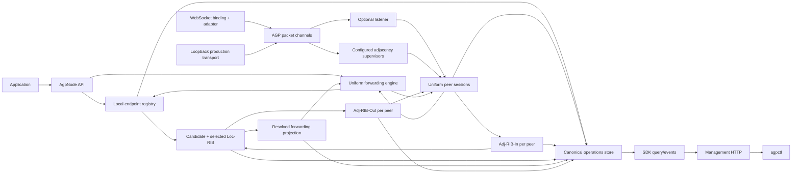

# AGP uniform node - architecture design

## 1. Status and authority

| Field | Value |
|---|---|
| Status | Ratified. This is the current implementation design; gate definitions live in `verification.md` |
| Intent authority | [`DECISIONS.md` section 2](../DECISIONS.md#2-confirmed-intent) |
| Transport intent | [`transport-sovereignty-authority.md`](transport-sovereignty-authority.md), explicit fixed-intent survey bypass approved 2026-07-30 |
| Axiom map | [`axioms.md`](axioms.md) |
| Mechanism index | [`mechanisms.md`](mechanisms.md) |
| Protocol target | AGP v1 replaced in place; legacy compatibility is not required |
| Runtime target | One transport-neutral `createNode()` kernel with canonical production WebSocket and Loopback transports |

This design supersedes the MVP's hub/spoke runtime split and its explicit exclusion of route propagation.\
Existing AGP v1 peers, `createRouter()`, and `createSpoke()` are not compatibility constraints.\
The mechanism index records strict conceptual alignment, adaptations, deliberate departures, and deferred familiar mechanisms; AGP does not claim BGP wire compatibility.

---

## 2. Mandate

AGP topology is assembled from identical `AgpNode` instances.\
A node may accept or initiate packet channels through an injected transport, expose local endpoints, import routes, export selected routes, deliver locally, and forward in transit.\
Configuration determines which capabilities are active; no protocol role, transport kind, or separate implementation makes a node a hub or spoke.

The AGP kernel consumes only a reliable, ordered, duplicate-free, bounded, full-duplex packet-channel contract.\
It never observes carrier framing, addresses, compression, negotiation, security configuration, or native close codes.\
WebSocket and Loopback are equally canonical production transports and must drive the same protocol, FSM, session, routing, and operations behavior.

Every node owns:

1. a local endpoint registry;
2. a per-session imported route table (Adj-RIB-In);
3. a deterministic candidate and selected RIB (Loc-RIB);
4. a resolved forwarding projection;
5. a per-session selected-route export table (Adj-RIB-Out);
6. a uniform session directory for inbound and outbound transports;
7. one canonical, revisioned operational state store.

Every locally originated or received data message consults the same selected RIB.\
No selected usable route means no onward data packet.

---

## 3. Non-negotiable outcomes

| ID | Outcome | Source |
|---|---|---|
| U1 | `createNode()` is the sole runtime factory. | Survey Q1/Q3/Q6 |
| U2 | Listener, dialer, local delivery, and transit behavior compose inside the same implementation. | Confirmed survey composite |
| U3 | Either side of an adjacency can exchange endpoint routes. | Survey Q4(a) |
| U4 | A selected learned route may be exported to other peers for multi-hop transit. | Survey Q4(b) |
| U5 | Ordered path provenance rejects control-plane loops. | Survey Q4(c) |
| U6 | Every data path is gated by the local selected RIB. | Survey Q1(b) |
| U7 | A local route miss rejects before wire admission. | Survey Q5(a) |
| U8 | A transit route miss emits no onward data packet. | Survey Q5(b) |
| U9 | A correlated nonfatal failure travels back toward the source. | Survey Q5(c) |
| U10 | Management HTTP and `agpctl` remain stable where their semantics remain true. | Survey Q6(c) |
| U11 | Every named public data-only DTO-wire, configuration, SDK, operational state, event, and management-has a sovereign, separately inspectable JSON Schema. | Stakeholder direction, 2026-07-30 |
| U12 | Protocol, core, node, routing, and canonical operations contain no concrete-transport semantics or branching. | Transport fixed intent, 2026-07-30 |
| U13 | Every conforming transport drives identical AGP packet, FSM, session, advertisement, RIB, forwarding, and teardown semantics. | Transport fixed intent, 2026-07-30 |
| U14 | Loopback is a canonical production transport for process-local AGP topologies and traverses the complete AGP protocol stack. | Stakeholder approval, 2026-07-30 |
| U15 | WebSocket binding rules and its Node.js implementation are sovereign owners outside the AGP kernel. | Transport fixed intent, 2026-07-30 |

---

## 4. Logical architecture



No arrow permits an adapter to reconstruct canonical state or a session to inspect carrier identity.\
HTTP and CLI are projections of SDK snapshots committed by the node.

---

## 5. Topology is configuration

The minimal public configuration shape is:
```ts
interface NodeConfig {
  nodeId: string;
  listen?: {
    transportRef: string;
  };
  peers?: readonly {
    adjacencyId: string;
    expectedNodeId: string;
    transportRef: string;
    reconnect?: ReconnectPolicy;
  }[];
  transit?: {
    enabled: boolean;
    defaultHopLimit?: number;
  };
  routeRejectionRetry?: {
    initialMs?: number; // default 1000
    maxMs?: number;     // default 30000
  };
  limits?: {
    receiveLimitBytes: number;
    // Other protocol limits remain explicit.
  };
  capacity?: {
    transportReceivePackets?: number; // default 64
    transportReceiveBytes?: number;   // default max(receiveLimitBytes, 4_194_304)
    // Existing maxPendingHandshakes/maxSessions and other capacities remain.
  };
  // Admission and protocol timers remain explicit.
}
```

The node derives the neutral channel limit triple from effective configuration exactly as `maxPacketBytes = receiveLimitBytes`, `maxBufferedPackets = transportReceivePackets ?? 64`, and `maxBufferedBytes = transportReceiveBytes ?? max(receiveLimitBytes, 4_194_304)`.\
An explicit byte capacity below the single-packet limit is synchronously `CONFIG_INVALID`; adapter or native defaults never alter the triple.

Concrete transport configuration is supplied when constructing the injected transport.\
For example, a WebSocket adapter resolves `transportRef` values to capabilities bound to host/port/path or URL records, while a Loopback adapter resolves them to capabilities bound to addresses inside one explicit process-local fabric.\
`@agp/core` validates logical reference shape and `createNode()` resolves each reference once; neither parses or stores either adapter's configuration.

### Canonical peer declaration

One `peers[]` entry declares desired outbound AGP adjacency intent:
```json
{
  "adjacencyId": "hub-primary",
  "expectedNodeId": "hub",
  "transportRef": "peer.hub.primary"
}
```

- `adjacencyId` is the stable node-local identity of the dial/reconnect
  supervisor.
- `expectedNodeId` is the AGP identity required from remote `OPEN`; resolving
  the intended carrier target does not authenticate that identity.
- `transportRef` is a carrier-neutral application-local composition key. It
  SHOULD describe intent, such as `peer.hub.primary`, rather than embed
  `websocket`, a scheme, address, or credential.

Every `adjacencyId` is unique across this node's `peers[]` by exact string equality.\
A duplicate violates `PEER-ADJACENCY-UNIQUENESS-1` and makes `createNode()` fail synchronously with `CONFIG_INVALID` before resolving any transport reference or constructing a partial node.

The embedding application separately supplies the concrete target binding:
```ts
const transport = createNodeWsTransport({
  listeners: [],
  targets: [{
    transportRef: "peer.hub.primary",
    url: "ws://hub.internal.example/agp",
    compression: { mode: "disabled" },
    security: { mode: "trusted-development" },
  }],
});

const node = createNode(nodeConfig, { transport });
```

The factory call is composition pseudocode for the certified trusted-development profile; secure WebSocket capability is deferred under F07.\
A Loopback composition can bind the same `peer.hub.primary` reference to `{ fabricId: "app", address: "hub" }` without changing `NodeConfig`.

`peers[]` is not an inbound allowlist.\
Inbound authority comes from `listen.transportRef`, the acquired channel's observed peer evidence, remote `OPEN`, and `IdentityAdmissionPort`.\
Keeping those concerns separate prevents a dial target, claimed protocol identity, and admission policy from becoming one overloaded peer object.

`listen` and `peers` are independent:

- a leaf may only dial;
- a central star node may only listen;
- a transit node may listen and dial;
- a mesh node may listen and dial several peers;
- an application-local node may expose endpoints without accepting transit.

These are topology descriptions, not roles.\
The controller's internal acquisition record is exactly `kind: dial | accept`; it alone owns reconnect behavior.\
Public `direction: outbound | inbound` is derived exactly as `dial -> outbound`, `accept -> inbound` and remains read-only connection evidence.\
It never controls which protocol messages a peer may send.

Before OPEN identity admission, `connections()` exposes a sovereign pre-identity controller record keyed by its temporarily node-wide local session ID.\
It has no `remoteNodeId`; configured or claimed identity is never presented as admitted fact.\
Successful admission atomically replaces that row with the ordinary pair-scoped session.\
Pre-admission teardown emits `connection.preidentity-closed`; only identity-admitted teardown emits pair-scoped `session.closed`.

### Required example geometries

| Geometry | Purpose |
|---|---|
| Star | Preserve the familiar two-leaf/one-central layout using identical node code and populated RIBs on all nodes |
| Line `A-B-C` | Prove learned-route re-advertisement and two-hop delivery |
| Triangle | Prove path-loop rejection and deterministic single-path selection |
| Diamond | Prove alternate-candidate promotion after selected-path loss without multipath forwarding |
| Process-local Loopback star and line | Prove canonical production composition without sockets while exercising the complete packet codec and node kernel |

Every independent-process example runs the same executable with a different configuration document.\
Loopback examples compose multiple ordinary `AgpNode` instances in one process; they do not use a separate node path.

---

## 6. Package and module composition

Packages are distribution boundaries, not declarations that all code inside a package is one A3 module.

| Package | Distribution responsibility | Demonstrated consumers |
|---|---|---|
| `@agp/protocol` | Sovereign wire schemas plus wire parse, semantic validation, and encode | core, node sessions |
| `@agp/core` | Sovereign configuration/state/event schemas plus deterministic FSM, RIB, clocks, capacity, and canonical operations | node, management |
| `@agp/transport` | Sovereign carrier-neutral acquisition and reliable ordered packet-channel ports, records, and conformance kit | node, transport implementations |
| `@agp/binding-websocket` | Runtime-neutral AGP-v1-over-WebSocket binding rules, schemas, constants, and native-code mappings | WebSocket implementations |
| `@agp/transport-node-ws` | Node.js `ws` implementation of the WebSocket binding and neutral transport ports | applications |
| `@agp/transport-loopback` | Runtime-neutral canonical production transport for process-local AGP fabrics | applications |
| `@agp/node` | Lifecycle composition, endpoints, sessions, forwarding, reverse errors | applications |
| `@agp/management-http` | Sovereign HTTP response schemas and read-only projection of `OperationsReader` | operators |
| `agpctl` | Read-only HTTP client and deterministic table/JSON rendering | operators |

The implementation must preserve these sovereign internal modules:

| Module boundary | One exact concern |
|---|---|
| `protocol/wire-contracts` | Own accepted wire data shape and generated DTOs |
| `protocol/codec` | Convert bounded opaque packet bytes to/from validated UTF-8 JSON envelopes |
| `protocol/semantic-rules` | Evaluate contextual wire rules that JSON Schema cannot express |
| `core/session-fsm` | Transition one peer-session state from one serialized event |
| `core/rib` | Derive imports, candidates, one selected route, FIB, and exports as one routing transaction |
| `core/capacity-ledger` | Reserve and release bounded count/byte/work resources |
| `core/operations-store` | Commit and project immutable canonical state revisions |
| `node/lifecycle` | Own one node instance's one-shot host lifecycle |
| `node/endpoint-registry` | Own local endpoint binding lifetime and dispatch authority |
| `node/composition-root` | Wire the sovereign modules into one `AgpNode` instance |
| `transport/ports` | Define acquisition and packet-channel capabilities |
| `transport/contracts` | Own peer evidence, terminal causes, references, limits, and observable transport records |
| `transport/conformance` | Prove every implementation against the same behavioral profile |
| `binding-websocket` | Map AGP packets and neutral terminal intents to RFC 6455 without kernel leakage |
| `transport-node-ws/adapter` | Implement the WebSocket binding with Node.js `ws` |
| `transport-loopback/fabric` | Own isolated process-local addressing, listeners, channels, bounds, and shutdown |
| `management/projection` | Wrap one `OperationsReader` result in its exact HTTP contract |
| `agpctl/http-driver` | Perform bounded read-only management requests |
| `agpctl/templates` | Render validated response documents without routing logic |

Internal module boundaries are not automatically public exports.\
A stable surface is exported only where the consumer column demonstrates a consumer; tests import public contracts or same-module test seams, never another module's private implementation.

A root AGP v1 schema catalog composes the package-owned catalogs.\
It is an assembly manifest, not an alternate owner or a source of copied definitions.

`@agp/router` and `@agp/spoke` retire.\
Code that is useful to the uniform node is moved once to its one-concern owner; the new node must not wrap both old implementations.

Dependency direction is:
```text
@agp/core ───────────────-> @agp/protocol
    └────────────────────-> @agp/transport

@agp/node ───────────────-> @agp/core
    ├────────────────────-> @agp/protocol
    └────────────────────-> @agp/transport

@agp/binding-websocket ──-> @agp/transport
@agp/transport-node-ws ──-> @agp/binding-websocket + @agp/transport + ws
@agp/transport-loopback ─-> @agp/transport
@agp/management-http ────-> @agp/core (OperationsReader + state DTOs)
agpctl ───── read-only HTTP ─────-> @agp/management-http
```

An arrow means "consumes."\
The management adapter does not depend on node internals: an application supplies the public `OperationsReader`.\
Adapters depend on public contracts only.\
No package imports another package's `src/` or private symbol.

---

## 7. Canonical processing paths

### 7.1 Local endpoint registration

1. `expose(endpoint, handler)` validates the endpoint and creates one active
   binding.
2. The routing transaction installs a local candidate.
3. Selection and forwarding recompute.
4. Every affected Adj-RIB-Out recomputes its desired selected-route snapshot.
5. Endpoint, RIB, forwarding, and export state commit at one operations
   revision.

Closing the binding performs the inverse transaction before later data is admitted.

### 7.2 Adjacency establishment

1. A configured transport listener accepts or an adjacency supervisor connects
   through a logical `transportRef`.
2. The transport yields an already-acquired conforming packet channel; binding
   negotiation is complete and carrier details remain private.
3. The same peer-session controller runs the BGP-inspired FSM.
4. Both nodes exchange `OPEN`, negotiate limits, exchange transit policy, and reach
   `Established`.
5. Both nodes send their current authoritative route snapshot, which may be
   empty.
6. Each accepted snapshot replaces only the importing session's Adj-RIB-In.
7. Selection, forwarding, and downstream exports converge.

Internal acquisition kind affects reconnect ownership only.\
A `dial` acquisition for a configured adjacency is supervised and retried; an `accept` acquisition is not redialed by its session controller.\
Public direction is only the fixed read-only projection described in section 5.

### 7.3 Local send

1. Validate payload, source binding, destination, and caller options.
2. Prove the source is the selected local route.
3. Resolve the destination through the selected RIB and forwarding projection.
4. If absent or unusable, reject `send()` with typed `NO_ROUTE` before
   reserving a wire queue slot.
5. For a peer next hop, validate the encoded packet against the egress receive
   bound.
6. Prove that a selected route for the same source identity is in that peer's
   acknowledged Adj-RIB-Out; otherwise reject with typed
   `SOURCE_NOT_ADVERTISED` before writing data.
7. Reserve exact bounded handler capacity for local delivery, or atomically
   reserve peer breadcrumb/egress capacity and then allocate the next
   non-reusing hop-scoped return token as the final infallible step.
8. Admit exactly one local handler delivery or one peer-session write and
   return a receipt naming the selected route and operations revision used for
   admission. It does not claim end-to-end delivery.

### 7.4 Transit forwarding

1. Parse and validate the complete data message.
2. Validate the source origin against a feasible route learned from the ingress
   peer.
3. Resolve the destination through the same selected RIB used by local send;
   if absent, enqueue no onward data and initiate correlated `NO_ROUTE`.
4. If the selected destination is local, reserve and deliver without transit
   permission or hop decrement.
5. For nonlocal forwarding, require transit permission, remaining hop budget,
   an Established egress distinct from ingress, egress size fit, and an ACKed
   export for the same source identity.
6. Atomically reserve breadcrumb and egress capacity, allocate the next fresh
   non-reusing hop-scoped return token as the final infallible step, decrement
   the hop limit, and enqueue exactly one onward packet.

There is no broadcast, flood, or implicit default next hop.

### 7.5 Session loss

1. Move the session out of `Established` before route mutation.
2. Atomically remove its complete Adj-RIB-In, invalidate its complete
   Adj-RIB-Out, and resolve or remove every affected reverse breadcrumb.
3. Recompute affected candidates, selected routes, forwarding entries, and
   exports to every remaining peer.
4. Publish the one revision before admitting later affected data.
5. The configured adjacency supervisor, if any, schedules a fresh session.

---

## 8. Global invariants

1. There is one node implementation and one peer-session implementation.
2. Every active local binding has exactly one local candidate.
3. Every learned candidate is owned by exactly one local peer session.
4. Every selected route has exactly one resolved forwarding entry, and every
   forwarding entry identifies exactly one selected route.
5. Every learned selected path begins at `originNodeId` and ends at the local
   node.
6. A node never installs or exports a path containing the same node ID twice.
7. A route is never exported to a peer whose node ID already appears in its
   path.
8. Every data write names a selected route valid at its admission revision.
9. A route miss produces zero onward data packets.
10. Session loss removes all and only state owned by that session before later
    affected data is admitted.
11. Every named public data-only DTO resolves to one sovereign schema ID.
12. SDK, HTTP, and CLI views never derive conflicting state from private
    runtime objects.
13. The kernel cannot branch on transport kind, address, binding protocol, or
    native terminal code.
14. A Loopback packet traverses the same encode, decode, FSM, session, RIB, and
    forwarding path as a WebSocket packet.
15. Every accepted packet channel satisfies the one neutral transport profile
    before the node can adopt it.

---

## 9. Scope boundary

Included:

- symmetric selected-route exchange;
- selected learned-route propagation;
- ordered node path and loop rejection;
- deterministic single best path;
- bounded data hop limit;
- local and transit route-miss behavior;
- one runtime API and same-code topology assembly;
- sovereign carrier-neutral transport contract;
- canonical production WebSocket and Loopback transports;
- reusable transport conformance kit;
- queryable RIB/forwarding/export state on every node;
- sovereign wire, configuration, SDK, operational-state, event, and management
  schemas.

Deferred:

- multipath forwarding;
- route metrics, local preference, communities, or arbitrary policy
  attributes;
- durable message queues or delivery guarantees;
- persistence of sessions or learned routes;
- legacy AGP v1 or old-factory compatibility;
- additional network transports, raw datagram semantics, carrier selection, or
  on-wire transport negotiation;
- secure WebSocket deployment (`wss:`, TLS, client certificates, and HTTP
  upgrade authentication) until sovereign security configuration, capability,
  peer-evidence, and conformance contracts are separately authorized;
- production identity and authorization mechanisms beyond the existing
  injected admission ports;
- mutating CLI administration.

---

## 10. Mechanics, rationale, and consequence

### Mechanics

The design replaces role branches with capability composition, inserts one sovereign packet-channel contract beneath every peer session, makes RIB resolution the only data path, uses full per-peer selected-route snapshots for control convergence, and commits all derived state through one revisioned operations store.

### Rationale

A spoke with an implicit upstream does not know reachability; it delegates the decision.\
Giving every process a RIB while retaining that behavior would be a cosmetic unification.\
Symmetric selected-route exchange makes each node capable of local reasoning and lets arbitrary topologies emerge from configuration without another fundamental rewrite.\
A transport-neutral packet boundary makes that same statement true beneath the session: process-local and network composition differ only in the injected transport.

### Consequence of violation

- Retaining separate session/data paths recreates hub/spoke under new names.
- Allowing any send to bypass the RIB reintroduces implicit default routing.
- Propagating routes without ordered paths creates stable control-plane loops.
- Persisting derived live state creates phantom sessions and stale forwarding.
- Reconstructing operations in adapters produces multiple truths.
- Letting transport bindings leak into core configuration, protocol parsing,
  FSM guards, or close behavior makes substitution cosmetic.
- Letting Loopback bypass packet encoding or session machinery creates a second
  protocol implementation disguised as an optimization.

---

## 11. Design set

- [`axioms.md`](axioms.md) - strict applicability and conformance gates
- [`mechanisms.md`](mechanisms.md) - feature index, RFC alignment, deliberate
  departures, and deferred mechanisms
- [`DECISIONS.md`](../DECISIONS.md) - required and ratified decision register
- [`transport-sovereignty-authority.md`](transport-sovereignty-authority.md) -
  fixed intent and explicit survey bypass
- [`traceability.json`](traceability.json) - machine-checkable intent,
  decision, contract, rule, test, and gate ownership
- [`contracts.md`](contracts.md) - sovereign schema ownership and catalog
- [`protocol.md`](protocol.md) - carrier-independent packet language and
  symmetric adjacency behavior
- [`transport-contract.md`](transport-contract.md) - neutral acquisition,
  packet-channel, bounds, evidence, and terminal contract
- [`binding-websocket.md`](binding-websocket.md) - AGP v1 WebSocket binding
- [`transport-loopback.md`](transport-loopback.md) - canonical production
  process-local transport
- [`fsm.md`](fsm.md) - exact connection states, timers, events, and teardown
- [`routing.md`](routing.md) - RIB model, selection, propagation, and data
  forwarding
- [`sdk-operations.md`](sdk-operations.md) - public API and canonical state
- [`verification.md`](verification.md) - layered and chaos certification
