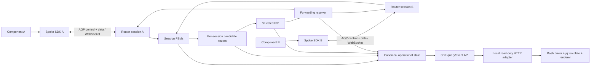

# Agent Gateway Protocol MVP — System Design

| Field | Value |
|---|---|
| Status | Proposed |
| Date | 2026-07-29 |
| Design authority | Project-owner intent captured in the AGP MVP survey |
| Planning input | [`surveys/agent-gateway-protocol-mvp-survey.md`](../../../surveys/agent-gateway-protocol-mvp-survey.md) |
| Scope | Contract and architecture for an embeddable single-hub AGP MVP |

## 1. Executive summary

Agent Gateway Protocol (AGP) is an application-layer routing protocol carried
over WebSockets. It combines control-plane signalling and data-plane JSON
messaging on one persistent connection. Spokes establish protocol sessions with
one hub router, advertise named endpoints, and exchange JSON data envelopes
through routes selected by the hub.

The MVP proves one hub with multiple directly connected spokes. Its route model
and forwarding API use abstract next hops and distinguish local from learned
route forms so future multi-hop work can extend the model. Router-to-router
peering, inter-router propagation, path-vector selection, and loop prevention
are explicitly deferred.

Correctness and operational transparency are co-equal release gates. The same
canonical state that drives the router is queryable through the SDK, projected
through an optional local read-only HTTP adapter, and rendered by a minimal
decoupled Bash/`jq` CLI.

## 2. Intent traceability

| Survey evidence | Design consequence |
|---|---|
| Q1 `a,c` — protocol credibility and operational transparency | FSM transitions, route decisions, and forwarding results are specified, tested, and queryable. |
| Q2 `a,c` — application developers and operators | The public surface contains both endpoint messaging APIs and immutable operational views. |
| Q3 `b,c` — layered foundations and contract-first | Wire schemas, transition tables, data models, and public interfaces precede implementation. |
| Q4 `a,b` — generic next hop and extensible RIB | No endpoint-to-WebSocket coupling; route records distinguish origin classes and admit optional future path attributes. |
| Q5 `a,b` — continuous skeleton and explicit gates | A hub-and-two-spoke topology remains runnable as transport, FSM, routing, forwarding, and operations are added. |
| Q6 `b` — local read-only HTTP adapter | The CLI queries an SDK-backed local HTTP projection and contains no protocol or mutation logic. |

### 2.1 Survey design-flag resolution

| Survey flag | Design resolution |
|---|---|
| F1 — runtime and package boundaries | Proposed TypeScript/Node reference runtime with sovereign protocol, core, transport, role, management, and CLI packages; wire/schema remain language-neutral. |
| F2 — BGP-modelled WebSocket FSM | Six-state transition tables define semantic transport events, timers, liveness, retry, teardown, and conformance cases. |
| F3 — endpoint identity and route selection | Canonical exact endpoint grammar, stable node/session identities, visible duplicate candidates, and deterministic local/lexical selection are fixed. |
| F4 — envelope and delivery semantics | Versioned schemas, code taxonomies, correlation, local-admission receipts, limits, backpressure, and explicit development/secure transport postures are fixed. |
| F5 — route and operations boundary | Advertisement, candidate, selected, next-hop, forwarding, snapshot, event, resource, and counter contracts are independently defined and revisioned. |
| F6 — local HTTP boundary | The adapter is optional, loopback-only, read-only, lifecycle-bound, resource-bounded, redacted, and receives only `OperationsReader`. |

## 3. Governing principles

1. **Correctness is a public contract.** Protocol behaviour is defined through
   schemas, state transitions, invariants, and observable failure semantics.
2. **Operability is part of the product.** Configuration and runtime state are
   modelled explicitly and exposed without leaking mutable internals.
3. **Defer behaviour, preserve the model.** The MVP does not implement
   inter-router routing, but its RIB and next-hop boundaries do not assume all
   destinations are directly connected forever.
4. **Integrate continuously at explicit gates.** Layered ownership does not
   postpone live composition.
5. **One state model, many read-only views.** SDK, HTTP, CLI, tests, and events
   observe the same canonical state.

## 4. Scope

### 4.1 Included

- A language-neutral AGP version 1 JSON wire contract over WebSockets.
- Control-plane and data-plane envelopes on the same WebSocket session.
- A BGP-inspired `Idle`, `Connect`, `Active`, `OpenSent`, `OpenConfirm`, and
  `Established` protocol FSM adapted to WebSocket events.
- A stable `nodeId`, a reconnect-scoped node-local `sessionId`, and an
  internal-only WebSocket `transportId`; socket addresses are never
  identities.
- Direct-spoke endpoint announcement and withdrawal.
- Per-session candidate routes, deterministic selected routes, and forwarding
  resolution through an abstract next hop.
- Bidirectional routing of generic JSON data envelopes.
- A router SDK, a spoke SDK, immutable query snapshots, and structured events.
- An optional local read-only HTTP management adapter.
- Minimal read-only connection and route CLI views with table and JSON output.
- Contract, FSM, RIB, integration, and observability verification.

### 4.2 Excluded

- Router-to-router sessions and route propagation.
- Multi-hop forwarding, path-vector best-path policy, and loop prevention.
- Production remote administration or any mutating CLI operation.
- Additional language SDK implementations.
- Durable message queues, broker semantics, or exactly-once delivery.
- Application-specific controllers, payload schemas, or business logic.

## 5. Logical architecture



### 5.1 Component responsibilities

| Component | Owns | Does not own |
|---|---|---|
| Protocol package | Envelope schemas, codecs, validation, protocol error taxonomy | WebSocket creation, routing policy, application payload meaning |
| Session core | FSM, protocol timers, negotiation, liveness, state transition events | Route selection, CLI formatting |
| WebSocket adapter | Dial/accept/send/close primitives and transport events | Peer identity, protocol state, route state |
| Routing core | Advertisements, candidate routes, selection, withdrawals, next-hop resolution | Socket lifecycle, payload business logic |
| Router SDK | Composition of listener, sessions, routing, forwarding, queries | Production management plane |
| Spoke SDK | Connection lifecycle, endpoint registration, send/receive API, local queries | Hub route selection |
| HTTP adapter | Read-only serialization of canonical query snapshots | State ownership or mutations |
| CLI | HTTP retrieval and deterministic JSON/table presentation | Protocol, routing, or state derivation |

### 5.2 Canonical terminology

| Term | Meaning and lifetime |
|---|---|
| Node | One configured AGP participant. Its opaque `nodeId` is stable across reconnects and may survive process restarts. |
| Role | The MVP protocol role of a node: `hub` or `spoke`. The hub composes the router; role does not imply a future router-to-router contract. |
| Session | One local AGP FSM lifecycle, identified by a new node-local `sessionId` for every reconnect attempt. The reference default is six lowercase hex; remote identity/provenance uses `(nodeId, sessionId)`. |
| Transport | One concrete WebSocket used by a session. Its `transportId` is adapter-internal and never enters wire, routing, or public query contracts. |
| Peer | The node at the other end of a session; a relationship, not a separate identity namespace. |
| Endpoint | An exact, named application destination owned locally or advertised by one or more established sessions. |
| Advertisement | A session-owned endpoint-reachability claim received by the hub. |
| Candidate route | One eligible or ineligible routing choice derived from a local binding or received advertisement; optional future attributes are inert in the MVP. |
| Selected route | The deterministic winner for an endpoint in the RIB. |
| Next hop | A tagged routing reference resolved separately to an active local binding or established peer session; never a WebSocket object. |
| Forwarding entry | The current endpoint-to-selected-route/next-hop projection used by the data plane. |

## 6. Canonical processing paths

### 6.1 Session establishment

1. A configured spoke starts its protocol session.
2. The WebSocket adapter opens a transport connection to the hub.
3. Both sides exchange and validate AGP `OPEN` control messages.
4. Both sides confirm readiness through `KEEPALIVE`.
5. The protocol session enters `Established`; operational state publishes the
   transition and reason.

### 6.2 Endpoint reachability

1. An established spoke sends its complete locally owned endpoint set, which
   may be empty to withdraw all reachability.
2. The router validates the update against session state and endpoint policy.
3. Advertisements and candidate routes are mutated atomically for the affected
   endpoint/session scope.
4. The selection function recomputes the selected route.
5. Forwarding resolution points the endpoint at a tagged local-binding or
   peer-session next hop.
6. The router sends the matching endpoint control-plane acknowledgement only
   after that transaction commits.
7. Query snapshots and events reflect endpoint-export, candidate, selected,
   and forwarding changes.

### 6.3 Data forwarding

1. An established sender submits a validated data envelope.
2. The router verifies source ownership and resolves the destination through
   the selected RIB and forwarding view.
3. A local next hop must resolve to an active bounded handler binding; a
   session next hop must resolve to an `Established` peer session.
4. The application payload is admitted to that local handler or sent unchanged
   in an AGP data envelope to the peer session.
5. Success/failure counters and structured events are updated.

A successful SDK `send()` reports only bounded local queue admission. A local
router send can identify the selected route used at that linearization point;
a spoke can identify only its hub session. It cannot claim that the hub found a
destination or that a remote handler ran. Unknown destination or unavailable
next hop at the hub produces a correlated, nonfatal delivery error and
operational event. Source-endpoint spoofing is a fatal protocol violation.
Previously claimed-but-uninstalled data is instead rejected recoverably using
the bounded latest-rejection context.

### 6.4 Session loss

1. Transport closure, hold expiry, protocol error, or administrative stop moves
   the session out of `Established`.
2. Every advertisement and candidate route owned by that session is withdrawn
   atomically.
3. Selection and forwarding are recomputed before further data is accepted for
   affected endpoints.
4. The spoke follows the configured retry policy; the accepted hub controller
   terminates and the independent listener accepts any replacement. Diagnostic
   retention is bounded.

## 7. Proposed implementation structure

The wire contract is language-neutral. The proposed MVP reference runtime is
TypeScript on Node.js, recorded as a reversible decision in
[`decisions/0001-reference-runtime.md`](decisions/0001-reference-runtime.md).
The implementation should be created in a clean worktree or project directory;
the existing prototype directories remain reference-only.

```text
agp-mvp/
  packages/
    protocol/          JSON schemas, codecs, validation, shared public types
    core/              FSM, clocks/timers, RIB, forwarding, canonical events
    transport/         runtime-neutral dial/listen/connection ports
    transport-node-ws/ Node WebSocket implementation of the transport ports
    router/            hub composition and listener/session orchestration
    spoke/             client composition and endpoint-facing API
    management-http/   optional read-only HTTP projection
  examples/
    walking-skeleton/  one hub and two spokes
  cli/
    cmd.*.sh
    drv/
    tpl/
  test/
    conformance/
    integration/
```

Package boundaries are sovereign: each package declares its own public API and
depends only toward the protocol/core layers. Application-specific code never
enters protocol, session, or routing packages.

## 8. Detailed specifications

- [Wire protocol](protocol.md)
- [Connection finite-state machine](fsm.md)
- [Routing information base and forwarding](routing.md)
- [SDK, HTTP adapter, and CLI](sdk-operations.md)
- [Verification strategy and integration gates](verification.md)

## 9. Design decisions

- [ADR-0001 — TypeScript/Node reference runtime](decisions/0001-reference-runtime.md)
- [ADR-0002 — Single-hub runtime with a multi-hop-ready route model](decisions/0002-single-hub-multihop-ready-model.md)
- [ADR-0003 — Canonical SDK state with a local read-only HTTP projection](decisions/0003-read-only-operations.md)
- [ADR-0004 — Contract-first layers with continuous integration gates](decisions/0004-contract-first-continuous-integration.md)
- [ADR-0005 — Node, session, and transport identity lifetimes](decisions/0005-identity-lifetimes.md)
- [ADR-0006 — Local admission is not remote delivery](decisions/0006-local-admission-delivery-semantics.md)

## 10. Review gates

| Gate | Evidence required |
|---|---|
| D1 — Contract review | Vocabulary, JSON schemas, protocol errors, SDK interfaces, and HTTP resources agree. |
| D2 — FSM review | Complete transition table, timer model, invalid-event policy, and state-query DTO. |
| D3 — Routing review | Candidate/selected/forwarding invariants and deterministic selection cases. |
| D4 — Skeleton review | One hub and two spokes establish simultaneously using the proposed interfaces. |
| D5 — Reachability review | Direct advertisements install, select, expose, and withdraw routes correctly. |
| D6 — Data review | Bidirectional JSON forwarding and all failure paths are observable. |
| D7 — Operations review | SDK, HTTP, CLI JSON, and CLI tables agree on canonical state. |

## 11. Design-review confirmations and deferred choices

The detailed tracks now make concrete Proposed choices for owner review:

- lowercase exact endpoint names with slash-separated segments and a negotiated
  maximum of 256 active endpoints per session;
- duplicate candidates retained visibly, with local preferred and then
  unsigned lexical `originNodeId`/`originSessionId` ordering;
- a 30-second default hold timer, one-third keepalive interval, 10-second OPEN
  timeout, and bounded exponential reconnect for spokes only;
- deployment-unique opaque message IDs, JSON-object payloads, local-admission
  send receipts, correlated failure but no data/application-delivery success
  ACK, replay, or durability; the mandatory endpoint ACK confirms only a
  control-plane set commit;
- finite session, route, queue, callback, subscriber, history, parser, and HTTP
  response bounds;
- mandatory explicit identity admission, using authenticated binding or a
  visibly weaker development trust policy;
- a built-in WebSocket adapter limited to explicit loopback development use,
  with `wss:` credentials/TLS delegated to an injected secure transport
  adapter for non-loopback deployments;
- loopback-only read-only management HTTP and no mutating CLI;
- TypeScript/Node as the reference runtime, with browser support deferred.

Implementation planning still selects exact Node/dependency versions, package
publication names, the clean implementation worktree location, production
credential adapters, and deployment-specific endpoint namespace rules. Those
choices do not alter the Proposed wire/FSM/RIB/SDK contracts.

## 12. Definition of design completion

The design is complete when:

1. All detailed documents and schemas are internally consistent.
2. Every survey-derived requirement maps to a specified component and
   verification case.
3. Every public entity has one owner, lifecycle, immutable query form, and
   stable identifier.
4. Every FSM event and route mutation has a deterministic observable outcome.
5. The walking-skeleton gates can be implemented without inventing protocol or
   package behaviour.
6. Deferred multi-hop work can extend the route/next-hop model without altering
   MVP application-facing messaging semantics.
