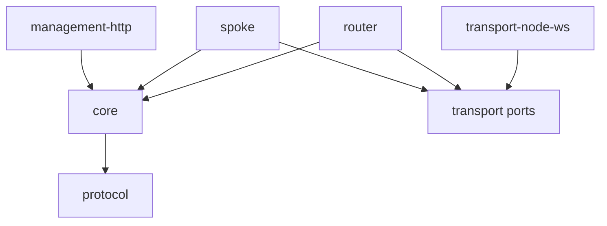

# AGP MVP — SDK, Operations, HTTP Adapter, and CLI

| Field | Value |
|---|---|
| Status | Proposed |
| Date | 2026-07-29 |
| Reference runtime | TypeScript on Node.js |
| Wire authority | [`protocol.md`](protocol.md), which remains language-neutral |
| Routing authority | [`routing.md`](routing.md) |
| Planning input | [AGP MVP survey](../../../surveys/agent-gateway-protocol-mvp-survey.md) |

## 1. Purpose and design position

This document specifies the public reference-SDK and read-only operational
surfaces for the AGP MVP. It does not redefine the wire protocol, connection
FSM, or RIB. It defines how application code constructs and drives those
capabilities, and how operators inspect their canonical state.

The design follows the captured intent:

- Q1 `a,c`: protocol correctness and operational transparency are release
  gates, so successful message delivery is insufficient without inspectable
  FSM and routing state.
- Q2 `a,c`: application developers and operators are both direct consumers, so
  messaging and operational queries are separate first-class SDK surfaces.
- Q3 `b,c`: public types and lifecycle contracts are fixed before layered
  implementation.
- Q4 `a,b`: application APIs resolve through a route and abstract `NextHop`;
  they never expose an endpoint-to-WebSocket map.
- Q5 `a,b`: the same APIs support the continuously runnable hub-and-two-spoke
  skeleton.
- Q6 `b`: a local read-only HTTP adapter projects SDK snapshots for a
  decoupled CLI.

The primary rule is **one state model, many read-only views**. Internal state is
owned by the SDK composition root. SDK queries return detached immutable
snapshots; HTTP serializes those snapshots; the CLI only retrieves and renders
them.

## 2. Reference-runtime and sovereignty rules

TypeScript on Node.js is the MVP reference implementation, as recorded in
[ADR-0001](decisions/0001-reference-runtime.md). The wire definitions are JSON
Schema plus language-neutral prose. TypeScript types are a binding of those
contracts, not the contracts themselves.

For this design, a **sovereign package**:

1. has an explicit documented export surface;
2. can be installed and imported without copying repository source;
3. owns no application-specific controller, payload, or presentation logic;
4. does not rely on repository-relative runtime paths or another package's
   private fields;
5. depends only down the declared dependency graph;
6. can be tested through its public API and injected ports; and
7. can be versioned without requiring consumers to import an umbrella package.

The local prototypes demonstrate useful lifecycle-event and role-composition
ideas in [`websocket/peerGroup.js`](../../../websocket/peerGroup.js), but also
show why sovereignty needs a hard boundary: peer identity currently depends on
private `ws._socket` fields and remote messages can mutate peer objects through
unchecked `Object.assign` in
[`websocket/router.js`](../../../websocket/router.js). Neither behaviour enters
the new SDK.

## 3. Package map and dependency direction

Publication names are placeholders until implementation planning; directory
responsibilities are normative.

```text
packages/
  protocol/          language-neutral schemas, codecs, validation, public DTOs
  core/              FSM, RIB, forwarding, clocks, canonical state/events
  transport/         transport ports only; no concrete WebSocket dependency
  transport-node-ws/ Node WebSocket dial/listen adapter
  router/            hub-router SDK composition and public Router API
  spoke/             spoke SDK composition and public Spoke API
  management-http/   optional loopback read-only adapter
```



| Package | Public responsibility | Must not own |
|---|---|---|
| `protocol` | Versioned envelope DTOs, JSON value type, validators, codecs, protocol error codes | WebSocket objects, timers, routing maps, Node-only APIs |
| `core` | Session/FSM and route engines, abstract `NextHop`, immutable query DTOs, events, injected clock/ID ports | Network listeners, Bash rendering, application handlers |
| `transport` | `TransportConnection`, dialer, listener, bounded-send result, transport events | Protocol negotiation or peer identity |
| `transport-node-ws` | Node WebSocket implementation of transport ports | FSM, route selection, application payload semantics |
| `router` | Listener/session/RIB/forwarder composition, local endpoints, operational facade | HTTP server or CLI formatting |
| `spoke` | Dial/reconnect composition, endpoint registration, send/receive, local operational facade | Hub route policy |
| `management-http` | Loopback HTTP lifecycle and serialization of `OperationsReader` | Canonical state, mutations, authentication service |

The Node WebSocket adapter is injected into router and spoke factories. Core
tests therefore run without real sockets, while integration tests use actual
WebSockets. A future browser adapter may implement the same transport port
without changing protocol or routing packages; browser support itself is not an
MVP commitment.

The split follows the useful separation sketched in
[`graph-client-v2/graph-client-notes.txt`](../../../graph-client-v2/graph-client-notes.txt):
controller/state, programmable API, translation, and presentation are
different responsibilities. It avoids the application/transport entanglement
visible in
[`websocket-router/router.js`](../../../websocket-router/router.js).

## 4. Public value conventions

All public DTOs follow these rules:

- identifiers are opaque non-empty strings; consumers compare but do not parse
  them;
- protocol timestamps are RFC 3339 UTC strings;
- durations are integer milliseconds;
- JSON counters are non-negative base-10 strings, avoiding precision loss in
  runtimes whose JSON numbers cannot represent arbitrarily large integers;
- optional values are absent, not `null`, unless the schema expressly says
  `null`;
- enums are closed for a protocol/API major version;
- secrets, credentials, raw socket objects, callbacks, JavaScript `Error`
  objects, and mutable `Map`/`Set` values never appear in a snapshot;
- every payload accepted as `JsonObject` is validated at runtime—TypeScript
  declarations alone are not a trust boundary.

```ts
export type JsonPrimitive = null | boolean | number | string;
export type JsonValue =
  | JsonPrimitive
  | readonly JsonValue[]
  | { readonly [key: string]: JsonValue };
export type JsonObject = { readonly [key: string]: JsonValue };

export type NodeId = string;
export type SessionId = string;
export type EndpointName = string;
export type RouteId = string;
export type MessageId = string;
export type Revision = string;     // non-negative decimal integer
export type CounterValue = string; // non-negative decimal integer
export type Timestamp = string;    // RFC 3339 UTC

export type ConnectionState =
  | "Idle"
  | "Connect"
  | "Active"
  | "OpenSent"
  | "OpenConfirm"
  | "Established";

export type NextHopRef =
  | { readonly kind: "local"; readonly bindingId: string }
  | {
      readonly kind: "session";
      readonly nodeId: NodeId;
      readonly owningSessionId: SessionId;
    };

export type SelectedReason =
  | "ONLY_ELIGIBLE"
  | "PREFER_LOCAL"
  | "LOWEST_ORIGIN_NODE_ID"
  | "LOWEST_ORIGIN_SESSION_ID";

export type CandidateSelectionReason =
  | SelectedReason
  | "DUPLICATE_NOT_SELECTED"
  | "LOCAL_BINDING_INACTIVE"
  | "ADVERTISEMENT_INACTIVE"
  | "SESSION_NOT_ESTABLISHED"
  | "NEXT_HOP_UNRESOLVED";

export type NotificationCode =
  | "CEASE"
  | "UNSUPPORTED_VERSION"
  | "INVALID_MESSAGE"
  | "UNEXPECTED_MESSAGE"
  | "ROLE_MISMATCH"
  | "IDENTITY_REJECTED"
  | "IDENTITY_COLLISION"
  | "HOLD_TIMEOUT"
  | "ENDPOINT_CAPACITY_MISMATCH"
  | "UPDATE_REVISION_ERROR"
  | "SOURCE_NOT_OWNED"
  | "INTERNAL_ERROR";

export type RecoverableErrorCode =
  | "ENDPOINT_REJECTED"
  | "NO_ROUTE"
  | "SOURCE_NOT_ACTIVE"
  | "SOURCE_NOT_SELECTED"
  | "DESTINATION_UNAVAILABLE"
  | "DESTINATION_LIMIT_EXCEEDED"
  | "BACKPRESSURE";

export type ConnectionEvent =
  | "StartDial"
  | "StartAccept"
  | "Stop"
  | "TransportOpened"
  | "TransportAccepted"
  | "TransportFailed"
  | "TransportClosed"
  | "TransportInputRejected"
  | "InboundAdmissionOverflow"
  | "OpenReceived"
  | "KeepaliveReceived"
  | "EndpointUpdateReceived"
  | "EndpointAckReceived"
  | "DataReceived"
  | "ErrorReceived"
  | "NotificationReceived"
  | "VersionMismatch"
  | "InvalidMessage"
  | "UnexpectedMessage"
  | "LocalEndpointsChanged"
  | "EndpointUpdateWritten"
  | "RevisionRolloverRequired"
  | "ControlQueueOverflow"
  | "IdentityAdmissionResolved"
  | "EndpointAdmissionResolved"
  | "AdmissionExpired"
  | "AdmissionFaulted"
  | "LocalDataSubmitted"
  | "RetryExpired"
  | "OpenExpired"
  | "KeepaliveExpired"
  | "HoldExpired"
  | "EndpointWriteExpired"
  | "EndpointResponseExpired";

export type LifecycleReasonCode =
  | "START_REQUESTED"
  | "STARTED"
  | "START_ABORTED"
  | "STOP_REQUESTED"
  | "STOPPED"
  | "START_FAILED"
  | "STOP_FAILED";

export type SessionOutcomeCode =
  | "PEER_CONFIRMED"
  | "RETRY_SCHEDULED"
  | "RETRY_DISABLED"
  | "CONTROL_QUEUE_OVERFLOW"
  | "INBOUND_ADMISSION_OVERFLOW"
  | "HANDSHAKE_CAPACITY_REJECTED"
  | "SESSION_CAPACITY_REJECTED"
  | "STOPPING_REJECTED";

export type SessionReasonCode =
  | ConnectionEvent
  | NotificationCode
  | RecoverableErrorCode
  | AgpErrorCode
  | TransportFailureCode
  | SessionOutcomeCode;

export type RouteReasonCode =
  | CandidateSelectionReason
  | "NO_ELIGIBLE_ROUTE"
  | "ADVERTISEMENT_WITHDRAWN"
  | "SESSION_WITHDRAWN"
  | "LOCAL_BINDING_CLOSED";

export type QueueResourceCode =
  | "outbound.data"
  | "inbound.data"
  | "endpoint.readiness"
  | "handler.concurrency"
  | "handler.bytes"
  | "urgent.control"
  | "event.subscribers"
  | "listener.handshakes"
  | "listener.sessions"
  | "management.requests";

export type QueuePressureReasonCode =
  | "QUEUE_FULL"
  | "BACKPRESSURE"
  | "CONTROL_QUEUE_OVERFLOW"
  | "INBOUND_ADMISSION_OVERFLOW"
  | "LOCAL_HANDLER_BACKPRESSURE"
  | "CONCURRENCY_LIMIT";

export type TransportFailureCode =
  | "DIAL_FAILED"
  | "HANDSHAKE_FAILED"
  | "SUBPROTOCOL_MISMATCH"
  | "BINARY_MESSAGE"
  | "INVALID_UTF8"
  | "MESSAGE_TOO_LARGE"
  | "WRITE_FAILED"
  | "WRITE_TIMEOUT"
  | "CLOSE_TIMEOUT"
  | "REMOTE_CLOSED"
  | "FORCE_ABORTED"
  | "ADAPTER_FAULT";

export interface SnapshotMeta {
  readonly schemaVersion: "agp.operations/v1";
  readonly nodeId: NodeId;
  readonly role: "hub" | "spoke";
  readonly capturedAt: Timestamp;
  readonly revision: Revision;
}
```

The runtime numeric profile is finite IEEE-754 binary64. Integer-valued JSON
numbers must be within `[-9007199254740991, 9007199254740991]`; applications
encode larger integers or exact decimal quantities as strings. Runtime
validation applies this recursively before admission, so the TypeScript
`number` binding cannot silently corrupt a conforming payload.

`ConnectionState` and `NextHopRef` are public re-exports of the authoritative
FSM and routing contracts. They are repeated here to make the SDK package
surface complete; generated declarations must not invent different variants.

Configuration is copied and validated at construction. Subsequent mutation of
the caller's input has no effect. Query configuration is sanitized and never
contains bearer tokens, private keys, cookies, or arbitrary authentication
material.

## 5. SDK composition and common lifecycle

### 5.1 Construction

Factories construct inert instances. They validate static configuration but do
not open sockets, start timers, or register signal handlers.

```ts
export function createRouter(
  config: RouterConfig,
  dependencies?: RouterDependencies,
): AgpRouter;

export function createSpoke(
  config: SpokeConfig,
  dependencies?: SpokeDependencies,
): AgpSpoke;
```

The default dependency set is appropriate for the Node reference runtime.
Tests and advanced embedders may inject clocks, ID sources, log sinks, and
transport factories. Dependency injection must not permit bypassing protocol
validation or RIB invariants.

### 5.2 Host lifecycle versus session FSM

Host lifecycle is deliberately distinct from the BGP-inspired connection FSM.

```ts
export type HostState =
  | "Created"
  | "Starting"
  | "Running"
  | "Stopping"
  | "Stopped"
  | "Failed";

export interface StartOptions {
  readonly signal?: AbortSignal;
}

export interface StopOptions {
  readonly drainTimeoutMs?: number;
}

export interface StartedInstance {
  readonly nodeId: NodeId;
  readonly startedAt: Timestamp;
  readonly listenUrl?: string;
}
```

Common lifecycle guarantees:

1. `start()` resolves when local facilities are ready: the router listener is
   accepting, or the spoke reconnect supervisor is running. It does **not**
   claim that a spoke session is already `Established`.
2. Applications wait for protocol readiness explicitly with
   `waitForSession()`. This makes retry behaviour observable rather than
   hiding an unbounded wait inside `start()`.
3. Concurrent `start()` calls share one underlying attempt. The initiating
   call's signal owns that attempt; abort before the `Running` commit cancels
   injected startup work, performs bounded cleanup, returns to the prior inert
   `Created`/`Stopped` state, and rejects all joined callers `ABORTED`.
   A later joiner's signal cancels only that caller's wait. Abort after the
   `Running` commit has no effect. Starting a `Running`
   router, or a running spoke with a live/nonterminal session controller, is a
   no-op that returns its existing descriptor. For any running spoke whose
   controller is terminal `Idle` with no retry armed, `start()` explicitly
   emits `StartDial` and begins one fresh attempt; this permits recovery after
   either a disabled-retry transient failure or a corrected permanent failure
   such as endpoint-capacity mismatch. It still does not wait for
   `Established`.
4. `stop()` is idempotent and not cancellable once begun. The first call
   changes the host state to `Stopping`; concurrent calls share its report.
   `drainTimeoutMs` is an integer in `0..300000` and defaults to 5,000 ms.
5. `Stopping` is host orchestration outside the six-state session FSM. It
   rejects new local sends/exposes, preserves registered local bindings for a
   possible restart, gates new inbound application work, and continues only
   the control/liveness needed to drain work already admitted before the
   stopping revision. A spoke attempts an authoritative empty endpoint set;
   its normal removed-source barrier writes older accepted source data first.
   A hub returns recoverable `BACKPRESSURE` for newly received spoke data
   instead of forwarding/dispatching it; a spoke drops newly received data
   with local `STOPPING_REJECTED` evidence because version 1 has no spoke-to-hub
   delivery-error direction.
6. Drain completes when pre-stop admitted data queues are written, active local
   handlers have settled, and an admitted withdrawal has ACKed or no session
   remains. The host then dispatches session `Stop`, which performs the
   FSM-level CEASE/purge/transport teardown. Control documents are not counted
   as application messages in `StopReport`.
7. Drain expiry discards remaining queued data, aborts active handler signals,
   releases every logical reservation exactly once, increments
   loss-after-admission counters, then dispatches session `Stop` and forces
   bounded teardown. `drainedMessages` and `discardedMessages` partition the
   application data work still queued, in-flight, or executing at the stopping
   revision. Work already completed before that commit is excluded; work
   admitted after it is forbidden. Late user Promise settlement cannot change
   the report. The MVP does not persist queues.
8. No library package installs process-wide signal or exception handlers.
   Examples may translate process signals into `stop()`.
9. A fatal start/composition error moves the host to `Failed`; `stop()` still
   performs cleanup but leaves the poisoned instance `Failed`. Restart after
   `Failed` requires a new SDK instance.

`start()` and `stop()` never resolve before their state change and resulting
operational event have been committed. Observer callbacks cannot delay either
operation.

The closed host transition/operation contract is:

| Host state | `start()` | `stop()` | `expose()` / registration `close()` | `send()` | `waitForSession()` |
|---|---|---|---|---|---|
| `Created` | begin shared start | commit `Stopped` with an empty report | expose/close local dormant bindings | `NOT_RUNNING` | `NOT_RUNNING` |
| `Starting` | join current attempt | cancel startup, then bounded cleanup to `Stopped` | local expose/close allowed and serialized | `NOT_RUNNING` | may wait with its own deadline |
| `Running` | router no-op; spoke manual-retry rule above | begin shared stop | allowed | allowed subject to role/session state | allowed |
| `Stopping` | `LIFECYCLE_INVALID` | join current stop | new expose rejects `NOT_RUNNING`; close remains idempotent | `NOT_RUNNING` | may observe until terminal, then `NOT_RUNNING` |
| `Stopped` | begin a fresh host run with existing open registrations | return the prior/empty report | expose/close dormant bindings | `NOT_RUNNING` | `NOT_RUNNING` |
| `Failed` | `LIFECYCLE_INVALID`; construct a new instance | bounded cleanup, remain `Failed` | new expose rejects; close remains idempotent | `NOT_RUNNING` | `NOT_RUNNING` |

Restart from `Stopped` preserves the SDK-lifetime operations revision and open
local registrations, but allocates fresh protocol session IDs and reconstructs
runtime route/session state. It is distinct from the `Running` spoke
manual-retry use of `start()`.

### 5.3 Readiness wait and identity lifetime

```ts
export type SessionSelector =
  | {
      readonly sessionId: SessionId;
      readonly remoteNodeId?: never;
      readonly state?: ConnectionState;
    }
  | {
      readonly sessionId?: never;
      readonly remoteNodeId: NodeId;
      readonly state?: ConnectionState;
    };

export interface WaitOptions {
  readonly timeoutMs: number;
  readonly signal?: AbortSignal;
}

export interface AgpLifecycle {
  readonly nodeId: NodeId;
  start(options?: StartOptions): Promise<StartedInstance>;
  stop(options?: StopOptions): Promise<StopReport>;
  waitForSession(
    selector: SessionSelector,
    options: WaitOptions,
  ): Promise<SessionSnapshot>;
}
```

`waitForSession()` first examines a current snapshot, then subscribes to
events without an observation gap. The selector must name either one local
`sessionId` or one `remoteNodeId`; an empty selector or both identifiers is
`CONFIG_INVALID`. At each observed revision, zero matches means keep waiting,
exactly one match resolves, and more than one match rejects
`WAIT_AMBIGUOUS`. `WaitOptions.timeoutMs` must be an integer in
`1..300000`. The SDK never chooses an arbitrary session. Timeout or
cancellation rejects with a typed SDK error.

As fixed in
[ADR-0005](decisions/0005-identity-lifetimes.md), `nodeId` is the sole stable
protocol participant identity. `sessionId` identifies one reconnect-scoped AGP
FSM attempt. The reference default renders it as six lowercase hexadecimal
characters from a node-local, nonrepeating 24-bit cursor; it is not a global
identifier. A remote session is identified semantically by
`(remoteNodeId, remoteSessionId)`. Any concrete WebSocket `transportId` remains
private to the transport adapter. “Peer” is prose for the remote node, not
another identifier.

## 6. Application-facing router and spoke APIs

Router and spoke intentionally share an endpoint-centric surface. Role-specific
methods are separate.

```ts
export interface EndpointContext {
  readonly messageId: MessageId;
  readonly correlationId?: string;
  readonly source: EndpointName;
  readonly destination: EndpointName;
  readonly receivedAt: Timestamp;
  readonly receivedViaNodeId?: NodeId; // immediate peer, not original source node
  readonly receivedViaSessionId?: SessionId; // absent for same-node dispatch
  readonly signal: AbortSignal;
}

export type EndpointHandler = (
  payload: JsonObject,
  context: EndpointContext,
) => void | Promise<void>;

export interface EndpointRegistration {
  readonly endpoint: EndpointName;
  readonly registeredAt: Timestamp;
  close(): Promise<void>;
}

export interface SendOptions {
  readonly correlationId?: string;
  readonly timeoutMs?: number;
  readonly signal?: AbortSignal;
}

export interface SendReceipt {
  readonly messageId: MessageId;
  readonly acceptedAt: Timestamp;
  readonly nextHop: NextHopRef;
  readonly sessionId?: SessionId;
  readonly selectedRouteId?: RouteId;
}

export interface AgpMessaging {
  expose(
    endpoint: EndpointName,
    handler: EndpointHandler,
  ): Promise<EndpointRegistration>;

  send(
    source: EndpointName,
    destination: EndpointName,
    payload: JsonObject,
    options?: SendOptions,
  ): Promise<SendReceipt>;
}

export interface AgpRouter extends AgpLifecycle, AgpMessaging {
  readonly role: "hub";
  readonly operations: OperationsReader;
}

export interface AgpSpoke extends AgpLifecycle, AgpMessaging {
  readonly role: "spoke";
  readonly operations: OperationsReader;
}
```

### 6.1 Endpoint registration

- Registration before `start()` is allowed. A spoke announces registered
  endpoints after its session becomes `Established`.
- `expose()` resolves after the local registry/desired-export mutation and its
  operational event commit. It does not wait for a spoke's remote endpoint ACK;
  callers observe convergence through `LocalEndpointSnapshot.exportState`.
- An endpoint name may be registered only once within one SDK instance.
  Duplicate local registration fails with `ENDPOINT_ALREADY_EXPOSED`.
- Closing the handle is idempotent and resolves after the local binding and
  desired-export mutation commit. It schedules/coalesces a withdrawal when an
  established session permits it, but does not wait for its ACK. The closed
  binding is no longer locally deliverable while session endpoint-control
  snapshots expose convergence.
- A session-policy rejection is sticky for that registration on that session,
  so unrelated desired-set changes do not create a rejection retry loop. A
  close followed by a fresh `expose()` creates a new binding and clears that
  endpoint's local rejection marker; a fresh protocol session likewise starts
  with no prior-session rejection markers and attempts its current desired set.
- An inbound data envelope is dispatched only to the exact registered
  destination.
- Handler rejection is an application failure. It increments a counter and
  emits a structured local event; it does not invent a transport-level delivery
  acknowledgement.
- Handler concurrency is bounded by configuration. A saturated receiver applies
  the defined inbound-overload policy rather than creating unbounded promises.
  The MVP has no handler waiting backlog: each delivery must atomically reserve
  one of `inboundHandlerConcurrency` execution slots or fail immediately.
- Reservation and its state/event commit happen on the canonical executor;
  application handler invocation and Promise waiting happen outside it.
  Completion re-enters with a binding/session/delivery token solely to release
  count/byte reservations exactly once and publish the outcome.
- `EndpointContext.signal` is core-owned and is aborted on binding closure,
  owning-session teardown, host teardown, or stop-drain expiry. If a handler
  ignores cancellation, its late settlement is token-discarded and retains no
  core reservation; it cannot mutate FSM/RIB state. Cooperative cancellation
  cannot prevent synchronous user code from blocking the single Node event
  loop, which remains a documented embedding risk.

### 6.2 Send and delivery meaning

Every `send()` first validates source ownership, destination syntax, payload
JSON shape, optional correlation syntax, and encoded-size limits. A supplied
`correlationId` must match the protocol identifier grammar and is rejected
atomically with `CORRELATION_INVALID` before message-ID allocation or queue/
handler reservation. Admission then depends on role:

The SDK always generates the wire `messageId`; callers cannot supply one.
Message-ID generators must satisfy the protocol's deployment-wide uniqueness
obligation even when messages from many ingress sessions are forwarded
unchanged onto one egress session. Application-defined identity belongs in
`correlationId`.

`SendOptions.timeoutMs`, when present, must be an integer in `1..300000`. It
bounds only waiting for local source readiness/queue admission; it is not a
remote-delivery deadline. Waiting for a pending endpoint result also ends at
the session's finite endpoint-control phase deadline, whichever occurs first.

- A spoke verifies its hub session is `Established`, checks the encoded
  envelope against both its local maximum and the hub's negotiated peer receive
  limit, then reserves count/byte capacity in that session's bounded queue. An
  excess rejects synchronously with `MESSAGE_TOO_LARGE`. The spoke does not
  have the hub's selected RIB and therefore cannot synchronously prove that the
  ultimate destination is reachable or accepts the same size.
- A hub-local send reads its own selected route, resolves the tagged
  `NextHopRef`, verifies a peer next hop has a current `Established` session,
  and reserves count/byte capacity in that session or concurrency/active-byte
  capacity at the local handler.

The returned receipt means only **validated and atomically admitted to this SDK
instance's bounded local execution or egress capacity**. A session next hop
reserves its queue; a local next hop reserves one handler slot plus active
payload bytes and commits before invoking the handler. A spoke receipt names
its established hub session and peer next hop; `selectedRouteId` is absent. A
hub-local receipt may also name the selected route it resolved. Neither form
means that another node received the message or that an application handler
completed.

Capacity admission and receipt creation are atomic. A message that cannot
reserve the applicable bounded queue/handler capacity rejects with
`QUEUE_FULL`; it is not silently dropped.
Connection loss after acceptance is reported through counters/events but cannot
retroactively reject an already resolved promise.

For a spoke source, local registration and export sequencing are also admission
guards:

- `pending-session` rejects with `SESSION_NOT_ESTABLISHED`;
- `pending-update` causes the SDK to admit an authoritative whole-set update
  and wait for its control-plane ACK; if that cannot complete before the
  caller's `timeoutMs`, cancellation signal, or the finite protocol endpoint
  control-phase timeout, it rejects with `SOURCE_NOT_READY` or `QUEUE_FULL`;
- `awaiting-ack` waits for that same bounded result;
- `rejected` rejects locally with `SOURCE_REJECTED`; and
- `advertised` permits data admission because the hub committed the
  authoritative set.

Every `send()` waiting on endpoint readiness reserves one message slot and its
exact encoded byte size from the same bounded per-session/global outbound
budgets used by queued data. If either reservation is unavailable, it rejects
immediately with `QUEUE_FULL`; timeout, cancellation, or teardown releases the
reservation. Therefore endpoint convergence can never accumulate an unbounded
set of waiting promises.

Only one endpoint update may await a result; later local changes coalesce into
the next whole set. Each spoke session reserves one dedicated endpoint-update
slot outside the general control/data capacity. With no update outstanding, a
desired-state change always occupies that slot atomically and starts the
endpoint-write phase; with one outstanding, exactly one bounded successor set
coalesces behind its already-running deadline. There is therefore no
un-timed, pre-admission endpoint-sync backlog.

Resolution never promotes a stale snapshot. After an ACK it promotes the
latest coalesced desired set when different. After a rejection it always
recomputes the next authoritative set from the latest live binding tokens,
subtracts only token-matched session rejections, and promotes it at the next
revision even when it equals the last ACKed set. Thus unrelated close/expose
changes made while the rejected update was outstanding are neither lost nor
overwritten, and a re-exposed binding cannot inherit an old binding's denial.

The outbound scheduler has two explicit ordering rules:

- urgent liveness/failure control (`notification`, `error`, `endpoint.ack`, and
  `keepalive`) may overtake queued data through reserved control capacity; and
- `endpoint.update` is an ordering barrier: it never overtakes already admitted
  data sourced by an endpoint that the update removes, while data from a newly
  included source remains inadmissible until that update is ACKed.

`SOURCE_NOT_ACTIVE` remains the recoverable defense against a
premature/nonconforming raced message; it produces message-failure evidence
but does not override the endpoint state established by correlated endpoint
ACK/rejection control. A source the spoke never claimed remains a fatal wire
violation.

AGP makes at most one ordered forwarding attempt on the current session and
does not replay after session loss. If the hub later finds no route or no usable
next hop, it returns the correlated nonfatal protocol `error` defined in
[`protocol.md`](protocol.md); the sending spoke exposes that as an asynchronous
`message.failed` event and counter. The already resolved `send()` promise is not
rejected retroactively. Successful remote handler execution is not
acknowledged. These semantics are recorded in
[ADR-0006](decisions/0006-local-admission-delivery-semantics.md).

An application that needs request/reply or business acknowledgement uses
message/correlation identifiers and an application response endpoint.

### 6.3 Configuration sketches

```ts
export interface CommonConfig {
  readonly nodeId: NodeId;
  readonly identityAdmission: IdentityAdmissionConfig;
  readonly transportSecurity: TransportSecurityConfig;
  readonly webSocket?: WebSocketConfig;
  readonly timers?: SessionTimerConfig;
  readonly limits?: {
    readonly maxEnvelopeBytes?: number;
    readonly outboundMessagesPerSession?: number;
    readonly outboundBytesPerSession?: number;
    readonly inboundMessagesPerSession?: number;
    readonly inboundBytesPerSession?: number;
    readonly inboundHandlerConcurrency?: number;
    readonly inboundHandlerBytes?: number;
    readonly recentSendCorrelations?: number;
    readonly maxEventSubscribers?: number;
    readonly eventSubscriberBuffer?: number;
    readonly retainedTransitionsPerSession?: number;
  };
}

export interface RouterListenConfig {
  readonly host: string;
  readonly port: number;
  readonly path?: string;
}

export interface RouterConfig extends CommonConfig {
  readonly listen: RouterListenConfig;
  readonly capacity?: {
    readonly maxPendingHandshakes?: number;
    readonly maxConcurrentSessions?: number;
    readonly maxLocalEndpoints?: number;
    readonly maxEndpointsPerSession?: number;
    readonly maxCandidateRoutes?: number;
    readonly maxTotalOutboundBytes?: number;
    readonly maxTotalInboundMessages?: number;
    readonly maxTotalInboundBytes?: number;
  };
  readonly endpointPolicy: EndpointPolicyConfig;
}

export interface SpokeConfig extends CommonConfig {
  readonly hubUrl: string;
  readonly capacity?: {
    readonly maxLocalEndpoints?: number;
    readonly maxEndpointsPerSessionOffer?: number;
  };
  readonly reconnect?: ReconnectPolicyConfig;
}
```

Timer, endpoint grammar, and selection fields are defined by their respective
detailed specifications. `identityAdmission` must select
either an authenticated node-binding policy or an explicit development-only
trust policy; there is no implicit unauthenticated default.
`transportSecurity` is also mandatory:

- `development-loopback` permits the built-in Node WebSocket adapter, exact
  loopback listener/address targets, and `ws:` only; and
- `injected-secure` requires a role-specific injected transport adapter, a
  non-empty sanitized method label, `wss:` listener/client URLs, and
  authenticated identity admission. TLS keys, bearer credentials, mTLS
  material, and handshake construction remain private to that adapter and the
  identity-admission port.

The injected-secure adapter must enforce certificate/peer validation and
credential handling appropriate to its declared method. Construction rejects
a missing required adapter, a default-adapter non-loopback target, a scheme
mismatch, or an insecure/identity-development combination with
`CONFIG_INVALID`. The router validates the injected listener's returned URL
against the configured security mode before becoming `Running`.
Operational snapshots expose only sanitized transport/identity mode and method
labels, never credentials.
`limits.maxEnvelopeBytes` is the local advertised OPEN
`receiveLimitBytes`, enforced reassembled inbound limit, and local SDK encode
cap. It defaults to 1 MiB and must be within 128 KiB–16 MiB. For any immediate
peer-session send, the effective encoded cap is the smaller of this local cap
and that session's negotiated `peerReceiveLimitBytes`.
WebSocket compression defaults to `disabled`. If explicit
`permessage-deflate` is used, `maxCompressedMessageBytes` defaults to
`maxEnvelopeBytes` and must be a positive safe integer no greater than it.
The transport receives both limits and enforces compressed input plus the
post-decompression/reassembled UTF-8 byte cap incrementally, before allocating
an over-limit complete message.

The reference defaults are deliberately finite: a 1 MiB envelope, 64 pending
handshakes, 64
concurrent hub sessions, 256 local endpoints, 64 active endpoints per spoke
session, 4,352 total route candidates, 1,024 outbound data messages and 16 MiB
of encoded outbound data per session, 256 MiB total encoded outbound data at a
hub, 256 queued inbound messages and 16 MiB queued inbound data per session, 32
concurrent inbound handlers with 32 MiB total active-handler payload bytes,
4,096 queued inbound messages and 256 MiB queued inbound data in total at a
hub, 4,096 recent outbound data correlations per spoke session, 32 event
subscribers with 1,024 queued events each, and 64 retained transitions per
current session. The protocol hard maximum for active endpoints per session is
256; configuration may lower it.

The hub listener applies its two pre-session bounds before controller creation.
An upgrade beyond `maxPendingHandshakes`, or one that would make the count of
upgraded live/closing transports exceed `maxConcurrentSessions`, receives HTTP
`503 Service Unavailable` with `Retry-After: 1` and is not upgraded.
The transport adapter invokes `capacityRejected()` exactly once, allowing the
core to record outcome `HANDSHAKE_CAPACITY_REJECTED` or
`SESSION_CAPACITY_REJECTED` and increment
`capacity.handshake_rejected` or `capacity.session_rejected`. No session
ID/controller, identity callback, AGP message, or RIB mutation is created for
either rejection. A concurrent-session slot is released only when its accepted
transport is physically closed or force-aborted, so closing work also remains
inside the bound.

Each endpoint-control write/response phase defaults to a 10,000 ms timeout and
remains bounded even when the negotiated AGP hold timer is zero.
Identity and endpoint admission callbacks each default to a 5,000 ms deadline.
Every transport write defaults to a 10,000 ms deadline and graceful transport
close to 5,000 ms before forced abort.
`openTimeoutMs`, both admission `timeoutMs` fields,
`transportWriteTimeoutMs`, and `transportCloseTimeoutMs` are integers in
`1..300000`; `endpointResponseTimeoutMs` has the same upper bound and a
1,000-ms minimum. `holdTimeMs` remains the wire-negotiated `0` or
`3000..300000` value.
Construction requires `maxCandidateRoutes >= maxLocalEndpoints +
maxConcurrentSessions * maxEndpointsPerSession` and rejects values above
implementation hard maxima or combinations whose worst-case operational
snapshot exceeds the management response budget.
It also requires the per-session and hub-total outbound byte caps to be at
least `maxEnvelopeBytes`, the per-session/hub-total inbound byte caps to be at
least `maxEnvelopeBytes`, and `inboundHandlerBytes >= maxEnvelopeBytes`.
Every queue admission atomically reserves both one message slot and the exact
encoded bytes; dequeue/discard releases both.
Inbound session queues enforce both their count and encoded-byte cap before
admission and, at the hub, also reserve the global inbound count/byte budgets.
Raw input or callback-continuation overflow follows the deterministic
`INBOUND_ADMISSION_OVERFLOW` token-invalidation and force-abort rule defined
for admission ports below; it is not a correlated routing `BACKPRESSURE`
response and never buffers beyond the configured bound.
After protocol/routing validation, local handler admission has zero backlog:
it must reserve both one `inboundHandlerConcurrency` slot (default 32) and its
payload bytes within `inboundHandlerBytes` (default 32 MiB). Failure of either
reservation deterministically takes the saturation path; completion releases
both.

Version 1 fixes rather than configures the per-session urgent-control layout:
one preemptive fatal-notification slot, one coalescing keepalive slot, and a
FIFO lane of 16 `endpoint.ack`/recoverable-`error` responses additionally
bounded to 2 MiB encoded. A mandatory response that cannot reserve its lane
records outcome `CONTROL_QUEUE_OVERFLOW`, increments
`control.queue_overflow`, and force-aborts that transport; it is never silently
dropped and the session cannot remain apparently healthy.
The dedicated outstanding `endpoint.update` slot and its one canonical
coalesced successor are outside this urgent-control layout, remain bounded by
the negotiated endpoint/envelope limits, and share the single transport
writer. The maximum session count makes the fixed per-session layout a finite
derived hub-wide control bound.

Router and spoke local capacity are separate. Router-local endpoints default to
256. A spoke's local registrations and OPEN offer both default to 64, and
construction requires `maxLocalEndpoints <= maxEndpointsPerSessionOffer`.
Registration beyond the configured limit rejects immediately. If a hub's OPEN
negotiates a lower effective cap than the spoke's already desired registration
count, that protocol attempt ends with `ENDPOINT_CAPACITY_MISMATCH` before
`OpenConfirm`; no arbitrary subset is advertised. Once established, exposing
beyond the effective cap rejects locally.

`RouterConfig.endpointPolicy` is mandatory so an operator must choose and can
query `allow-all` or `admission-port`; omission is `CONFIG_INVALID`.
`ReconnectPolicyConfig` defaults to `enabled=true`, `initialDelayMs=1000`,
`maxDelayMs=30000`, `multiplier=2`, and `jitterRatio=0.2`. Delay fields are
integers in `1..300000` with `maxDelayMs >= initialDelayMs`; `multiplier` is
a finite number in `[1, 10]`, and `jitterRatio` is finite in `[0, 1)`.
For consecutive retry index `n` starting at zero, the scheduler computes

```text
base = min(maxDelayMs, initialDelayMs * multiplier^n)  // saturating arithmetic
delay = clamp(1, maxDelayMs,
              round(base * (1 + jitterRatio * (2 * random.nextUnit() - 1))))
```

It samples exactly once per scheduled retry, resets `n` after `Established`,
and consumes no random value when jitter is zero or no retry is armed.
`RandomPort.nextUnit()` must return a finite value in `[0, 1)`; an invalid
injected value is local `INTERNAL` and schedules no retry.

An operation that would cross a bound is rejected before mutation or partial
admission. An expected `endpoint.update` rejected by endpoint policy consumes
its protocol update revision but leaves advertisements and routes unchanged.
After the terminal session event is published, a hub removes that session and
its transition ring from current state; aggregate counters remain, while event
subscriptions have no replay contract.

### 6.4 Supporting public contracts

The earlier API sketches refer to the following minimum exported shapes. These
are part of the contract baseline rather than placeholders for unrelated
implementation decisions.

```ts
export type IdentityAdmissionConfig =
  | { readonly mode: "development-trust" }
  | {
      readonly mode: "authenticated";
      readonly method: string;
      readonly timeoutMs?: number;
    };

export type TransportSecurityConfig =
  | { readonly mode: "development-loopback" }
  | {
      readonly mode: "injected-secure";
      readonly method: string;
    };

export type WebSocketConfig = {
  readonly compression?:
    | { readonly mode: "disabled" }
    | {
        readonly mode: "permessage-deflate";
        readonly maxCompressedMessageBytes?: number;
      };
};

export interface SessionTimerConfig {
  readonly holdTimeMs?: number;
  readonly openTimeoutMs?: number;
  readonly endpointResponseTimeoutMs?: number;
  readonly transportWriteTimeoutMs?: number;
  readonly transportCloseTimeoutMs?: number;
}

export interface ReconnectPolicyConfig {
  readonly enabled?: boolean;
  readonly initialDelayMs?: number;
  readonly maxDelayMs?: number;
  readonly multiplier?: number;
  readonly jitterRatio?: number;
}

export type EndpointPolicyConfig =
  | { readonly mode: "allow-all" }
  | { readonly mode: "admission-port"; readonly timeoutMs?: number };

export interface StopReport {
  readonly stoppedAt: Timestamp;
  readonly drainedMessages: CounterValue;
  readonly discardedMessages: CounterValue;
}

export interface TimerSnapshot {
  readonly enabled: boolean;
  readonly durationMs?: number;
  readonly remainingMs?: number;
  readonly deadline?: Timestamp;
}

export type CounterKey =
  | "lifecycle.started"
  | "lifecycle.stopped"
  | "lifecycle.failed"
  | "session.attempted"
  | "session.established"
  | "session.closed"
  | "identity.accepted"
  | "identity.rejected"
  | "identity.timeout"
  | "endpoint.update.accepted"
  | "endpoint.update.rejected"
  | "endpoint.update.timeout"
  | "route.changed"
  | "message.accepted"
  | "message.forwarded"
  | "message.received"
  | "message.rejected_before_admission"
  | "message.lost_after_admission"
  | "queue.full"
  | "handler.completed"
  | "handler.error"
  | "observer.gap"
  | "capacity.handshake_rejected"
  | "capacity.session_rejected"
  | "control.queue_overflow"
  | "inbound.admission_overflow"
  | "transport.error"
  | "diagnostic.sink_failure"
  | "other"
  | `protocol.notification.${NotificationCode}`
  | `protocol.error.${RecoverableErrorCode}`
  | `sdk.error.${AgpErrorCode}`;

export type SessionCounterSnapshot =
  Readonly<Partial<Record<CounterKey, CounterValue>>>;

export interface CounterSnapshot extends SnapshotMeta {
  readonly values: Readonly<Record<CounterKey, CounterValue>>;
}

export interface LifecycleSnapshot extends SnapshotMeta {
  readonly state: HostState;
  readonly stateSince: Timestamp;
  readonly startedAt?: Timestamp;
  readonly stoppedAt?: Timestamp;
  readonly lastErrorCode?: AgpErrorCode;
}

export interface ConfigurationSnapshot extends SnapshotMeta {
  readonly transportSecurity: {
    readonly mode: "development-loopback" | "injected-secure";
    readonly method?: string;
  };
  readonly identityAdmission: {
    readonly mode: "development-trust" | "authenticated";
    readonly method?: string;
  };
  readonly endpointPolicy?: {
    readonly mode: "allow-all" | "admission-port";
  };
  readonly effective: JsonObject; // recursively sanitized, no secret values
  readonly redactedKeys: readonly string[];
}

export interface EventSubscriptionOptions {
  readonly bufferSize?: number;
  readonly signal?: AbortSignal;
}

export interface EventSubscription
  extends AsyncIterable<OperationalEvent> {
  close(): void;
}
```

The exported `CounterKey` catalog is closed for operations v1. A global
snapshot contains every catalog key with zero values included; a session
snapshot may omit non-applicable catalog keys but cannot add others. Node IDs,
endpoint names, message IDs, callback `reasonCode` strings, exception classes,
and remote text never become key suffixes. Unknown adapter/application reasons
aggregate into the fixed `other`/owning-family key, so counter cardinality is
independent of untrusted input.

Injected dependencies implement small sovereign ports:

```ts
export interface Cancellable {
  cancel(): void;
}

export interface ClockPort {
  wallTime(): Timestamp;
  monotonicMs(): number;
  schedule(delayMs: number, callback: () => void): Cancellable;
}

export interface RandomPort {
  nextUnit(): number;
}

export interface DiagnosticRecord {
  readonly level: "debug" | "info" | "warn" | "error";
  readonly component:
    | "lifecycle"
    | "transport"
    | "session"
    | "routing"
    | "forwarding"
    | "operations";
  readonly code: string;
  readonly occurredAt: Timestamp;
  readonly nodeId: NodeId;
  readonly sessionId?: SessionId;
  readonly details: JsonObject;
}

export interface DiagnosticSinkPort {
  emit(record: DiagnosticRecord): void;
}

export interface IdSourcePort {
  next(
    scope:
      | "session"
      | "message"
      | "advertisement"
      | "route"
      | "binding",
  ): string;
}

export interface TransportConnectionPort {
  readonly direction: "inbound" | "outbound";
  readonly selectedSubprotocol: string;
  readonly remoteAddress?: string;
  readonly handshakeContext: unknown;
  sendText(document: string, signal: AbortSignal): Promise<void>;
  close(code: number, reason: string, signal: AbortSignal): Promise<void>;
  forceAbort(reason: string): void;
  events(): AsyncIterable<
    | {
        readonly kind: "text";
        readonly document: string;
        readonly encodedBytes: number;
      }
    | {
        readonly kind: "input-rejected";
        readonly rejection:
          | { readonly code: "BINARY_MESSAGE"; readonly closeCode: 1003 }
          | { readonly code: "INVALID_UTF8"; readonly closeCode: 1007 }
          | { readonly code: "MESSAGE_TOO_LARGE"; readonly closeCode: 1009 };
      }
    | { readonly kind: "closed"; readonly code?: number; readonly reason?: string }
    | { readonly kind: "failed"; readonly error: unknown }
  >;
}

export interface TransportReceiveLimits {
  readonly maxMessageBytes: number;
  readonly compression:
    | { readonly mode: "disabled" }
    | {
        readonly mode: "permessage-deflate";
        readonly maxCompressedMessageBytes: number;
      };
}

export interface HubTransportStartOptions {
  readonly listen: RouterListenConfig;
  readonly security: TransportSecurityConfig;
  readonly maxPendingHandshakes: number;
  readonly maxConcurrentSessions: number;
  readonly receive: TransportReceiveLimits;
}

export interface HubTransportCallbacks {
  accept(connection: TransportConnectionPort): void;
  capacityRejected(
    kind: "handshake-capacity" | "session-capacity",
  ): void;
}

export interface HubTransportPort {
  start(
    options: HubTransportStartOptions,
    callbacks: HubTransportCallbacks,
    signal: AbortSignal,
  ): Promise<{ readonly listenUrl: string }>;
  stop(signal: AbortSignal): Promise<void>;
}

export interface SpokeTransportPort {
  connect(
    input: {
      readonly hubUrl: string;
      readonly security: TransportSecurityConfig;
      readonly receive: TransportReceiveLimits;
    },
    signal: AbortSignal,
  ): Promise<TransportConnectionPort>;
}

export interface IdentityAdmissionPort {
  admit(input: {
    readonly claimedNodeId: NodeId;
    readonly claimedRole: "hub" | "spoke";
    readonly direction: "inbound" | "outbound";
    readonly handshakeContext: unknown;
    readonly signal: AbortSignal;
  }): Promise<
    | {
        readonly accepted: true;
        readonly method: string;
      }
    | {
        readonly accepted: false;
        readonly reasonCode: string;
      }
  >;
}

export interface EndpointAdmissionPort {
  authorize(input: {
    readonly nodeId: NodeId;
    readonly desiredEndpoints: readonly EndpointName[];
    readonly currentlyAcceptedEndpoints: readonly EndpointName[];
    readonly addedEndpoints: readonly EndpointName[];
    readonly signal: AbortSignal;
  }): Promise<
    | { readonly accepted: true }
    | {
        readonly accepted: false;
        readonly rejectedEndpoints: readonly EndpointName[];
        readonly reasonCode: string;
      }
  >;
}

export interface CommonDependencies {
  readonly clock?: ClockPort;
  readonly random?: RandomPort;
  readonly diagnostics?: DiagnosticSinkPort;
  readonly ids?: IdSourcePort;
}

export interface RouterDependencies extends CommonDependencies {
  readonly transport?: HubTransportPort;
  readonly identityAdmission?: IdentityAdmissionPort;
  readonly endpointAdmission?: EndpointAdmissionPort;
}

export interface SpokeDependencies extends CommonDependencies {
  readonly transport?: SpokeTransportPort;
  readonly identityAdmission?: IdentityAdmissionPort;
}
```

The default Node adapters fill omitted clock, random, and ID ports. They fill
an omitted transport port only for explicit `development-loopback` mode; the
default listener accepts only literal `127.0.0.1`/`::1`, and the default spoke
dials only a `ws:` URL with one of those literal hosts.
`identityAdmission` may be omitted only when configuration explicitly selects
`development-trust`; authenticated mode requires a matching admission port.
Router `endpointPolicy.mode: "admission-port"` likewise requires
`endpointAdmission`; explicit `allow-all` needs no callback and is visible as
the weaker endpoint-authorization posture.
Development trust deterministically records posture `self-asserted` and method
`development-trust` without invoking the port. The admission port is valid only
for authenticated configuration, so an accepted result always records posture
`authenticated` and must supply a non-empty sanitized method matching the
configured mechanism. A rejected result maps to `IDENTITY_REJECTED`. A thrown,
mismatched, or malformed identity-port result is a local `INTERNAL_ERROR`, not
an authentication rejection.

An endpoint-port rejection must contain a canonical, unique, non-empty subset
of `addedEndpoints`; retained names were admitted earlier in the same session
and ordinary updates do not silently revoke them. The core maps a valid result
to wire reason `POLICY` and may retain the port's sanitized `reasonCode` only
in local operations. An empty, duplicate, out-of-set, malformed, or thrown
result is a fatal local
`INTERNAL_ERROR`; it cannot consume a revision as a policy result or partially
mutate routes. Core-enforced set capacity maps separately to wire reason
`CAPACITY` and rejects all newly added names. The core sorts every valid wire
`rejectedEndpoints` list by unsigned UTF-8 bytes.
When `addedEndpoints` is empty—including a pure withdrawal or an identical
authoritative set—the core auto-allows the update and does not invoke
`EndpointAdmissionPort`; such an update cannot acquire callback side effects,
time out, or be policy-rejected.
Authorization of an already accepted name is immutable for that live session.
The MVP has no public per-session administrative-stop API: changed
authorization takes effect on natural session replacement or host-wide
`stop()`, while urgent deployments may stop/restart that router instance.
Dynamic per-endpoint revocation is not a hidden side effect of this
read/replace update callback.

Admission callbacks run outside the canonical state executor and have the
configured finite deadline (default 5,000 ms). Completion re-enters the owning
session queue with an opaque request token containing the local session and
request identities; a result is discarded if that token is no longer current.
The core aborts the callback signal on its deadline or owning-session teardown;
the deadline still wins and late settlement is discarded if an adapter ignores
the signal. `HubTransportPort.start()` and `stop()` likewise receive
core-owned signals tied to lifecycle cancellation and their finite cleanup
deadline.
The endpoint callback receives immutable copies of the desired, currently
accepted, and added sets. Its session
preserves wire order in a bounded inbound count/byte queue while the callback
is pending, but other sessions, timers, and canonical queries continue. A
deadline closes that attempt as a transient local admission timeout without a
wire notification, so the peer observes transport loss and follows its
configured retry policy. Callback throw or invalid output follows the explicit
`INTERNAL_ERROR` path above.
If that per-session or hub-total continuation queue cannot reserve both the
next document and its exact encoded bytes, the core invalidates the admission
token, records outcome `INBOUND_ADMISSION_OVERFLOW`, increments
`inbound.admission_overflow`, and synchronously calls
`forceAbort("INBOUND_ADMISSION_OVERFLOW")`. It sends no notification because
the ordered inbound continuation is already blocked. The callback result
cannot consume an endpoint revision or mutate routes; for an endpoint callback
on an already established session, ordinary session teardown still withdraws
the previously installed session routes. The peer observes transport loss and
applies its configured retry policy.
`TransportConnectionPort.handshakeContext` is an adapter-owned opaque value
passed only to `IdentityAdmissionPort`. The composition root never serializes,
logs, or retains it in session state, and it never appears in SDK, HTTP, or CLI
snapshots.
The transport emits `text` only for one complete valid-UTF-8 WebSocket text
message within `TransportReceiveLimits`; `encodedBytes` is its exact
post-decompression UTF-8 length used for inbound reservation. Binary input,
invalid UTF-8, or either materialization limit causes the adapter to begin the
specified `1003`, `1007`, or `1009` close and emit exactly one
`input-rejected`, never `text`, for that message. The core records the typed
transport failure and does not attempt to construct an AGP notification from
unadmitted input.
`events()` is a single-consumer FIFO stream and is called once by the core.
Before termination it may emit `text`; after `input-rejected` it emits no
further input. It then emits exactly one terminal `closed` or `failed` event
and completes; completion without a terminal event is an adapter fault mapped
to `TransportFailed`. `forceAbort()` and close completion must drive that
terminal/completion contract even if the underlying library omits a callback.
No event is emitted after completion. Adapter stop/cancellation prevents new
`accept()` calls; a connection won by a stop race is force-aborted privately
and never handed to the core. These rules make physical close the exact point
at which the listener releases its concurrent-session capacity slot.
An injected `IdSourcePort` must return schema-valid opaque values with these
scope guarantees:

- `session` values do not collide with another live local session owned by the
  same controller/router. The reference `CryptoIdSource` chooses a random
  24-bit starting point, emits exactly six lowercase hexadecimal characters,
  advances without repetition through that source instance, and fails after
  exhausting all 16,777,216 values. It provides no cross-node or
  post-process-restart uniqueness;
- `message` values are unique across the deployment lifetime so an exact
  protocol correlation cannot alias another envelope;
- `advertisement`, `route`, and `binding` values are unique for the running SDK
  lifetime and are never reused while any current snapshot, retained
  transition, or live correlation can still reference them.

All default non-session ID scopes retain their namespaced UUID
representation and their existing uniqueness obligations. An injected source
may give `session` a different schema-valid representation, but this does not
widen its semantic scope: remote provenance always uses
`(nodeId, sessionId)`, while a router keys its own live session registry by the
locally unique `owningSessionId`.

The core validates each generated value before mutation and treats a detected
live collision or invalid value as `INTERNAL`, without replacing the existing
entity. Deterministic IDs are permitted only in isolated tests whose source
controls the entire topology and obeys the corresponding scope rules.
An advertisement ID is allocated only when a newly accepted session endpoint
creates its ledger row, remains stable across retained authoritative updates,
and is retired on withdrawal; re-adding that endpoint creates a new ID and
route.
The default random source is suitable for retry jitter, not protocol identity;
tests inject a deterministic `RandomPort`.
`ClockPort.wallTime()` returns a nondecreasing valid RFC 3339 UTC timestamp.
`monotonicMs()` returns a finite nondecreasing safe-integer millisecond value
unaffected by wall-clock adjustment. `schedule()` accepts a non-negative
safe-integer delay, invokes its callback at most once and never before the
monotonic deadline, and returns an idempotent cancellation whose completion
prevents a callback that has not already begun. Races that have begun still
re-enter through the owning token. Manual test clocks obey the same contract.
Detected invalid clock/random output is local `INTERNAL`; it never mutates a
protocol timer from malformed input.

`DiagnosticSinkPort.emit()` is synchronous and non-authoritative. The core
passes an immutable, payload-free, credential-free record whose `code` comes
from an implementation allowlist, never remote/admission free text. It catches
sink exceptions, increments `diagnostic.sink_failure`, and never invokes the
sink recursively for that failure. Embedders that need asynchronous logging
perform their own bounded handoff inside the sink.
The core owns bounded send queues. Every `sendText()` receives an abort signal
with the configured finite write deadline (default 10,000 ms). Expiry marks the
session transport-failed and calls idempotent synchronous `forceAbort()` even
if the adapter Promise ignores cancellation. Graceful `close()` is bounded
similarly (default 5,000 ms) and falls back to `forceAbort()`. Thus one stuck
adapter write cannot block urgent control forever or make `stop()` unbounded.
A resolved `sendText()` means one dequeued message entered the adapter's send
sequence—not remote delivery.
The `close()` reason argument is empty or a sanitized stable reason-code token
of at most 123 UTF-8 bytes, never the longer AGP notification diagnostic or an
exception message.

## 7. Error contract

All anticipated public failures are `AgpError` values.

```ts
export type AgpErrorCode =
  | "CONFIG_INVALID"
  | "LIFECYCLE_INVALID"
  | "NOT_RUNNING"
  | "WAIT_TIMEOUT"
  | "WAIT_AMBIGUOUS"
  | "ABORTED"
  | "ENDPOINT_INVALID"
  | "ENDPOINT_ALREADY_EXPOSED"
  | "ENDPOINT_CAPACITY"
  | "CORRELATION_INVALID"
  | "SOURCE_NOT_OWNED"
  | "SOURCE_NOT_READY"
  | "SOURCE_REJECTED"
  | "PAYLOAD_NOT_JSON"
  | "MESSAGE_TOO_LARGE"
  | "ROUTE_NOT_FOUND"
  | "NEXT_HOP_UNAVAILABLE"
  | "SESSION_NOT_ESTABLISHED"
  | "QUEUE_FULL"
  | "PROTOCOL_VIOLATION"
  | "TRANSPORT_FAILURE"
  | "INTERNAL";

export class AgpError extends Error {
  readonly code: AgpErrorCode;
  readonly operation: string;
  readonly retryable: boolean;
  readonly details?: Readonly<Record<string, JsonValue>>;
  readonly cause?: unknown; // local only; never serialized by operations/HTTP
}
```

Requirements:

- callers branch on `code`, never message text;
- `retryable` describes whether retrying the same class of operation may
  succeed after state changes; it is not a retry instruction;
- details use an allowlist and never include payload bodies or credentials;
- a fatal protocol `notification` maps to an observable reason and is always
  followed by WebSocket close; a recoverable protocol `error` maps to a
  correlated asynchronous event and does not change FSM state by itself;
- user callback errors are caught at the SDK boundary and cannot escape into
  FSM or RIB mutation code;
- unexpected faults are wrapped as `INTERNAL`, emit a redacted diagnostic
  event, and fail only the smallest safe scope.

The default mapping is deterministic:

| Code | Public operations | `retryable` |
|---|---|---|
| `CONFIG_INVALID` | factory construction or invalid event-subscription options | `false` |
| `LIFECYCLE_INVALID` | `start`, `stop` | `false` |
| `NOT_RUNNING` | `expose` during Stopping/Failed; `send` while not Running; wait when terminal | `true` |
| `WAIT_TIMEOUT` | `waitForSession` | `true` |
| `WAIT_AMBIGUOUS` | `waitForSession` | `false` |
| `ABORTED` | any signal-aware operation | `false` |
| `ENDPOINT_INVALID` | `expose`, `send` | `false` |
| `ENDPOINT_ALREADY_EXPOSED` | `expose` | `true` |
| `ENDPOINT_CAPACITY` | `expose` | `true` |
| `CORRELATION_INVALID` | `send` | `false` |
| `SOURCE_NOT_OWNED` | local `send` | `false` |
| `SOURCE_NOT_READY` | spoke `send` | `true` |
| `SOURCE_REJECTED` | spoke `send` after policy result | `true` |
| `PAYLOAD_NOT_JSON` | `send` | `false` |
| `MESSAGE_TOO_LARGE` | `send` | `false` |
| `ROUTE_NOT_FOUND` | hub-local `send` | `true` |
| `NEXT_HOP_UNAVAILABLE` | hub-local `send` | `true` |
| `SESSION_NOT_ESTABLISHED` | spoke or hub-local `send` | `true` |
| `QUEUE_FULL` | `send` queue/readiness reservation or event-subscriber admission | `true` |
| `PROTOCOL_VIOLATION` | lifecycle/wait failure caused by fatal peer state | `false` |
| `TRANSPORT_FAILURE` | lifecycle/wait | `true` |
| `INTERNAL` | any operation | `false` |

Wire delivery errors received after a spoke receipt are events/counters with
their protocol codes; they are not converted into a second rejection of the
already resolved Promise.
Handler rejection after local admission is likewise `handler.error` evidence
and a counter, never a later Promise rejection.

## 8. Canonical operational model

### 8.1 Snapshot consistency

Every canonical mutation transaction increments a monotonic `revision` scoped
to one running SDK lifetime. One transaction may emit several domain events
carrying the same revision. A snapshot is a detached, deeply read-only view
committed at exactly one revision.
`capturedAt` is the wall-clock timestamp of that revision's commit, not the
time a query method copied it; repeated reads of unchanged state therefore
retain identical metadata.
`TimerSnapshot.remainingMs` is the non-negative value calculated for that same
commit instant from the canonical monotonic deadline. It is an as-of-revision
projection, not a live countdown that mutates merely because a query occurs;
the next timer-related commit refreshes it, and expiry commits the disabled or
successor timer state.
`TimerSnapshot.deadline` is the corresponding wall-clock deadline captured
when the timer is armed. It permits read-only clients on the same host to
render a countdown without mutating the canonical snapshot.

Returned objects are detached and deeply frozen (or represented by an
equivalent runtime-enforced immutable value) in every build. They never share
mutable collections with the core. Development builds additionally assert the
freeze/copy boundary. Snapshot mutation by a consumer must be impossible and
can never reflect back into the router.

```ts
export interface ListSnapshot<T> extends SnapshotMeta {
  readonly items: readonly T[];
}

export interface OperationsSnapshot extends SnapshotMeta {
  readonly configuration: ConfigurationSnapshot;
  readonly lifecycle: LifecycleSnapshot;
  readonly localEndpoints: readonly LocalEndpointSnapshot[];
  readonly sessions: readonly SessionSnapshot[];
  readonly advertisements: readonly AdvertisementSnapshot[];
  readonly candidateRoutes: readonly CandidateRouteSnapshot[];
  readonly selectedRoutes: readonly SelectedRouteSnapshot[];
  readonly forwarding: readonly ForwardingEntrySnapshot[];
  readonly resources: ResourceSnapshot;
  readonly counters: CounterSnapshot;
}

export interface RouteTableSnapshot extends SnapshotMeta {
  readonly candidates: readonly CandidateRouteSnapshot[];
  readonly selected: readonly SelectedRouteSnapshot[];
}

export interface UsageGauge {
  readonly current: CounterValue;
  readonly maximum: CounterValue;
  readonly highWater: CounterValue;
}

export interface ResourceSnapshot extends SnapshotMeta {
  readonly pendingHandshakes?: UsageGauge; // hub only
  readonly sessionCapacitySlots: UsageGauge;
  readonly totalOutboundBytes: UsageGauge;
  readonly totalInboundMessages: UsageGauge;
  readonly totalInboundBytes: UsageGauge;
  readonly activeHandlers: UsageGauge;
  readonly activeHandlerBytes: UsageGauge;
  readonly eventSubscribers: UsageGauge;
}
```

Specific list queries are cheaper projections of the same state. Consumers that
need cross-entity atomicity call `snapshot()`. Separate list calls can carry
different revisions during active churn.
Within one `OperationsSnapshot`, the embedded configuration, lifecycle,
resource, and counter snapshot metadata exactly matches the aggregate
`SnapshotMeta`.

### 8.2 Required entity snapshots

The exact FSM and route enum definitions come from
[`fsm.md`](fsm.md) and [`routing.md`](routing.md). The SDK projection must
contain at least:

```ts
export interface SessionTransitionSnapshot {
  readonly sequence: Revision;
  readonly from: ConnectionState;
  readonly to: ConnectionState;
  readonly event: ConnectionEvent;
  readonly reasonCode: SessionReasonCode;
  readonly at: Timestamp;
}

export interface LocalEndpointSnapshot {
  readonly bindingId: string;
  readonly endpoint: EndpointName;
  readonly registeredAt: Timestamp;
  readonly handlerState: "ready" | "saturated";
  readonly exportState:
    | "local"
    | "pending-session"
    | "pending-update"
    | "awaiting-ack"
    | "advertised"
    | "rejected";
  readonly lastAckedEndpointRevision?: Revision;
  readonly lastEndpointResult?:
    | "ACKED"
    | "POLICY_REJECTED"
    | "CAPACITY_REJECTED"
    | "UPDATE_NOT_INSTALLED";
}

export interface PendingEndpointUpdateSnapshot {
  readonly endpointCount: number;
  readonly endpoints: readonly EndpointName[];
  readonly pendingSince: Timestamp;
}

export interface OutstandingEndpointUpdateSnapshot {
  readonly messageId: MessageId;
  readonly revision: Revision;
  readonly endpointCount: number;
  readonly endpoints: readonly EndpointName[];
  readonly admittedAt: Timestamp;
  readonly writeDeadline: Timestamp;
  readonly writtenAt?: Timestamp;
  readonly responseDeadline?: Timestamp;
}

export interface EndpointRejectionSnapshot {
  readonly endpoint: EndpointName;
  readonly reasonCode: "POLICY" | "CAPACITY";
}

export interface HubSessionEndpointState {
  readonly kind: "hub-received";
  readonly acceptedEndpointCount: number;
  readonly consumedEndpointRevision?: Revision;
  readonly lastClaimedEndpointCount: number;
  readonly lastClaimedEndpoints: readonly EndpointName[];
  readonly rejectedEndpointCount: number;
  readonly rejectedEndpoints: readonly EndpointRejectionSnapshot[];
  readonly lastEndpointRejectionReason?: "POLICY" | "CAPACITY";
}

export interface SpokeSessionEndpointState {
  readonly kind: "spoke-export";
  readonly desiredEndpointCount: number;
  readonly desiredEndpoints: readonly EndpointName[];
  readonly lastAckedEndpointRevision?: Revision;
  readonly lastAckedEndpointCount: number;
  readonly lastAckedEndpoints: readonly EndpointName[];
  readonly rejectedEndpointCount: number;
  readonly rejectedEndpoints: readonly EndpointRejectionSnapshot[];
  readonly recentSendCorrelationCount: number;
  readonly pendingEndpointUpdate?: PendingEndpointUpdateSnapshot;
  readonly outstandingEndpointUpdate?: OutstandingEndpointUpdateSnapshot;
}

export type SessionTimerName =
  | "retry"
  | "open"
  | "keepalive"
  | "hold"
  | "identityAdmission"
  | "endpointAdmission"
  | "endpointWrite"
  | "endpointResponse"
  | "transportWrite"
  | "transportClose";

export interface PendingAdmissionSnapshot {
  readonly kind: "identity" | "endpoint";
  readonly startedAt: Timestamp;
  readonly deadline: Timestamp;
}

export interface BoundedQueueSnapshot {
  readonly currentMessages: CounterValue;
  readonly maximumMessages: CounterValue;
  readonly highWaterMessages: CounterValue;
  readonly currentBytes: CounterValue;
  readonly maximumBytes: CounterValue;
  readonly highWaterBytes: CounterValue;
}

export interface SessionQueueSnapshot {
  readonly inbound: BoundedQueueSnapshot;
  readonly outbound: BoundedQueueSnapshot & {
    readonly readinessReservedMessages: CounterValue;
    readonly readinessReservedBytes: CounterValue;
  };
  readonly urgentControl: {
    readonly fatalOccupied: boolean;
    readonly keepaliveOccupied: boolean;
    readonly responseMessages: CounterValue;
    readonly maximumResponseMessages: "16";
    readonly highWaterResponseMessages: CounterValue;
    readonly responseBytes: CounterValue;
    readonly maximumResponseBytes: "2097152";
    readonly highWaterResponseBytes: CounterValue;
  };
}

export interface SessionSnapshotBase {
  readonly sessionId: SessionId; // local owning ID; unique in this host's live registry
  readonly nodeId: NodeId;
  readonly remoteNodeId?: NodeId; // absent until validated OPEN identity
  readonly remoteSessionId?: SessionId; // meaningful with remoteNodeId
  readonly remoteRole?: "hub" | "spoke";
  readonly remoteIdentity?: {
    readonly posture: "authenticated" | "self-asserted";
    readonly method: string;
  };
  readonly direction: "inbound" | "outbound";
  readonly state: ConnectionState;
  readonly transportState: "none" | "opening" | "open" | "closing";
  readonly stateSince: Timestamp;
  readonly establishedAt?: Timestamp;
  readonly remoteAddress?: string; // diagnostic only, never identity
  readonly reconnectAttempt?: CounterValue;
  readonly retryDelayMs?: number;
  readonly lastErrorCode?: SessionReasonCode | TransportFailureCode;
  readonly lastClose?: {
    readonly code?: number;
    readonly reasonCode?:
      | NotificationCode
      | TransportFailureCode
      | SessionOutcomeCode;
  };
  readonly lastTransition: SessionTransitionSnapshot;
  readonly transitions: readonly SessionTransitionSnapshot[];
  readonly transitionEventsDropped: CounterValue;
  readonly pendingAdmission?: PendingAdmissionSnapshot;
  readonly negotiated?: {
    readonly holdTimeMs: number;
    readonly keepaliveTimeMs: number;
    readonly peerReceiveLimitBytes: number;
    readonly maxEndpointsPerSession: number;
  };
  readonly timers: Readonly<
    Partial<Record<SessionTimerName, TimerSnapshot>>
  >;
  readonly queues: SessionQueueSnapshot;
  readonly counters: SessionCounterSnapshot;
}

export type SessionSnapshot =
  | (
      SessionSnapshotBase
      & {
        readonly role: "hub";
        readonly endpointState: HubSessionEndpointState;
      }
    )
  | (
      SessionSnapshotBase
      & {
        readonly role: "spoke";
        readonly endpointState: SpokeSessionEndpointState;
      }
    );

export interface AdvertisementSnapshot {
  readonly advertisementId: string;
  readonly endpoint: EndpointName;
  readonly sourceKind: "session";
  readonly originNodeId: NodeId;
  readonly originSessionId: SessionId;
  readonly owningSessionId: SessionId;
  readonly updateRevision: Revision;
  readonly receivedAt: Timestamp;
}

export interface CandidateRouteSnapshot {
  readonly routeId: RouteId;
  readonly endpoint: EndpointName;
  readonly sourceKind: "local" | "session";
  readonly routeClass: "local" | "learned";
  readonly learnedKind?: "direct";
  readonly originNodeId: NodeId;
  readonly originSessionId?: SessionId;
  readonly owningSessionId?: SessionId;
  readonly advertisementId?: string;
  readonly nextHop: NextHopRef;
  readonly eligible: boolean;
  readonly selectionStatus: "selected" | "not-selected" | "ineligible";
  readonly selectionReason: CandidateSelectionReason;
  readonly attributes?: Readonly<Record<string, JsonValue>>;
  readonly installedAt: Timestamp;
}

export interface SelectedRouteSnapshot {
  readonly endpoint: EndpointName;
  readonly routeId: RouteId;
  readonly routeClass: "local" | "learned";
  readonly learnedKind?: "direct";
  readonly originNodeId: NodeId;
  readonly nextHop: NextHopRef;
  readonly selectionReason: SelectedReason;
  readonly selectedAt: Timestamp;
}

export interface ForwardingEntrySnapshot {
  readonly endpoint: EndpointName;
  readonly selectedRouteId: RouteId;
  readonly nextHop: NextHopRef;
  readonly resolvedSessionId?: SessionId;
}
```

Important semantics:

- socket address is diagnostic metadata, never `NodeId`, `SessionId`, or a
  `NextHopRef`;
- operational `reasonCode`/resource/code fields are closed and branchable, not
  display text. A transition uses the wire notification/error code when one
  caused the row, an explicit `SessionOutcomeCode` when the FSM names that
  outcome, an `AgpErrorCode` for an SDK failure, and otherwise its exact
  `ConnectionEvent`. Adapter/admission free text may appear only in separately
  bounded sanitized diagnostic detail and never substitutes for these codes;
- `LocalEndpointSnapshot.exportState` is computed per endpoint from desired,
  last-ACKed, outstanding, and rejected-set membership. A still-desired
  endpoint in the last ACKed set remains `advertised`, including while a
  successor set retaining it is outstanding. A newly included endpoint is
  `pending-update` until queued and `awaiting-ack` while outstanding; only its
  matching ACK makes it `advertised`. A correlated rejection marks its listed
  names `rejected`; a desired unlisted name remains `advertised` if it belonged
  to the prior ACKed set, otherwise it becomes `pending-update`. A closed local
  registration disappears from the active endpoint list even while its
  withdrawal is pending; the session snapshot still exposes
  pending/outstanding control state;
- `LocalEndpointSnapshot.lastAckedEndpointRevision` is the wire
  endpoint-update revision (not the operations revision) whose exact ACK most
  recently included the current binding on the current spoke session.
  `lastEndpointResult` is the latest correlated ACK/rejection outcome
  concerning that binding; an unlisted new name in a whole-set rejection uses
  `UPDATE_NOT_INSTALLED`. Both are absent for hub-local bindings, a
  fresh binding, or a fresh/unestablished spoke session; neither carries over
  from a closed binding or prior protocol session;
- a session not yet identified still has its locally generated `sessionId`;
- session values are intentionally compact and node-local. The local
  `sessionId` (and route `owningSessionId`) directly indexes only the owning
  host's current session registry; a remote `sessionId` and route
  `originSessionId` are interpreted only with their remote/origin `nodeId`;
- `SessionSnapshot.endpointState` is role-discriminated. A hub session exposes
  received/accepted and bounded rejected-claim state and never carries pending
  or outstanding outbound updates. A spoke session exposes desired,
  last-ACKed, rejected, coalesced-pending, outstanding, and recent-correlation
  counts and never claims a received advertisement ledger. Absent optional
  fields mean that phase has never occurred or is not currently active; counts
  are always present and use zero rather than absence. Endpoint-name arrays are
  bounded by the negotiated cap, lexically sorted, and make pending withdrawals
  inspectable by comparing desired/last-ACKed/outstanding sets;
- `transitions` is the current session's oldest-to-newest ring, capped at 64;
  `transitionEventsDropped` counts overwritten entries. A terminal hub event
  carries the final snapshot before that session is removed from current state;
- candidate snapshots show selected, losing, and ineligible routes with
  deterministic reasons;
- selected-route and forwarding snapshots remain distinct: selection produces
  a tagged next hop, while resolution associates a peer next hop with the
  current established session;
- every committed selected route has one matching, resolved forwarding entry.
  If a binding/session is lost, the same serialized transaction changes
  candidate eligibility, recomputes selection, and removes or replaces the
  forwarding entry; no unusable intermediate revision is observable;
- active list queries omit withdrawn entities. Reason-coded counters and the
  terminal change event preserve bounded evidence of their removal; events are
  not replayable history;
- each received `endpoint.update` revision is session-scoped, begins at `1`,
  and advances exactly by one; its advertisement ownership remains visible;
- future path attributes may be represented, but the MVP does not claim that
  they were propagated or used in selection.

All list ordering is normative and uses unsigned UTF-8 byte comparison:
endpoints by `(endpoint, bindingId)`; sessions by `sessionId`; advertisements by
`(endpoint, originNodeId, originSessionId)`; candidates by
`(endpoint, sourceKind with local first, originNodeId, originSessionId,
routeId)`; and selected routes/forwarding entries by endpoint. Normalized JSON
uses lexically sorted object keys, so an unchanged state has byte-stable
fixtures and CLI output.

### 8.3 Query facade

```ts
export interface OperationsReader {
  snapshot(): OperationsSnapshot;
  configuration(): ConfigurationSnapshot;
  lifecycle(): LifecycleSnapshot;
  endpoints(): ListSnapshot<LocalEndpointSnapshot>;
  connections(): ListSnapshot<SessionSnapshot>;
  advertisements(): ListSnapshot<AdvertisementSnapshot>;
  routes(): RouteTableSnapshot;
  forwarding(): ListSnapshot<ForwardingEntrySnapshot>;
  resources(): ResourceSnapshot;
  counters(): CounterSnapshot;
  events(options?: EventSubscriptionOptions): EventSubscription;
}
```

`advertisements()`, `routes()`, and `forwarding()` are hub routing queries. On a
spoke they respectively return an empty list, an empty candidate/selected
table, and an empty list; the aggregate advertisement/candidate/selected/
forwarding arrays are empty too. A spoke's outbound intent/convergence is
represented by `endpoints()` and its session snapshot instead of inventing a
local mirror of the hub RIB/FIB.

Queue/resource gauges are committed canonical state, not values sampled from
private WebSocket fields. Outbound `currentMessages/currentBytes` includes both
encoded queued data and endpoint-readiness reservations; the two
`readinessReserved*` fields identify the reserved subset and can never exceed
the corresponding current values. Inbound gauges cover complete accepted
WebSocket messages waiting for protocol/application continuation. Urgent
control exposes its fixed slots separately, while endpoint-update occupancy is
in the spoke endpoint state. High-water values are monotonic for the running
SDK lifetime and never exceed their matching maximum.

Synchronous snapshot reads are intentional: they copy already committed
in-memory state and perform no I/O. If future storage makes reads asynchronous,
a new API version is required rather than occasionally returning a promise.

### 8.4 Structured events

Events support applications, tests, and eventual operator streaming, but are
not an event-sourced persistence contract.

```ts
export type OperationalEventKind =
  | "lifecycle.changed"
  | "endpoint.changed"
  | "session.state.changed"
  | "advertisement.changed"
  | "route.changed"
  | "forwarding.changed"
  | "message.accepted"
  | "message.forwarded"
  | "message.received"
  | "message.failed"
  | "queue.pressure"
  | "protocol.notification"
  | "protocol.error"
  | "transport.error"
  | "handler.error"
  | "observer.gap";

export interface OperationalEventBase<
  K extends OperationalEventKind,
  D extends JsonObject,
> {
  readonly schemaVersion: "agp.event/v1";
  readonly sequence: Revision;
  readonly revision: Revision;
  readonly nodeId: NodeId;
  readonly occurredAt: Timestamp;
  readonly kind: K;
  readonly subjectId: string;
  readonly data: D;
}

export type DataErrorCode =
  Exclude<RecoverableErrorCode, "ENDPOINT_REJECTED">;

export interface MessageFailedEventData extends JsonObject {
  readonly messageId: MessageId;
  readonly source: EndpointName;
  readonly destination?: EndpointName;
  readonly code:
    | DataErrorCode
    | "TRANSPORT_FAILURE"
    | "STOPPING_REJECTED"
    | "STOP_DISCARDED"
    | "LOCAL_DESTINATION_UNAVAILABLE"
    | "LOCAL_HANDLER_BACKPRESSURE";
  readonly stage:
    | "routing"
    | "transport"
    | "local-delivery"
    | "shutdown";
  readonly afterAdmission: boolean;
}

export interface ProtocolErrorEventData extends JsonObject {
  readonly code: RecoverableErrorCode;
  readonly correlation:
    | "endpoint-update"
    | "unknown-or-evicted-message"
    | "source-mismatch";
  readonly refId: MessageId;
  readonly source?: EndpointName;
  readonly reasonCode?:
    | "POLICY"
    | "CAPACITY"
    | "POLICY_REJECTED"
    | "CAPACITY_REJECTED"
    | "UPDATE_NOT_INSTALLED";
}

export interface ObserverGapEventData extends JsonObject {
  readonly droppedFromSequence: Revision;
  readonly droppedThroughSequence: Revision;
}

export interface OperationalEventDataMap {
  readonly "lifecycle.changed": JsonObject & {
    readonly from: HostState;
    readonly to: HostState;
    readonly reasonCode: LifecycleReasonCode | AgpErrorCode;
  };
  readonly "endpoint.changed": JsonObject & {
    readonly endpoint: EndpointName;
    readonly bindingId?: string;
    readonly change: "added" | "updated" | "removed";
    readonly exportState?: LocalEndpointSnapshot["exportState"];
  };
  readonly "session.state.changed": JsonObject & {
    readonly sessionId: SessionId;
    readonly from: ConnectionState;
    readonly to: ConnectionState;
    readonly event: ConnectionEvent;
    readonly reasonCode: SessionReasonCode;
  };
  readonly "advertisement.changed": JsonObject & {
    readonly advertisementId: string;
    readonly endpoint: EndpointName;
    readonly change: "added" | "updated" | "removed";
  };
  readonly "route.changed": JsonObject & {
    readonly endpoint: EndpointName;
    readonly routeId?: RouteId;
    readonly change:
      | "candidate-added"
      | "candidate-updated"
      | "candidate-removed"
      | "selected"
      | "reselected"
      | "unreachable";
    readonly reasonCode: RouteReasonCode;
  };
  readonly "forwarding.changed": JsonObject & {
    readonly endpoint: EndpointName;
    readonly selectedRouteId?: RouteId;
    readonly change: "installed" | "replaced" | "removed";
  };
  readonly "message.accepted": JsonObject & {
    readonly messageId: MessageId;
    readonly source: EndpointName;
    readonly destination: EndpointName;
    readonly encodedBytes: number;
    readonly nextHop: NextHopRef;
  };
  readonly "message.forwarded": JsonObject & {
    readonly messageId: MessageId;
    readonly source: EndpointName;
    readonly destination: EndpointName;
    readonly encodedBytes: number;
    readonly nextHop: NextHopRef;
  };
  readonly "message.received": JsonObject & {
    readonly messageId: MessageId;
    readonly source: EndpointName;
    readonly destination: EndpointName;
    readonly encodedBytes: number;
  };
  readonly "message.failed": MessageFailedEventData;
  readonly "queue.pressure": JsonObject & {
    readonly resource: QueueResourceCode;
    readonly current: CounterValue;
    readonly maximum: CounterValue;
    readonly reasonCode: QueuePressureReasonCode;
  };
  readonly "protocol.notification": JsonObject & {
    readonly code: NotificationCode;
    readonly direction: "sent" | "received";
    readonly refId?: MessageId;
  };
  readonly "protocol.error": ProtocolErrorEventData;
  readonly "transport.error": JsonObject & {
    readonly code: TransportFailureCode;
    readonly sessionId?: SessionId;
    readonly retryable: boolean;
  };
  readonly "handler.error": JsonObject & {
    readonly messageId: MessageId;
    readonly endpoint: EndpointName;
    readonly code:
      | "HANDLER_THROWN"
      | "HANDLER_REJECTED"
      | "HANDLER_ABORTED";
  };
  readonly "observer.gap": ObserverGapEventData;
}

export type OperationalEvent = {
  readonly [K in OperationalEventKind]:
    OperationalEventBase<K, OperationalEventDataMap[K]>;
}[OperationalEventKind];
```

Event rules:

1. State commits before its events are observable; a listener querying the
   advertised revision sees that state or a later revision.
2. `sequence` is strictly increasing within one running SDK lifetime. Several
   events from one transaction may share a `revision`.
3. Callback exceptions are caught and reported to the configured local error
   sink; they never interrupt protocol work.
4. Subscribers receive events asynchronously from bounded per-subscriber
   buffers. A slow subscriber cannot apply backpressure to the FSM or data
   plane.
5. Overflow produces one `observer.gap` with the dropped sequence interval.
   The subscriber must resynchronize from `snapshot()`.
6. Events contain metadata, identifiers, sizes, and reason codes—not arbitrary
   application payload bodies.
7. No event replay across process restart is promised in the MVP.

For received data that cannot enter a spoke's local delivery path, an absent
binding emits `message.failed` with
`LOCAL_DESTINATION_UNAVAILABLE`; zero-backlog slot/byte saturation emits
`LOCAL_HANDLER_BACKPRESSURE`; and the Stopping ingress gate emits
`STOPPING_REJECTED`. Each uses `stage="local-delivery"` and
`afterAdmission=false`. A `SOURCE_NOT_ACTIVE` error whose `refId` exists but
whose source differs from the retained record uses
`protocol.error.correlation="source-mismatch"` and never attributes a
`message.failed` event.

`events()` synchronously validates `bufferSize` as a positive safe integer no
larger than the effective `limits.eventSubscriberBuffer` (default 1,024);
omission uses that effective bound. Invalid options throw
`CONFIG_INVALID`. Admission of a subscriber is atomic with the configured
`maxEventSubscribers` count (default 32); an excess call throws retryable
`QUEUE_FULL` and creates no iterable or hidden buffer. An already-aborted
signal throws `ABORTED`; later abort or idempotent `close()` releases the
subscriber slot and buffer. Only an admitted slow subscriber takes the
`observer.gap` overflow path.

## 9. Local read-only HTTP adapter

### 9.1 Ownership and lifecycle

The adapter is an optional sovereign package. It accepts only an
`OperationsReader`; it cannot obtain or downcast the router core.

```ts
export interface ManagementHttpConfig {
  readonly host?: "127.0.0.1" | "::1";
  readonly port: number; // 0 permits an ephemeral port for tests
}

export interface ManagementHttpServer {
  start(options?: StartOptions): Promise<{ readonly url: string }>;
  stop(options?: StopOptions): Promise<void>;
}

export function createManagementHttpServer(
  operations: OperationsReader,
  config: ManagementHttpConfig,
): ManagementHttpServer;
```

The adapter:

- binds loopback only in the MVP and rejects wildcard/non-loopback hosts;
- starts and stops explicitly—constructors and imports have no side effects;
- is normally owned by the example/router host and stopped before the SDK;
- becomes ready only after it can answer from a valid snapshot;
- has bounded request concurrency, header/body limits, timeouts, and no request
  body parsing;
- exposes no WebSocket upgrade, event stream, static file service, CORS
  permission, or mutation endpoint.

Version 1 fixes the adapter bounds rather than exposing another tuning surface:
5,000 ms per request, 32 concurrent requests, 2,048 UTF-8 bytes of request
target, 16 KiB aggregate request headers, no request body, and 16 MiB encoded
response. `host` defaults to `127.0.0.1`; `port` is a safe integer in
`0..65535`. Router capacity configuration is validated so every complete
canonical list fits the fixed response budget at its declared maximum.
Serialization still checks actual encoded size and fails closed if an
invariant-breaking projection exceeds it.

Construction is inert. Concurrent `start()` calls share one bind attempt;
Running start is a no-op, Stopped may start again, and Failed requires a new
adapter. Initiator cancellation rolls a partial bind back to the prior inert
state after bounded cleanup; a joiner's cancellation affects only its wait.
`stop()` is idempotent, first stops accepting, waits up to its
`drainTimeoutMs` (default 5,000 ms) for already admitted requests, then aborts
remaining HTTP connections and reaches Stopped. Starting-stop cancels the bind
then follows that cleanup; no library signal handler is installed.

Loopback is a containment measure, not authentication: another local process
may read the interface. All response DTOs therefore use the SDK's redacted
operational projection. Production remote access, TLS termination, identity,
and authorization are a separate management-plane design.

### 9.2 Resource contract

All successful responses use `Content-Type: application/json` and:

```json
{
  "apiVersion": "agp.management/v1",
  "kind": "ConnectionList",
  "meta": {
    "nodeId": "hub-1",
    "role": "hub",
    "capturedAt": "2026-07-29T06:00:00.000Z",
    "revision": "42"
  },
  "items": []
}
```

The adapter uses three closed response shapes:

```ts
export interface ManagementMeta {
  readonly nodeId: NodeId;
  readonly role: "hub" | "spoke";
  readonly capturedAt: Timestamp;
  readonly revision: Revision;
}

export interface ManagementValue<K extends string, T> {
  readonly apiVersion: "agp.management/v1";
  readonly kind: K;
  readonly meta: ManagementMeta;
  readonly data: T;
}

export interface ManagementList<K extends string, T> {
  readonly apiVersion: "agp.management/v1";
  readonly kind: K;
  readonly meta: ManagementMeta;
  readonly items: readonly T[];
}

export interface ManagementRouteTable {
  readonly apiVersion: "agp.management/v1";
  readonly kind: "RouteTable";
  readonly meta: ManagementMeta;
  readonly candidates: readonly CandidateRouteSnapshot[];
  readonly selected: readonly SelectedRouteSnapshot[];
}

export type ManagementHealth = ManagementValue<
  "Health",
  {
    readonly ready: boolean;
    readonly adapterState: "Running";
    readonly hostState: HostState;
  }
>;

export type ManagementSnapshotData<T extends SnapshotMeta> =
  Omit<T, keyof SnapshotMeta>;

export type ManagementOperationsSnapshot = ManagementValue<
  "OperationsSnapshot",
  ManagementSnapshotData<OperationsSnapshot>
>;
export type ManagementConfiguration = ManagementValue<
  "Configuration",
  ManagementSnapshotData<ConfigurationSnapshot>
>;
export type ManagementLocalEndpointList = ManagementList<
  "LocalEndpointList",
  LocalEndpointSnapshot
>;
export type ManagementConnectionList = ManagementList<
  "ConnectionList",
  SessionSnapshot
>;
export type ManagementAdvertisementList = ManagementList<
  "AdvertisementList",
  AdvertisementSnapshot
>;
export type ManagementForwardingList = ManagementList<
  "ForwardingList",
  ForwardingEntrySnapshot
>;
export type ManagementResources = ManagementValue<
  "Resources",
  ManagementSnapshotData<ResourceSnapshot>
>;
export type ManagementCounters = ManagementValue<
  "Counters",
  ManagementSnapshotData<CounterSnapshot>
>;
export type ManagementSuccess =
  | ManagementHealth
  | ManagementOperationsSnapshot
  | ManagementConfiguration
  | ManagementLocalEndpointList
  | ManagementConnectionList
  | ManagementAdvertisementList
  | ManagementRouteTable
  | ManagementForwardingList
  | ManagementResources
  | ManagementCounters;

export type ManagementErrorCode =
  | "BAD_REQUEST"
  | "METHOD_NOT_ALLOWED"
  | "NOT_FOUND"
  | "URL_LIMIT_EXCEEDED"
  | "HEADER_LIMIT_EXCEEDED"
  | "BODY_NOT_ALLOWED"
  | "CONCURRENCY_LIMIT"
  | "REQUEST_TIMEOUT"
  | "RESPONSE_LIMIT_EXCEEDED"
  | "OPERATIONS_FAILURE"
  | "INTERNAL";

export interface ManagementError {
  readonly apiVersion: "agp.management/v1";
  readonly kind: "Error";
  readonly requestId: string;
  readonly error: {
    readonly code: ManagementErrorCode;
    readonly message: string;
  };
}
```

Each resource invokes its listed `OperationsReader` method exactly once. The
adapter copies that returned snapshot's `SnapshotMeta` fields into `meta` and
projects the remaining value, list, or route-table fields into the matching
management shape. It never issues a second query to manufacture metadata, so a
response cannot combine two operations revisions. The health exception reads
one `LifecycleSnapshot` and combines it only with the adapter's own local
running state.

| Method and path | Response kind/shape | Source SDK query | Purpose |
|---|---|---|---|
| `GET /v1/health` | `Health`, value | adapter + lifecycle | Minimal readiness/liveness; no topology |
| `GET /v1/snapshot` | `OperationsSnapshot`, value | `snapshot()` | Atomic cross-entity diagnostic snapshot |
| `GET /v1/configuration` | `Configuration`, value | `configuration()` | Sanitized effective configuration |
| `GET /v1/endpoints` | `LocalEndpointList`, list | `endpoints()` | Active local registrations and export state |
| `GET /v1/connections` | `ConnectionList`, list | `connections()` | FSM/session table |
| `GET /v1/advertisements` | `AdvertisementList`, list | `advertisements()` | Hub received ledger; empty on spokes |
| `GET /v1/routes` | `RouteTable`, route table | `routes()` | Candidate and selected routes at one revision |
| `GET /v1/forwarding` | `ForwardingList`, list | `forwarding()` | Selected endpoint resolution |
| `GET /v1/resources` | `Resources`, value | `resources()` | Current/max/high-water bounded-resource gauges |
| `GET /v1/counters` | `Counters`, value | `counters()` | Protocol, route, and message counters |

The resources are versioned independently of the wire protocol. MVP responses
are complete bounded lists; pagination/filtering is deferred. Servers reject
unknown query parameters so typos cannot silently change meaning.
While the adapter is accepting requests, `/v1/health` returns `200` with
`ManagementHealth`; `ready` is true exactly when the SDK host is `Running`.
This reports local process readiness without disclosing session or route
topology.

HTTP behaviour:

- `GET` and `HEAD` are supported for the listed resources; `OPTIONS` on a
  listed path returns `204` plus `Allow: GET, HEAD, OPTIONS`, no body, and no
  CORS permission;
- disallowed methods return `405 METHOD_NOT_ALLOWED` with
  `Allow: GET, HEAD, OPTIONS`;
- an over-target, over-header, or body-bearing request fails before SDK access
  with `414 URL_LIMIT_EXCEEDED`, `431 HEADER_LIMIT_EXCEEDED`, or
  `413 BODY_NOT_ALLOWED`;
- the 33rd active request receives `503 CONCURRENCY_LIMIT`; an admitted request
  that cannot finish within 5,000 ms receives `503 REQUEST_TIMEOUT`;
- a response crossing 16 MiB receives `503 RESPONSE_LIMIT_EXCEEDED`;
- an anticipated operations read/serialization failure receives redacted
  `503 OPERATIONS_FAILURE`; only an adapter invariant fault uses
  `500 INTERNAL`;
- unknown paths use `404 NOT_FOUND`; malformed or unknown query parameters use
  `400 BAD_REQUEST`;
- every non-success response other than the bodyless `HEAD` projection uses a
  stable error envelope with `code`, `message`, and `requestId`;
- `HEAD` returns the corresponding `GET` status and headers with no body;
- responses set `Cache-Control: no-store` and an explicit JSON content type;
- a request observes one SDK snapshot/revision; serialization never traverses
  live mutable maps.

No resource returns raw application payloads, credentials, authentication
headers, stack traces, or socket objects.

### 9.3 Discovery

The demo configures a known loopback port and prints the final management URL.
The CLI reads `AGP_MANAGEMENT_URL` (or an explicit `--url`) and never searches
the filesystem or process table. `start()` returns the resolved port in a
canonical base URL: `http://127.0.0.1:<port>` or
`http://[::1]:<port>`, without a trailing slash. Tests use port `0` and pass
that returned URL.

## 10. Minimal read-only Bash CLI

### 10.1 Scope

The CLI is an acceptance proof for operational decoupling, not a production
administration tool. The only MVP entity/verb commands are:

```text
agpctl connections.list [--json] [--url URL]
agpctl routes.list      [--json] [--url URL]
```

Both are read-only. There are no `create`, `put`, `set`, `withdraw`, `connect`,
`disconnect`, or `delete` verbs.

`connections.list` renders all current connections and FSM states.
`routes.list` renders every candidate route, marks the selected route, and
shows its next hop and selection reason. `--json` bypasses projection and emits
the exact management response as formatted JSON.

### 10.2 Deliberately decoupled layout

```text
cli/
  agpctl
  cmd.connections.list.sh
  cmd.routes.list.sh
  lib/
    command.sh
    http.sh
    render.sh
  drv/
    drv.connections.list.sh
    drv.routes.list.sh
  tpl/
    tpl.connections.list.jq
    tpl.routes.list.jq
```

This retains the useful prototype split:

- thin dotted command entry points, as in
  [`cli/cmd.probes.list.sh`](../../../cli/cmd.probes.list.sh);
- HTTP retrieval in a driver, as in
  [`cli/drv/drv.probes.list.sh`](../../../cli/drv/drv.probes.list.sh);
- entity field selection in a standalone `jq` template, as in
  [`cli/tpl/tpl.probes.list.jq`](../../../cli/tpl/tpl.probes.list.jq);
- shared table construction, inspired by
  [`cli/mod.command`](../../../cli/mod.command).

It does not copy the prototype's use of `eval`, command substitution for
dispatch, unquoted expansion, mutable context files, or dynamically assembled
shell source.

### 10.3 Layer contracts

| Layer | Input | Stdout | Stderr |
|---|---|---|---|
| `agpctl` dispatcher | whitelisted command and flags | command output | usage/diagnostics |
| `cmd.*` | parsed URL/output mode | final JSON or table | diagnostics |
| `drv.*` | URL | one validated JSON document | transport diagnostics |
| `tpl.*.jq` | management JSON | array of flat display objects | `jq` diagnostics |
| `render.sh` | projected array | deterministic table | renderer diagnostics |

Rules:

- dispatch uses a `case` allowlist and shell arrays; never `eval`;
- every expansion is quoted unless intentional word splitting is proven;
- the driver uses `curl` with connection/overall timeouts and non-success
  handling;
- a driver writes JSON only to stdout, enabling composition;
- templates are static files selected by the whitelisted command, never a
  user-supplied path;
- the renderer derives headers from a fixed projected shape, emits TSV with
  newline/tab sanitization, then uses `column` when available;
- `NO_COLOR` disables optional header color, and non-TTY output is uncoloured;
- empty views still print stable headers in table mode and preserve their JSON
  shape (`items: []` for lists; `candidates: [], selected: []` for routes);
- the CLI makes no files and stores no context.

The table projections are:

| Command | Columns |
|---|---|
| `connections.list` | `session_id`, `remote_node`, `direction`, `state`, `uptime`, `ttl`, `last_event` |
| `routes.list` | `selected`, `endpoint`, `route_class`, `learned_kind`, `next_hop`, `origin_node`, `origin_session`, `owning_session`, `eligible`, `reason` |

`selected` renders `>` for the winning candidate and an empty string otherwise,
echoing a familiar BGP-table convention without claiming BGP wire
compatibility.

For an `Established` connection, `uptime` is the elapsed whole-second duration
between the CLI render time and the session's `establishedAt`, rendered as
`HH:MM:SS` without wrapping after 24 hours. It therefore advances on each CLI
invocation rather than waiting for a new operations revision. It is `-` for
other states or unavailable timestamps. `last_event` is the FSM transition
event, while the exact transition reason remains available in the JSON view.
`ttl` is the active AGP hold timer's remaining whole seconds, derived from its
canonical deadline at CLI render time. It counts down as `<seconds>s`, resets
on every valid inbound AGP message, clamps at `0s`, and is `-` when the hold
timer is disabled, unarmed, or unavailable.

The route template renders a structured `NextHopRef` as `local` or
`<nodeId>@<owningSessionId>`. The local binding ID remains available in the
structured JSON view. Origin and local ownership sessions remain separate
columns; neither is labelled merely `session`.
`owningSessionId` is locally unique within that router and resolves its live
session registry. `originSessionId` is not globally unique and expresses
provenance only as `(originNodeId, originSessionId)`.

### 10.4 Dependencies and exit status

The MVP shell client requires Bash, `curl`, and `jq`. `column` is used when
present; otherwise the renderer emits deterministic tab-separated text rather
than failing.

| Exit | Meaning |
|---:|---|
| `0` | Query and rendering succeeded, including an empty list |
| `2` | CLI usage or unsupported command |
| `3` | Missing local dependency |
| `4` | Management endpoint unavailable or timed out |
| `5` | HTTP non-success response |
| `6` | Response is not valid expected-version JSON |
| `7` | Template or rendering failure |

No output mode converts an operational state such as zero routes into a
non-zero exit. Transport/contract failure and valid empty state are distinct.

## 11. Logging, metrics, and diagnostics boundary

Structured SDK events and snapshots are the normative MVP observability
surface. Logging is an injected, non-authoritative diagnostic sink.

- Core packages do not call `console.*`.
- Log records have severity, component, event code, node/session IDs, and
  redacted fields.
- Application payloads and credentials are always excluded.
- `DiagnosticSinkPort` failure is caught/accounted and never changes protocol
  behaviour or recursively logs itself.
- Counter updates and state transitions occur even when no logger is supplied.
- Metrics exporters are not part of the MVP; consumers can derive initial
  gauges/counters from snapshots and events.

The repeated console loops in [`websocket/router.js`](../../../websocket/router.js)
are useful exploration aids but are not a query model. Likewise, the entity
snapshot request in
[`graph-server-v2/router/cmdHandler.js`](../../../graph-server-v2/router/cmdHandler.js)
supports the idea of a serializable model while demonstrating why application
commands and transport dispatch must remain outside the protocol core.

## 12. Invariants and acceptance consequences

1. An application can instantiate router or spoke packages without importing
   HTTP or CLI code.
2. No public API accepts or returns a concrete WebSocket.
3. A send receipt proves local admission only. It names the local next hop; only
   a hub-local send may additionally name its selected route.
4. Only an `Established` session can resolve a peer forwarding next hop.
5. Closing a session removes its advertisements, candidates, and forwarding
   eligibility in one canonical mutation before another send resolves through
   it.
6. SDK snapshots cannot mutate core state.
7. Events are ordered hints over committed state; snapshots are authoritative.
8. HTTP responses are direct redacted projections and contain no routing logic.
9. CLI table and JSON modes originate from the same HTTP document.
10. Management HTTP and CLI have no mutation path in the MVP.

Verification of these requirements is defined in
[`verification.md`](verification.md).

## 13. Deferred work

- Router-to-router APIs, route export policy, path-vector propagation, and
  loop-prevention controls.
- Durable send queues, delivery acknowledgements, replay, deduplication, and
  exactly-once semantics.
- Dynamic peer/configuration mutation and a production control plane.
- Remote management authentication/TLS, pagination, streaming, and fleet
  discovery.
- Full-featured CLI filtering, watch mode, shell completion, packaging, and
  mutation.
- Browser and non-TypeScript SDKs.
