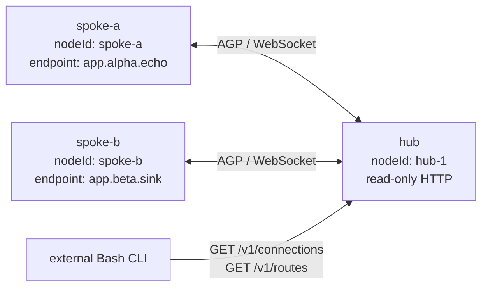

# AGP MVP — Verification Strategy

| Field | Value |
|---|---|
| Status | Proposed |
| Date | 2026-07-29 |
| Verification target | Language-neutral contracts plus TypeScript/Node reference implementation |
| Planning input | [AGP MVP survey](../../../surveys/agent-gateway-protocol-mvp-survey.md) |
| Runtime surfaces | [`protocol.md`](protocol.md), [`fsm.md`](fsm.md), [`routing.md`](routing.md), [`sdk-operations.md`](sdk-operations.md) |

## 1. Verification objective

The MVP is accepted only when protocol correctness and operational
transparency are demonstrated together. A successful WebSocket exchange is not
enough. The tests must show why a session is usable, why an endpoint is
reachable, which route and next hop were selected, how a message was admitted
and forwarded, and how the state changes after withdrawal or failure.

This directly implements survey Q1 `a,c`. Q3 `b,c` requires executable
contracts and focused layer tests; Q5 `a,b` additionally requires a continuously
runnable hub-and-two-spoke skeleton with explicit integration gates. Q4 `a,b`
requires seam tests for abstract next-hop and extensible RIB models without
claiming multi-hop behaviour. Q6 `b` requires proof that SDK, local HTTP, and
the read-only CLI agree.

Verification has two complementary forms:

1. **Conformance:** a component or implementation behaves according to a
   reviewed contract.
2. **Composition:** the real reference layers work together over actual
   loopback WebSockets and HTTP.

Neither substitutes for the other.

## 2. Quality rules for the test system

All automated tests follow these rules:

- use fixed node IDs and injected deterministic ID sources;
- use a manual/fake clock for timers, retry, hold expiry, and ordering unit
  tests;
- use the real monotonic clock only in end-to-end process tests;
- allocate ephemeral ports and pass resolved URLs explicitly;
- await SDK state/events with bounded deadlines rather than arbitrary sleeps;
- make random/property tests seeded and print the seed on failure;
- preserve the first useful failure artifact: protocol transcript, event
  sequence, redacted snapshots, process output, and CLI result;
- shut down SDKs, HTTP servers, sockets, timers, and child processes in
  `finally` blocks;
- fail on leaked handles, unhandled rejections, unexpected console output, or
  post-test state mutations;
- run tests independently and in randomized order;
- never reach into private WebSocket or core maps to assert outcomes.

The local WebSocket prototypes use periodic sleeps and private socket state in
[`websocket/peerGroup.js`](../../../websocket/peerGroup.js). Those patterns are
useful exploratory evidence but would make the new suite timing-sensitive and
implementation-coupled. Tests instead observe public events and snapshots.

## 3. Walking-skeleton topology

The persistent integration fixture is:



The fixture uses actual Node WebSocket and HTTP adapters on loopback. It starts
all three SDK instances through public factories, registers endpoints before
connection establishment, and makes no direct mutation of FSM/RIB state.

The canonical happy-path scenario:

1. start the hub listener and its management adapter;
2. start both spoke reconnect supervisors;
3. observe two independent sessions reach `Established`;
4. observe each spoke advertise its desired endpoint set and receive the
   matching control-plane ACK;
5. observe one selected route and resolved forwarding entry for each endpoint;
6. send a JSON object from `app.alpha.echo` to `app.beta.sink`;
7. send a response in the reverse direction using a correlation identifier;
8. compare SDK, HTTP, and CLI operational views;
9. close `app.beta.sink`, send the next authoritative set omitting it, prove
   its route disappears, prove a hub-local send
   rejects immediately, and prove a spoke send is locally admitted but receives
   a correlated asynchronous protocol `error`;
10. expose it again, disconnect spoke B, prove session-owned state is removed
    atomically, then reconnect and prove the full desired endpoint set is
    advertised again.

The topology is kept runnable from the first transport milestone. Early gates
may have expected missing capabilities, but later work never replaces it with
an unrelated demo.

## 4. Integration gates

Each gate adds assertions to the same fixture and remains in the regression
suite.

| Gate | Capability | Required executable evidence |
|---|---|---|
| G0 — Contracts | Schemas and public types exist | Valid examples pass; invalid fixtures fail with exact codes; public consumer TypeScript fixture compiles using package exports only. |
| G1 — Transport skeleton | One hub accepts two actual WebSockets | Noncolliding local `sessionId` per live router-owned attempt; remote identity uses `(nodeId, sessionId)`; no private socket values in public state; deterministic start/stop; bounded frame handling enabled. |
| G2 — Established sessions | Both FSMs complete negotiation | `Idle → Connect/Active → OpenSent → OpenConfirm → Established` paths conform; snapshots/events agree; invalid messages cannot skip states. |
| G3 — Reachability | Direct endpoint updates populate routing | Advertisement, candidate, selected route, and forwarding entry appear with one revision-consistent ownership chain; the spoke marks new sources advertised only after the matching endpoint ACK. |
| G4 — Data | Bidirectional JSON routing works | Both application handlers receive one matching payload; each receipt proves local admission and names the local next hop/session; only hub-local receipts may name a selected route; hub records forwarding; no broadcast occurs. |
| G5 — Loss and recovery | Withdrawal, closure, and reconnect converge | Whole-set omission removes only the omitted endpoint; session loss atomically removes all owned candidates; deterministic alternatives promote; reconnect re-advertises desired local endpoints. |
| G6 — Operations | One canonical state has three views | SDK snapshot, HTTP resources, CLI JSON, and CLI table represent the same quiescent connections/routes; mutation methods are unavailable. |
| G7 — Resilience | Bounds and failure semantics hold | Malformed, oversized, slow, and saturated peers cannot corrupt state, starve control traffic, or block unrelated sessions. |

### 4.1 Gate completion rule

A gate is complete only when:

- its contract and negative cases are reviewed;
- its automated test runs from a clean process;
- relevant operational state is asserted, not only log output;
- resources are clean after normal and failing cases; and
- the full earlier-gate suite still passes.

The visible demo is evidence, not the oracle. Test assertions use stable
contracts rather than terminal formatting or timing coincidence.

## 5. Test portfolio

### 5.1 Unit tests

#### Protocol values and codecs

- accept every valid control/data fixture and preserve defined values through
  encode/decode;
- reject malformed JSON, invalid UTF-8, non-object top-level values, unknown
  protocol versions, unknown message types, missing/extra forbidden fields,
  invalid IDs/endpoints, non-object data payloads, and non-JSON runtime values;
- distinguish transport WebSocket Ping/Pong frames from AGP `keepalive`
  messages—neither one satisfies the other's liveness obligation;
- generate deployment-unique opaque message IDs and preserve data IDs unchanged
  through forwarding from multiple ingress sessions to one egress session;
- prove the default session generator emits exactly six lowercase hexadecimal
  characters, starts from a random 24-bit position, does not repeat within one
  source instance, and cannot alias equal values from different nodes when
  keyed as `(nodeId, sessionId)`; prove hub-local `owningSessionId` collision is
  rejected; detect injected live advertisement/route/binding ID collisions
  before mutation, and prove retained/re-added advertisements keep/replace IDs
  at the specified lifecycle boundary;
- validate accepted `endpoint.ack` fixtures plus exact outstanding
  update/revision correlation; reject an unknown or mismatched ACK;
- enforce the 128-KiB minimum receive offer, negotiated receive limits, and the
  invariant that a maximum endpoint set plus structured rejection fits;
- enforce encoded byte size and structural depth/collection limits before
  allocating unbounded object graphs;
- drive transport `input-rejected` for binary, invalid UTF-8, compressed/raw,
  and post-decompression over-limit input; prove the exact 1003/1007/1009
  close, no `text` event, and no oversized complete allocation;
- construct validated records without merging untrusted objects into internal
  prototypes;
- preserve an opaque application payload without interpreting its business
  fields;
- recursively accept only finite binary64 numbers and safe-range integers;
  reject overflow/unsafe-integer fixtures while preserving their string-encoded
  equivalents;
- map fatal `notification` to one stable close action and recoverable `error`
  to a correlated asynchronous event that does not itself change FSM state.
- prove the WebSocket Close reason is empty/a stable token no longer than 123
  UTF-8 bytes even when the AGP diagnostic reason is longer.
- exercise the fixed urgent-control layout: one fatal slot, one coalescing
  keepalive slot, and 16 FIFO ACK/error slots capped at 2 MiB; prove the stated
  priority and `CONTROL_QUEUE_OVERFLOW` forced-abort outcome.

#### FSM

- table-drive every valid `(state, event) → actions, next state` row in
  [`fsm.md`](fsm.md);
- exercise both outbound `Connect` and inbound `Active` paths;
- prove `endpoint.update` and `message` are accepted only in `Established`;
- enforce session-scoped `endpoint.update` revision `1`, then exact `+1`
  progression; reject gaps, repeats, and regressions atomically;
- consume the maximum safe revision without wrap, keep its accepted set usable,
  and require a fresh session before a later endpoint change;
- require every `endpoint.update.endpoints` array to be the complete
  authoritative set; prove add/retain/omission-as-withdraw/empty-set replacement
  atomically;
- prove a policy-rejected full set consumes its revision without route
  mutation, returns structured rejected names, and a subsequent full set
  excluding those names resynchronizes;
- coalesce unrelated close/expose changes during a rejected update; prove the
  next revision is recomputed from latest binding tokens, old denials cannot
  taint a re-exposed binding, and even a last-ACKed-equivalent successor is
  emitted to resynchronize;
- prove at most one endpoint update is outstanding, local changes coalesce, an
  ACK is emitted only after the accepted route transaction commits, and newly
  included sources remain locally inadmissible until the exact ACK;
- expire the finite endpoint-write timer while an admitted update is stalled,
  and separately expire the endpoint-response timer after a written update
  receives neither ACK nor rejection; prove teardown plus enabled-retry and
  disabled-retry behaviour even when the negotiated hold timer is zero;
- negotiate `maxEndpointsPerSession`, reject local over-cap registration, and
  stop before `OpenConfirm` with `ENDPOINT_CAPACITY_MISMATCH` when existing
  desired registrations exceed the effective cap;
- prove transport open alone does not imply protocol establishment;
- test open, keepalive, hold, reconnect, and shutdown timers with a manual
  clock, including simultaneous events;
- with either reconnect setting, drive a running spoke to terminal `Idle`,
  correct the cause, call `start()` again, and prove exactly one fresh
  `StartDial`/session attempt begins;
- prove the configured saturating retry formula, defaults/ranges, exactly one
  `[0,1)` random sample per jittered retry, no sample when disabled/zero, and
  deterministic failure for an invalid injected value;
- test malformed/duplicate `open`, identity mismatch, invalid-state messages,
  WebSocket close/error, AGP hold expiry, transport Ping/Pong without AGP
  keepalive, and administrative stop;
- assert state, last transition event/reason/time, timer state, and emitted
  actions after every step;
- assert stale callbacks from an old session attempt cannot mutate a new one.

#### RIB and forwarding

- key independent candidates by endpoint and source ownership;
- install local and peer-learned direct candidates;
- retain duplicate endpoint candidates rather than overwriting them;
- deterministically select local before peer and then use the defined stable
  peer/session tie-break;
- expose losers and their `selectionStatus`/reason;
- accept only the closed selected/candidate reason unions and expose
  `NO_ELIGIBLE_ROUTE` on the unreachable event/counter rather than fabricating
  a selected row;
- resolve a selected route first to tagged `NextHopRef`; resolve `local` to an
  active bounded handler binding and `session` to the current `Established`
  peer plus private transport handle;
- reject forwarding when either tagged next hop is absent/unusable;
- apply the negotiated peer receive limit only to `NextHopRef.session` and
  return `DESTINATION_LIMIT_EXCEEDED` without enqueueing; prove
  `NextHopRef.local` instead uses bounded handler admission;
- replace a set while omitting one endpoint without affecting another from the
  same session;
- on session loss, remove all owned advertisements/candidates, recompute all
  affected endpoints, promote eligible alternatives, and publish one
  transaction revision;
- accept optional future route attributes as inert data without applying
  undefined multi-hop policy.

#### SDK and operations

- copy and validate config; prove caller mutation cannot change effective
  config;
- reject missing/mismatched transport-security modes; prove the built-in
  adapter is literal-loopback `ws:` only and injected-secure mode requires
  authenticated identity, injected transport, and `wss:` URLs without exposing
  credentials;
- reject omission of explicit router endpoint policy; prove reconnect defaults
  enabled and all finite admission/write/close deadlines appear in sanitized
  effective configuration;
- reject wait/send/retry/session/admission/transport/stop timeout values outside
  their exact closed ranges, including unsafe integers;
- table-drive every host lifecycle/operation cell, including shared start
  cancellation rollback, restart from `Stopped`, poisoned `Failed`, and the
  distinct Running-spoke manual retry;
- require `waitForSession()` to select by exactly one identity dimension;
  prove zero matches wait, one resolves, multiple reject `WAIT_AMBIGUOUS`, and
  timeout/cancellation leave no subscription behind;
- register, close, and re-register an endpoint;
- skip endpoint-admission callbacks for identical/retained-only/pure-withdrawal
  sets; prove those updates cannot time out or be policy-rejected;
- reject duplicate local registration, unowned/pending/rejected source,
  invalid JSON-object payload,
  oversized message, full queue, and (for a hub-local send) absent route or
  unusable next hop with exact `AgpError.code`/`retryable`;
- reject a spoke send whose encoded envelope exceeds the hub session's
  negotiated peer receive limit before queue admission, independently of the
  later destination-egress limit case;
- prove `send()` resolves only after atomic bounded-queue admission and that the
  receipt does not claim remote delivery;
- prove a spoke receipt names its established hub session but no selected
  route, while a hub-local receipt may include its selected route;
- prove a correlated nonfatal `error` after spoke admission emits
  `message.failed` and never retroactively rejects the resolved promise;
- apply the recent-send table to every data-error `refId`; known IDs correlate,
  while unknown/evicted IDs emit uncorrelated diagnostics without false
  attribution or session close;
- prove a newly exposed source cannot enter the conforming data queue before
  its whole-set update is ACKed; use a scripted nonconforming peer to send
  premature claimed data and prove recoverable `SOURCE_NOT_ACTIVE`, while a
  truly never-claimed source remains fatal;
- cap endpoint-readiness send waiters by the same message/encoded-byte budgets
  as queued data and release reservations on success, timeout, cancellation,
  and teardown;
- prove `expose()`/registration `close()` resolve at local state commit while
  ACK/withdrawal convergence remains independently observable;
- catch handler and observer failures without corrupting FSM/RIB state;
- prove handler reservation/commit precedes invocation outside the canonical
  executor; teardown aborts its signal, releases reservations once, and
  token-discards late settlement from a cancellation-ignoring Promise;
- return detached immutable snapshots and redacted config; expose local
  endpoint export state, remote identity posture, both session-ID perspectives,
  and the bounded current-session transition ring;
- assert the hub/spoke-discriminated session endpoint state, including
  coalesced pending and outstanding update phases plus the last ACKed endpoint
  revision after quiescence/empty-set convergence, and prove hub routing query
  shapes are empty on a spoke;
- assert pending-admission metadata, per-session inbound/outbound/readiness and
  fixed-control gauges, global resource gauges, maxima, and monotonic
  high-water values at the same revision;
- maintain monotonic sequence/revision values and event-after-commit ordering;
- prove timer `remainingMs` is an as-of-commit value stable across repeated
  reads of one revision and is refreshed by the next timer-related commit;
- overflow one subscriber buffer, emit `observer.gap`, and allow resync from a
  current snapshot;
- reject buffer overrides outside `1..eventSubscriberBuffer`, reject the 33rd
  default subscriber with `QUEUE_FULL`, and prove abort/close releases exactly
  one subscriber slot;
- prove global counters contain only the closed catalog, session counters only
  its subset, zero values remain stable, and hostile/dynamic reason strings
  aggregate without creating keys;
- inject malformed/early/multiple clock callbacks and a throwing diagnostic
  sink; prove `INTERNAL`/sink-failure accounting, no timer corruption,
  no recursive logging, and unaffected protocol progress;
- prove each transport event stream has one consumer, FIFO input, exactly one
  terminal `closed`/`failed` event followed by completion, deterministic
  adapter-fault handling for bare completion, and no accepted connection
  escaping a listener-stop race;
- prove local endpoint `lastAckedEndpointRevision` is session-scoped,
  `lastEndpointResult` distinguishes ACK/policy/capacity/not-installed
  outcomes, neither leaks across binding/session replacement, and
  `reconnectAttempt` remains a JSON-safe counter string;
- represent counters as JSON-safe decimal strings.

#### HTTP adapter and shell presentation

- map every state resource to exactly one `OperationsReader` method; `/v1/health`
  is the documented adapter-plus-lifecycle exception;
- prove lifecycle, configuration, resource, and counter value snapshots carry
  their own complete `SnapshotMeta`, and management metadata comes from that
  single call;
- serialize a single immutable revision per response;
- reject non-loopback bind configuration;
- enforce method allowlist, query-parameter policy, concurrency, header, and
  timeout bounds;
- table-drive the fixed 5-second/32-request/2,048-target/16-KiB-header/no-body/
  16-MiB-response management limits, closed success/error/status catalog,
  shared start cancellation, idempotent bounded stop, and restart/failed
  lifecycle;
- stall identity and endpoint admission ports; prove finite timeout, stale
  token discard, per-session ordering, and progress by unrelated sessions;
- assert lifecycle/deadline/session-teardown cancellation reaches listener and
  admission ports even when a fake adapter settles late;
- overflow the count and byte bounds of an admission continuation; prove token
  invalidation, `INBOUND_ADMISSION_OVERFLOW`, immediate forced abort, no
  notification attempt, no callback revision/route mutation, and ordinary
  teardown of previously installed session routes;
- exceed pending-handshake and concurrent-session bounds independently; prove
  HTTP `503` plus `Retry-After: 1`, one stable capacity outcome/counter, and no
  upgrade/controller/session ID/identity callback/RIB mutation;
- redact internal errors and SDK secrets;
- test each static `jq` template against empty, one-row, multiple-row, missing
  optional field, and hostile control-character fixtures;
- test dispatcher allowlisting, quoting, URL parsing, exit codes, non-TTY
  output, `NO_COLOR`, and the `column` fallback;
- statically prohibit `eval`, mutable state files, and mutating HTTP verbs in
  MVP CLI scripts.

### 5.2 Contract tests

Contract tests sit between pure unit and live integration tests.

| Contract | Producer fixture | Consumer assertions |
|---|---|---|
| Wire JSON Schema | `protocol` package | Every golden transcript validates identically through schema and reference codec. |
| Transport port | scripted fake dialer/listener | Core never assumes a concrete WebSocket or private field. |
| FSM action port | FSM transcript runner | Transport and route actions occur in specified order with exact reason codes. |
| Routing query DTOs | routing core fixtures | SDK and HTTP serializers accept every candidate/selected/forwarding state. |
| Public package API | external TypeScript fixture | Imports only declared exports; no source-tree paths are required. |
| Operations API | deterministic fake `OperationsReader` | HTTP response kinds, meta, items, redaction, and status codes remain stable. |
| CLI driver | fake loopback HTTP server | Correct paths/methods/timeouts; stdout is one JSON document; errors use stderr/exit codes. |

Wire fixtures are language-neutral files, not snapshots of TypeScript class
instances. Future implementations can run the same corpus.

### 5.3 Integration tests

Integration boundaries are exercised separately before the full skeleton:

1. concrete WebSocket adapter against the transport port;
2. transport plus session FSM for dial, accept, close, retry, and timer cases;
3. established session plus endpoint-update/RIB ingestion;
4. RIB selection plus forwarding resolver plus bounded transport send;
5. router/spoke public APIs over one actual session;
6. hub plus two spokes for route-specific forwarding and isolation;
7. router operations plus actual loopback HTTP;
8. external Bash CLI against the live adapter.

At least one integration case runs each role in a separate Node process. This
detects accidental shared-memory coupling hidden by the in-process fixture.

### 5.4 Language-neutral conformance harness

The conformance harness treats an implementation as a black box behind:

- a process launch/configuration convention;
- a WebSocket peer controlled by the harness;
- a JSON-lines observation/control channel used only by test adapters; and
- language-neutral input/transcript/expected-outcome fixtures.

Suites:

- `wire-valid` and `wire-invalid`;
- `fsm-outbound` and `fsm-inbound`;
- `endpoint-update`;
- `message-forwarding`;
- `withdraw-and-session-loss`;
- `protocol-errors-and-close`;
- `limits-and-overload`.

The MVP ships and runs the suite against the TypeScript/Node implementation.
Another language implementation is not required. A test-only scripted peer is
not advertised as an interoperable SDK.

## 6. End-to-end scenario matrix

| ID | Scenario | Data-plane expectation | Required operational evidence |
|---|---|---|---|
| E1 | Hub plus two healthy spokes | A→B and B→A each delivered once | Two `Established` sessions; two selected learned/direct routes; two resolved forwarding entries |
| E2a | Spoke sends to unknown destination | Local `send()` resolves after hub-session admission; correlated nonfatal `error` arrives asynchronously | Spoke `message.failed`; hub failure counter/event; no broadcast or FSM change |
| E2b | Hub-local send targets unknown destination | `send()` rejects `ROUTE_NOT_FOUND` before admission | Hub rejection counter/event; no outbound frame |
| E3 | Destination session leaves `Established` | Hub-local send rejects; spoke send may be admitted to its healthy hub session and then receive asynchronous unavailable-destination `error` | Owned candidates removed atomically; no stale resolved forwarding entry; resolved promise is never retroactively rejected |
| E4 | Whole-set endpoint omission | Omitted endpoint no longer receives | Advertisement/candidate/selected/forwarding removal at one revision |
| E5 | Duplicate advertisement | Only deterministic winner receives | Both candidates visible; exactly one selected with reasons |
| E6 | Winner disconnects | Eligible loser is promoted | New selected route and next hop visible before subsequent send |
| E7 | Spoke reconnects | No replay of accepted old messages; new messages work | New `sessionId`; desired endpoints re-advertised; old session state absent |
| E8 | Malformed/fatal control message | No application delivery | Fatal `notification` reason, state transition/close, owned routes cleaned |
| E9 | Data message before `Established` | Rejected and connection follows spec | Exact invalid-state error/transition visible |
| E10 | Transport Ping/Pong only, AGP keepalive absent | Hold timer expires | Transport may remain open, but AGP session leaves `Established` with hold-expired reason |
| E11 | AGP keepalive valid, transport closes | No forwarding after close | Immediate session-loss transaction and reconnect activity |
| E12 | Slow spoke B | A's bounded sends eventually reject; spoke C/control stays responsive | Queue pressure/high-water events, `QUEUE_FULL`, no unbounded memory trend |
| E13 | Handler throws/rejects | Other messages/sessions continue | `handler.error`; handler-failure counter; FSM/RIB unchanged |
| E14 | Observer stalls | Protocol/data continue | `observer.gap` for that subscriber and successful snapshot resync |
| E15 | Management adapter unavailable | Protocol/data continue | CLI exits unavailable; SDK state remains queryable |
| E16 | HTTP mutation attempt | No state change | `405`, unchanged revision, no protocol event |
| E17 | Endpoint policy rejects authoritative set | Whole set is rejected; next full set excluding named rejections installs allowed endpoints | Rejected local endpoint state, consumed update revision, no partial RIB mutation, later resynchronization |
| E18 | Scripted nonconforming data races an uninstalled endpoint set | Premature claimed data is dropped nonfatally; a conforming SDK could not enqueue it before ACK | Hub `SOURCE_NOT_ACTIVE`; spoke async failure evidence does not override ACK/rejection export state; session stays `Established` |
| E19 | Egress receive limit is smaller | Oversized-for-egress message is not forwarded | `DESTINATION_LIMIT_EXCEEDED`; no destination close; sender failure event |
| E20 | Desired endpoints exceed negotiated cap | No partial endpoint set is advertised | `ENDPOINT_CAPACITY_MISMATCH` before `OpenConfirm`; exact local state remains queryable |
| E21 | Endpoint control progress/result never arrives | No source awaiting that update is admitted | Both admitted-but-unwritten and written-but-unanswered phases time out; enabled reconnect obtains a fresh session/revision sequence, while disabled reconnect stops in `Idle` |
| E22 | Reconnect overlaps old controller teardown | Replacement does not become a second live identity | `IDENTITY_COLLISION` closes only that attempt; spoke backs off and later establishes after old teardown |
| E23 | Spoke targets a hub-local endpoint | Payload is admitted once to the active local handler without a peer receive-limit check | Local `NextHopRef` and handler admission visible; saturation returns correlated `BACKPRESSURE`; handler failure is local event-only |
| E24 | Spoke envelope exceeds immediate hub receive limit | Local `send()` rejects before wire admission | SDK `MESSAGE_TOO_LARGE`; no frame at hub; distinct from downstream `DESTINATION_LIMIT_EXCEEDED` |
| E25 | Listener handshake/session capacity is exhausted | Excess request is never upgraded and no AGP controller is born | HTTP `503`, `Retry-After: 1`, exact capacity counter/outcome, unchanged session/RIB state |
| E26 | Host stops with queued data and active handler | No post-stop new work is admitted; pre-stop work drains or is discarded exactly once | Stopping ingress evidence, optional empty-set ACK, partitioned `StopReport`, aborted handler signal, terminal session/host state |
| E27 | Secure transport posture is misconfigured | Host never becomes Running and no plaintext fallback occurs | `CONFIG_INVALID`, sanitized effective posture, no credential/log leakage |

## 7. Observability acceptance criteria

Operational transparency is accepted when all of the following are automated:

| ID | Criterion |
|---|---|
| O1 | Every session attempt has a stable, router-locally noncolliding `sessionId`; remote session identity is the validated `(nodeId, sessionId)` pair, never a socket address. |
| O2 | A connection view exposes FSM state plus last transition event, reason, and timestamp. |
| O3 | A listener receiving a state-change event can query that revision or a later committed snapshot; it never sees pre-event state. |
| O4 | Endpoint reachability is traceable from advertisement → candidate → selected route → tagged next hop → current established session. |
| O5 | Duplicate candidates and deterministic selection reasons are visible; the table is not only a destination-to-socket cache. |
| O6 | Whole-set omission and session loss remove all and only owned state in one revision; forwarding cannot observe a stale usable next hop. |
| O7 | Message counters distinguish accepted, forwarded, received, rejected-before-admission, and lost-after-admission. |
| O8 | Protocol, transport, queue, handler, and observer failures have stable codes and bounded redacted context. |
| O9 | An aggregate SDK snapshot is internally revision-consistent and detached; consumer mutation cannot change a later query. |
| O10 | At a quiescent gate, each SDK query snapshot and corresponding HTTP metadata/payload are semantically equal. |
| O11 | CLI `--json` is the HTTP response, while its default table is a pure static projection of that same document. |
| O12 | Empty connections/routes are valid observable states, not transport/CLI errors. |
| O13 | Configuration is queryable with effective non-secret values; credentials and payload bodies never appear. |
| O14 | All operational list ordering is deterministic and `capturedAt` is the revision commit time, so unchanged state produces byte-stable normalized JSON/table output. |
| O15 | Every local registration exposes `pending-session`, `pending-update`, `awaiting-ack`, `advertised`, `rejected`, or hub-local state using per-endpoint desired/last-ACKed/outstanding membership. |
| O16 | Session state distinguishes router-local `sessionId`/route `owningSessionId` from remote `originSessionId`, whose provenance key also includes `originNodeId`; it exposes identity posture, and its transition ring never exceeds 64 entries. |
| O17 | Pending admission, per-session data/control queue occupancy, endpoint-update phases, and global current/max/high-water resource gauges are queryable at one revision. |
| O18 | Counter keys and transition/event enums are closed; remote or callback reason text cannot grow metric cardinality or alter event shapes. |

For comparison tests, the topology is first driven to a known event/revision and
then quiesced. Separate HTTP requests are not assumed to be atomic with one
another during live churn; `/v1/snapshot` is used when cross-entity atomicity is
required.

The CLI golden tests retain the decoupled command/driver/template/rendering idea
from [`cli/mod.command`](../../../cli/mod.command) while proving the unsafe
prototype mechanisms were not copied.

## 8. Security verification

The MVP is not accepted with “read-only” or “JSON” used as a substitute for a
threat model.

### 8.1 Wire and parser boundary

Tests must prove:

- raw frame size is bounded before JSON parsing, including compressed-frame
  expansion limits if compression is enabled;
- binary frames are rejected unless the protocol explicitly adopts them;
- JSON depth, array/object cardinality, string length, endpoint length, and
  aggregate encoded size are bounded;
- `__proto__`, `constructor`, and similar payload keys remain inert data and
  cannot alter validators or state objects;
- unknown/extra control fields follow the schema policy rather than reaching
  `Object.assign`;
- invalid UTF-8, duplicate/ambiguous fields where detectable, non-finite
  runtime numbers, and cyclic SDK input fail safely;
- invalid messages cannot install routes, invoke endpoint handlers, or reveal
  stack traces;
- errors and logs exclude application payloads and credential material.

Fuzz/property testing targets decoder, validator, endpoint grammar, FSM event
dispatcher, and route-update normalization. A seed corpus includes every
reviewed positive and negative fixture.

### 8.2 Identity and transport boundary

The MVP always includes an identity-admission policy hook. Tests document
whether a fixture uses authenticated binding or the explicit development-mode
trust policy; neither may be implicit. Authenticated-policy cases cover valid,
missing, invalid, expired, and identity-mismatched credentials before
`Established`. Development-mode cases prove that the resulting self-asserted
identity is visibly marked unauthenticated in sanitized configuration and
session state.

TLS is exercised when enabled, including trust failure and hostname mismatch.
Plain `ws://` is limited to explicit development/loopback configurations. No
test derives protocol identity from an IP address, port, URL, or private socket
object.

### 8.3 HTTP management boundary

Tests prove:

- only `127.0.0.1` and `::1` binds are accepted;
- wildcard and non-loopback binds fail before listen;
- no CORS access is enabled;
- `POST`, `PUT`, `PATCH`, `DELETE`, and WebSocket upgrade cannot mutate or
  subscribe;
- cache prevention and content-type headers are present;
- Host/header abuse, slow headers, excess concurrency, and unknown query
  parameters are bounded/rejected;
- responses contain only allowlisted operational fields and redacted errors;
- adapter compromise is structurally limited by receiving `OperationsReader`,
  not mutable SDK internals.

Loopback does not prevent another local user/process from reading data. That
residual risk is called out in deployment notes and is not “fixed” with an
unreviewed token mechanism.

### 8.4 Shell boundary

CLI tests pass hostile URL strings, spaces, shell metacharacters, newlines, and
malicious field values. The dispatcher must never execute them. Static checks
and review reject:

- `eval`;
- unquoted command/argument construction;
- user-selected executable/template paths;
- source of writable files;
- temporary/state files containing responses;
- mutating curl methods;
- ANSI/control-sequence injection from remote display fields.

## 9. Backpressure and resource-bound verification

Every queue, buffer, retained history, and concurrent callback set must have a
configured bound and an observable overflow policy.

### 9.1 Required behaviours

- Each transport session has a bounded outbound data queue.
- Each outbound queue and endpoint-readiness reservation enforces both message
  count and encoded-byte budgets; the hub also enforces its total byte budget.
- Each per-session inbound queue enforces both message count and encoded bytes;
  a hub additionally enforces global inbound count/byte budgets.
- Applicable bounded-target admission is what `send()` success means: a
  session next hop reserves its queue and a local next hop reserves a handler
  slot plus bytes; saturation rejects with `QUEUE_FULL`.
- Urgent control uses the fixed one-fatal/one-coalescing-keepalive/16-response
  (2-MiB) reservation and its specified priority. It may overtake data; a
  mandatory response that cannot reserve its lane records
  `CONTROL_QUEUE_OVERFLOW` and force-aborts rather than being dropped.
- An endpoint update remains an ordering barrier: it cannot overtake older
  queued data from an endpoint it removes, and newly added-source data remains
  blocked until its ACK.
- FIFO order is preserved for admitted data on one session unless the protocol
  explicitly closes it; order across sessions is unspecified.
- One slow peer cannot block another peer's FSM, route updates, or sends.
- Inbound handler concurrency is bounded with zero waiting backlog; failure to
  reserve a slot follows the defined overload path and is observable.
- Every adapter write and graceful close has a finite deadline and forced-abort
  fallback.
- Subscriber buffers, transition history, counters-by-reason, HTTP concurrency,
  and diagnostic transcript capture are bounded.
- Stop performs bounded drain, then reports forced-discard counts.

### 9.2 Load cases

| Case | Injection | Acceptance |
|---|---|---|
| B1 — Slow transport | Adapter send promises stall/ignore cancellation | Count and byte budgets plateau; later sends reject promptly; write deadline force-aborts and the session cleans up. |
| B2 — One noisy spoke | Continuous data at hub | Other spoke keepalive, route withdrawal, and data latency remain within test budget. |
| B3 — Control under saturation | Fill data, then separately exhaust the 16-response count cap and 2-MiB response-byte cap while requiring keepalive, endpoint ACK/error, notification, and endpoint replacement | Fixed fatal/keepalive/response priority is preserved; keepalives coalesce; mandatory-response overflow records `CONTROL_QUEUE_OVERFLOW` and force-aborts; the dedicated endpoint slot preserves its affected-source barrier; no false healthy/export state. |
| B4 — Slow handler | Exhaust the handler concurrency or active-payload-byte budget | No waiting backlog forms; the next delivery takes the exact BACKPRESSURE/QUEUE_FULL path; completion releases both reservations; FSM remains responsive. |
| B5 — Slow observer | Subscriber stops consuming | Only its bounded buffer overflows; `observer.gap` appears; protocol counters continue. |
| B6 — HTTP scrape storm | Exceed management concurrency | Excess requests receive bounded failure; routing/data remain functional. |
| B7 — Oversized frame | Send just over raw/decoded maximum | Connection follows protocol error policy without proportional memory growth. |
| B8 — Stop while queued | Stop with a short drain deadline while data, withdrawal, and a cancellation-ignoring handler are active | New local/inbound work takes the exact Stopping gate; work outstanding at the stopping commit is partitioned into drained/discarded while already completed work is excluded; handler signal aborts and logical reservations release once; endpoint ACK or teardown proves withdrawal; late settlement cannot change report/state. |

Resource tests use process memory as a trend signal, not a brittle exact byte
assertion. The primary oracle is that configured cardinality/concurrency bounds
are never exceeded.

## 10. Failure-injection and race tests

Deterministic schedulers or barriers force races that otherwise become flaky:

- endpoint-set omission races with send route resolution;
- a newly exposed source attempts data while its full-set update awaits ACK;
- a scripted nonconforming source crosses a consumed policy rejection;
- an endpoint withdrawal barrier races older already-admitted source data;
- endpoint ACK, endpoint rejection, and endpoint-response timeout race at the
  same logical instant;
- an egress receive limit changes through destination reconnect while the hub
  resolves a message;
- session close races with queue admission;
- old-session close callback arrives after reconnect creates a new session;
- two duplicate candidates arrive/withdraw in opposite orders;
- hold expiry and valid keepalive occur at the same logical instant;
- application stop races with reconnect timer;
- handler completion races with forced drain expiry;
- operations snapshot occurs during multi-entity session-loss transaction;
- HTTP serialization overlaps a later state commit.

Acceptance is based on linearization points:

- route selection and queue admission are one send decision;
- session-loss cleanup is one canonical-state revision;
- a snapshot sees either the complete before-state or complete after-state;
- stale callbacks are scoped by the router-local `owningSessionId` and cannot
  affect successor state.

## 11. Multi-hop-readiness verification without multi-hop

Survey Q4 selected model seams, not runtime inter-router behaviour. The MVP
therefore includes these structural tests only:

1. a selected route contains a tagged `NextHopRef`, not a WebSocket;
2. a separate resolver maps peer next hop to the current established session;
3. candidate DTOs distinguish `sourceKind` (`local|session`) from
   `routeClass` (`local|learned`) and mark MVP learned routes as `direct`;
4. optional path attributes survive snapshot/serialization as inert validated
   values;
5. forwarding code consumes the selected-route interface and has no
   direct-endpoint socket map;
6. package dependency/static architecture tests prevent routing core imports
   from the concrete WebSocket adapter.

There is deliberately no simulated router-to-router UPDATE, propagated
withdrawal, AS/path selection, or loop-prevention acceptance test. Adding one
would invent a deferred contract.

## 12. CI and evidence layout

Recommended lanes, ordered from fastest to broadest:

```text
lint/static architecture
  -> schema + public API contracts
  -> protocol/FSM/RIB/SDK unit and property tests
  -> adapter contract tests
  -> in-process real-WebSocket integration
  -> multi-process walking skeleton
  -> live HTTP + external Bash CLI
  -> bounded load/security corpus
```

Parallel lanes may run once their prerequisites are built; ordering describes
diagnostic layering, not a required serial CI implementation.

On failure, the harness stores a redacted artifact bundle:

```text
artifacts/<test-id>/
  topology.json
  protocol-transcript.jsonl
  operations-events.jsonl
  final-snapshots.json
  process-output/
  cli/
```

Artifacts use the same redaction policy as operations. No credential or
application payload fixture marked secret may be retained.

## 13. MVP release checklist

- [ ] All wire schemas and examples pass the language-neutral conformance
      corpus.
- [ ] Every FSM transition and invalid-state event has an executable case.
- [ ] Transport Ping/Pong and AGP keepalive independence is proven.
- [ ] Candidate selection, abstract next-hop resolution, whole-set withdrawal,
      and session-loss cleanup pass deterministic RIB tests.
- [ ] Endpoint policy rejection consumes one revision, installs no partial
      state, reports bounded rejected names, and the next full set converges.
- [ ] Endpoint ACK is post-commit and exactly correlated; one-outstanding,
      coalescing, new-source gating, withdrawal ordering, and response timeout
      are proven.
- [ ] Pending/rejected source sequencing and destination receive-limit failures
      remain recoverable and observable without a false spoofing close.
- [ ] The public package consumer fixture compiles without private imports.
- [ ] The hub-and-two-spoke skeleton passes all gates in-process and at least
      once across processes.
- [ ] Bidirectional payloads are routed once to the selected endpoint and never
      broadcast.
- [ ] At-most-once/local-admission send semantics and loss-after-admission
      observability are proven.
- [ ] SDK, HTTP, CLI JSON, and CLI tables pass the operational consistency
      criteria.
- [ ] Development-loopback versus injected-secure transport posture,
      pre-materialization WebSocket limits, and listener capacity rejection
      pass without plaintext fallback or secret projection.
- [ ] The HTTP adapter is loopback-only and all mutation methods are rejected.
- [ ] CLI scripts have no mutation path, hidden state writes, or dynamic code
      evaluation.
- [ ] Malformed/oversized input, slow peers, saturated queues, callback errors,
      and shutdown races preserve invariants and bounds.
- [ ] Inbound/outbound count and byte budgets, pending-send reservations,
      fixed urgent-control slots, subscriber/counter catalogs, admission
      deadlines, handler cancellation, stop drain, transport write/close
      deadlines, and forced abort prevent unbounded memory or waits.
- [ ] No test or public API depends on `ws._socket`, application-controller
      code, broadcast routing, or mutable internal maps.
- [ ] Multi-hop runtime tests remain explicitly deferred.
